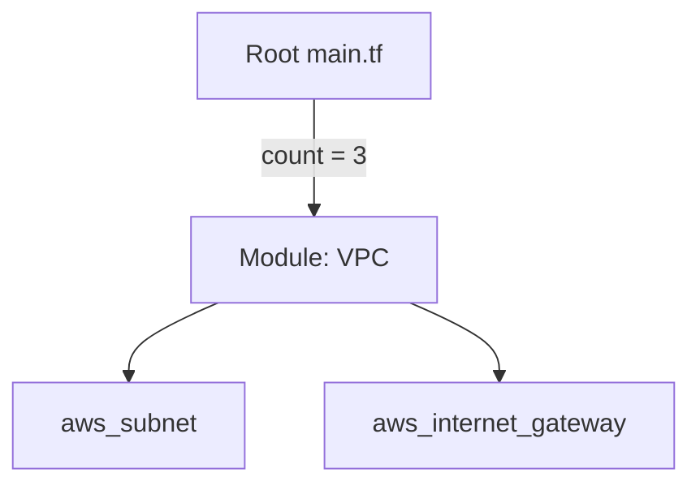

# 🟡 Part 2: Modular Architecture & Scaling

## 📖 Overview

In this level, we move from "Resource Scripting" to **"Architectural Design"**. Modules are the primary way to encapsulate infrastructure logic, making it reusable across teams and environments. 

We will also tackle the #1 cause of Terraform frustration: **Scaling Resources**.

---

## 📦 High-Quality Module Design

A module should be treated like an API. It has inputs, internal logic, and outputs.

### The "Anatomy" of a Module Folder
```text
modules/
  vpc/
    main.tf      # Internal resources
    variables.tf # Mandatory and Optional inputs
    outputs.tf   # Values exported for other modules
    versions.tf  # Required terraform version/providers
```

### The Module Pattern (Abstraction)


---

## ⚖️ Scaling: `count` vs. `for_each` (The Critical Choice)

In a professional environment, choosing the wrong scaling logic can lead to downtime.

### 1. Why `count` is Dangerous
`count` is index-based (0, 1, 2). If you have a list of subnets `["A", "B", "C"]` and you remove "A", Terraform shifts "B" to index 0 and "C" to index 1. 
**Result:** Terraform deletes and recreates EVERYTHING because the IDs changed. 💥

### 2. Why `for_each` is Safe
`for_each` uses a Map or a Set. Resources are identified by their **Key** (e.g., `aws_instance.web["db-server"]`). If you remove one item, only that item is deleted. The others are untouched.

### Scaling Example:
```hcl
variable "environments" {
  type    = set(string)
  default = ["dev", "staging", "prod"]
}

module "app_stack" {
  for_each = var.environments
  source   = "./modules/app"
  
  env_name = each.key
}
```

---

## 📐 Environment Isolation Strategies

### Strategy A: Workspaces (Small Scale)
One directory, one set of code, but multiple states managed by the CLI (`terraform workspace select prod`).
-   **Pros**: Fast to set up.
-   **Cons**: Easy to run a command in the wrong workspace by mistake. Use for dev/testing only.

### Strategy B: Directory-Based Isolation (Enterprise Standard)
Physically separate folders for `dev/`, `staging/`, and `prod/`.
-   **Pros**: Explicit isolation. You can't "accidentally" destroy prod while trying to apply dev. Allows for different provider versions or secrets per environment.
-   **Cons**: Slightly more initial boilerplate.

---

## 🚀 Hands-On Lab: The LEGO Pattern

Prepare to build your first reusable component.

### Step 1: Create the Module
Navigate to `modules/s3_bucket/` and create a simple encrypted bucket.

### Step 2: Call from Root
In your root `main.tf`, use `for_each` to create three buckets named after your departments: `Finance`, `Marketing`, and `Engineering`.

### Step 3: Verify Addressing
Run `terraform plan`. Observe the addresses:
`module.buckets["Finance"].aws_s3_bucket.main`

---

## ❓ Knowledge Check

1.  **Q: How do you make a module variable optional?**
    *   **A:** Provide a `default` value in the variable definition. If no default is provided, the variable is **mandatory**.
    
2.  **Q: What is the main benefit of directory-based isolation over workspaces?**
    *   **A:** Safety and explicitness. It is much harder to run a command against the wrong environment when you have to physically change into a different directory.

---

**Next Step**: Learn to manage state at scale and refactor without downtime in **[Part 3: Advanced Workflows](readme.md)** 🔴
