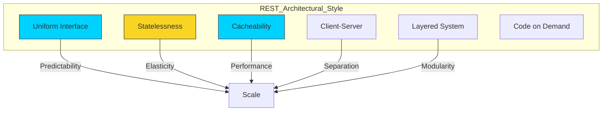

# 🏗️ Part 1.2: REST Architectural Style

> **"REST is not a protocol; it's a philosophy of constraints. When followed correctly, it turns a chaotic mess of endpoints into a predictable, scalable ecosystem."**

## 📖 Overview

**Representational State Transfer (REST)** is the architectural DNA of the modern web. Specifically designed for distributed systems, REST treats everything as a **Resource** (a noun) rather than an action (a verb). 

In DevOps, we live in a RESTful world. Whether you are calling the Kubernetes API to deploy a pod or the GitHub API to merge a PR, you are leveraging the power of REST.

---

## 🏗️ The 6 Constraints of REST

These constraints ensure that your API is built for the "Internet Scale."

### 1. Statelessness (The DevOps Favorite)

The server must not store any "client state" between requests. Every request is an "isolated island" containing all information required to fulfill it (e.g., Auth tokens).

- **Pro**: Allows us to spin up 1,000 instances of a service behind a Load Balancer; any instance can handle any request.

### 2. Client-Server

Complete separation of concerns. The server deals with data persistence and security; the client deals with state and visualization.

### 3. Layered System

A client cannot tell if it is connected to the end-server or an intermediary (Proxy, Load Balancer, API Gateway). This allows us to inject security layers without breaking the client.

### 4. Uniform Interface

- **Resources**: Identified by URIs (`/api/v1/servers`).
- **Representations**: Delivered via JSON/XML based on headers.

---

## 🚀 Professional Patterns: Resource-Oriented Design

### Pattern A: Nouns Over Verbs

Good APIs are mapped to physical or logical objects.

- **❌ Bad (RPC Style)**: `POST /createUser`, `GET /fetchLogs`
- **✅ Good (REST Style)**: `POST /users`, `GET /logs`

### Pattern B: Collection vs. Member

- `/v1/deployments`: The **Collection**. `GET` to list, `POST` to create.
- `/v1/deployments/45`: The **Member**. `GET` to inspect, `DELETE` to terminate.

---

## 🏆 Real-World DevOps Story: The Sticky Session Nightmare

**The Scenario**: A company had a legacy API that was "Stateful"—it stored user sessions in the server's local RAM. 

**The Crisis**: During a traffic spike, the DevOps team tried to scale from 2 servers to 10. Users started getting "Unauthorized" errors because their requests were hitting new servers that didn't have their session in memory.

**The Fix**: They refactored the API to be **RESTful/Stateless**. Identity was moved into a **JWT Token** sent with every request. 

**The Lesson**: Statelessness is a prerequisite for **Cloud Elasticity**.

---

## 🎓 Career Readiness

**Interview Question:** "What does it mean for an API to be HATEOAS compliant?"

**Strong Answer:** "HATEOAS stands for 'Hypermedia as the Engine of Application State.' It means the API response contains not only data but also links to related actions. For example, a request to `/orders/123` would return the order details AND a list of links like 'cancel-order' or 'track-delivery'. This allows a client to dynamically discover what it can do next without hardcoding URI paths."

---

**Next Step**: [Part 1.3: Status Codes & Error Handling](../03-status-codes-and-errors/) 🚀
