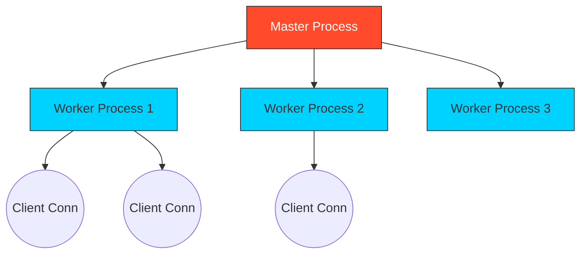

# 🏗️ Module 01: Nginx Architecture & Installation

> **"To master the server, you must understand the signal path. Nginx isn't just a program; it's a finely tuned orchestration of processes."**



## 📚 Overview

Nginx owes its speed to its **Event-Driven, Asynchronous Architecture**. While traditional servers (like Apache) create a new thread or process for every single visitor, Nginx handles thousands of connections within a single "Worker Process." This makes it incredibly efficient with CPU and RAM.

## 🎓 Learning Objectives

- ✅ Understand the **Master vs. Worker** process model.
- ✅ Install Nginx on major Linux distributions (Ubuntu/CentOS).
- ✅ Manage the Nginx service (Start, Stop, Reload).
- ✅ Navigate the **Configuration Directory Structure**.

---

## 🏗️ The Internal Workflow

### 1. The Master Process

The "Boss" of the server. It reads the configuration, binds to ports (like 80 or 443), and spawns/manages the Worker processes. You rarely interact with this process directly.

### 2. The Worker Processes

The "Employees." These processes do the actual heavy lifting. They handle network connections, read files from disk, and communicate with backends.

- **Pro Tip**: Usually, you configure 1 worker process per CPU core.

### 3. The Event Loop

Instead of waiting for a slow disk or a slow network (blocking), the worker process registers an event and immediately moves on to the next user. When the data is ready, it's "called back." This is why Nginx doesn't "hang" under load.

---

## 🚀 Installation & Service Management

### Ubuntu/Debian

```bash
sudo apt update
sudo apt install nginx -y
```

### CentOS/RHEL

```bash
sudo yum install epel-release -y
sudo yum install nginx -y
```

### Service Commands

- `sudo systemctl start nginx`: Start the engine.
- `sudo systemctl status nginx`: Check if it's healthy.
- `sudo systemctl reload nginx`: Apply changes **without** downtime.
- `nginx -v`: Check the version.
- `nginx -t`: **CRITICAL**. Always run this to check for syntax errors before reloading.

---

## 📂 The Configuration Map

| File/Directory | Purpose |
| :--- | :--- |
| `/etc/nginx/nginx.conf` | The main configuration entry point. |
| `/etc/nginx/sites-available/` | Where you store configs for different websites. |
| `/etc/nginx/sites-enabled/` | Where you link the sites you actually want to be active. |
| `/var/log/nginx/access.log` | Records every visitor. |
| `/var/log/nginx/error.log` | Records every failure (Your best friend for debugging). |

---

## 🏆 Real-World DevOps Story: The 10,000 Connection Wall

**The Scenario**: A startup's server was hitting a limit where it couldn't handle more than 1,024 users simultaneously.
**The Discovery**: The Linux OS has a `ulimit` (user limit) on how many open files/connections a single process can have. Nginx's worker processes were hitting this "OS Wall."
**The Fix**: The DevOps team updated the `worker_rlimit_nofile` directive in Nginx and the OS `/etc/security/limits.conf`.
**The Lesson**: Nginx is fast, but it's only as powerful as the Operating System allows it to be. Always check your **System Limits**.

---

## ❓ Interview Preparation

1. **Q: Why is 'Reload' better than 'Restart' in Nginx?**
   *A: Restart shuts down the whole server, dropping active users. Reload starts new workers and tells old ones to shut down only after they finish their current request. Zero downtime.*

2. **Q: What is the purpose of the 'events' block in `nginx.conf`?**
   *A: It defines how many total connections each worker process can handle (`worker_connections`).*

3. **Q: How do you verify Nginx is installed and running via CLI?**
   *A: `curl -I localhost` should return a `200 OK` with a `Server: nginx` header.*

4. **Q: What is the Main vs. Site configuration pattern?**
   *A: `nginx.conf` handles global settings (like users and logs). Individual site configs are "Included" from separate files to keep things organized.*

5. **Q: If `nginx -t` fails, what should you do?**
   *A: DO NOT reload. Read the error message carefully; it will tell you the exact line number and character where your config is broken.*

---

## 🔗 Next Steps

Architecture is solid. Now let's build the shield.

Proceed to: **[02-Reverse Proxy Basics](../02-reverse-proxy-basics/readme.md)** →

---

[Back to Part 1 Overview](../readme.md) | [Back to Home](../../readme.md)
