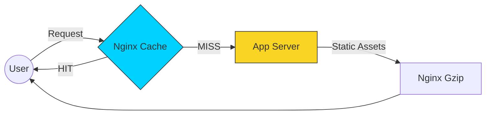

# 🏎️ Module 02: Performance Optimization

> **"Speed is a feature. A 100ms delay can cost millions. Nginx provides the tools to wring every drop of performance from your network."**



## 📚 Overview

Performance tuning in Nginx is about reducing the distance and time between the user and the data. By leveraging **Caching** and **Compression**, we can reduce server load by up to 80% and improve user experience significantly.

## 🎓 Learning Objectives

- ✅ Implement **Static Caching** for assets.
- ✅ Configure **Micro-Caching** for dynamic content.
- ✅ Enable **Gzip and Brotli** compression.
- ✅ Optimize **Buffer Sizes** for high-throughput apps.
- ✅ Understand the **FastCGI Cache** for PHP applications.

---

## 🏗️ The Caching Strategy

Caching saves the response of a slow backend to the Nginx server's disk/RAM for future use.

```nginx
# Define the cache path
proxy_cache_path /var/cache/nginx levels=1:2 keys_zone=MY_CACHE:10m max_size=1g inactive=60m;

server {
    location / {
        proxy_cache MY_CACHE;
        proxy_cache_valid 200 302 10m; # Cache successes for 10 mins
        proxy_cache_valid 404 1m;      # Cache failures for 1 min
        
        proxy_pass http://backend;
    }
}
```

### Micro-Caching

A professional DevOps secret. Caching a dynamic page (like a news feed) for just **1 second**. During a traffic spike, this preserves your database while users still see fresh content.

---

## 🚀 The Compression Toolkit

Sending uncompressed files is a waste of money and time.

```nginx
gzip on;
gzip_types text/plain text/css application/json application/javascript;
gzip_min_length 1000;
gzip_comp_level 5; # 5 is the 'Sweet Spot' between CPU and Size.
```

---

## 🛠️ Buffer Optimization

If your backend sends huge responses, Nginx needs to buffer them.

- `proxy_buffers`: Number of buffers.
- `proxy_buffer_size`: Size of the initial header buffer.
- `client_body_buffer_size`: Buffer for client POST data.

---

## 🏆 Real-World DevOps Story: The Billion-Request Cache

**The Scenario**: A world news site was struggling with a huge influx of users during a global event. Their application server CPU was at 99%.

**The Discovery**: Every user was requesting the same "Top Stories" JSON file. The app was recalculating this JSON 5,000 times per second from the DB.

**The Fix**: Adding a `proxy_cache_valid 200 1s;` rule. Nginx now calculated the JSON once per second and served the other 4,999 requests from memory.

**The Lesson**: In distributed systems, **Cache is King**. One second of caching can be the difference between a crash and a successful launch.

---

## ❓ Interview Preparation

1. **Q: What is the 'Gzip' compression level sweet spot?**
   *A: Level 5 or 6. Anything higher (7-9) consumes significantly more CPU for almost no extra compression benefit. Anything lower (1-2) doesn't compress enough.*

2. **Q: What is a Cache 'HIT' vs a Cache 'MISS'?**
   *A: A 'HIT' means Nginx found the requested data in its local cache and served it instantly. A 'MISS' means it had to go back to the app server for a fresh copy.*

3. **Q: Why should you never cache a POST request?**
   *A: Because POST requests change server state (like buying an item). Caching them would mean Nginx might think it has the result of a purchase without actually telling the backend to process it.*

4. **Q: What does the 'Vary: Accept-Encoding' header do?**
   *A: It tells intermediate caches (like ISPs) that the response may be compressed (gzip) or uncompressed. This prevents an ISP from sending a compressed file to a user whose browser doesn't support it.*

5. **Q: How does `keepalive_timeout` affect performance?**
   *A: It defines how long an idle connection should stay open. A higher value reduces the overhead of new TCP handshakes for returning users but consumes more memory by keeping connections alive.*

---

## 🔗 Next Steps

Congratulations! You are now a master of the Edge.

Proceed to: **[Part 3: Security & Hardening](../../part-03-security-and-hardening/01-security-and-ssl/readme.md)** 🚀

---

[Back to Part 2 Overview](../readme.md) | [Back to Home](../../readme.md)
