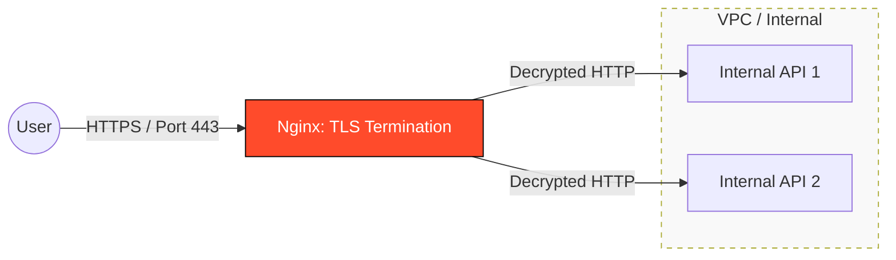

# 🔐 Part 3: Security & Hardening

> **"If Nginx is your front door, this module is about installing the locks, cameras, and reinforced steel. Security at the edge is your most effective defense."**

## 📖 Overview

This module focuses on transforming Nginx from a simple traffic router into a hardened **Security Gateway**. We explore SSL/TLS termination, modern encryption standards, and defensive configuration patterns to protect against common web attacks.

---

## 🏗️ The Secured Edge

How Nginx terminates encryption to keep the internal network "clean."



---

## 🎯 Learning Objectives

By the end of this part, you will:

- ✅ **Implement** SSL/TLS certificates using Let's Encrypt and Certbot.
- ✅ **Harden** SSL settings by disabling weak ciphers (SSLv3, TLS 1.0).
- ✅ **Configure** HSTS (HTTP Strict Transport Security) to prevent protocol downgrade attacks.
- ✅ **Protect** against information leakage by hiding Nginx version numbers.
- ✅ **Enforce** security headers (X-Frame-Options, X-Content-Type-Options).

---

## 🗺️ Included Modules

1. **[01-Security & SSL](./01-security-and-ssl/readme.md)**: Turning on the lights. Certificates, Ciphers, and modern encryption standards.

---

## 🚀 Professional Pattern: "Hiding the Identity"

By default, Nginx broadcasts its name and version in every error page and response header (`Server: nginx/1.18.0`). This tells an attacker exactly which vulnerabilities to look for.

**The Fix:**

```nginx
http {
    server_tokens off;
}
```

Turning `server_tokens off` removes the version number from headers and default error pages, practicing **Security through Obscurity**.

---

## 🎓 Career Readiness

**Interview Question:** "What is SSL Termination and why do we do it at the Load Balancer level instead of the App level?"

**Strong Answer:** "SSL Termination is the process of decrypting HTTPS traffic at the Nginx level before forwarding it to the backend. We do this for three reasons:

1. **Performance**: SSL/TLS handshakes are CPU-intensive; offloading them to Nginx leaves the application server's CPU free for business logic.
2. **Management**: It's easier to manage and rotate certificates in one centralized place than on 50 different app servers.
3. **Internal Speed**: It allows Nginx to inspect headers (like cookies or URI paths) for smarter routing, which would be impossible if the traffic remained encrypted."

---

**Next Step**: Start with **[01-Security & SSL](./01-security-and-ssl/readme.md)** 🚀
