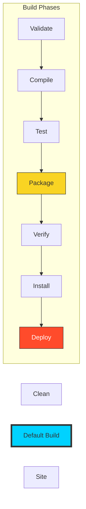

# ⚙️ Module 05: The Build Lifecycle

> **"A build is a sequence of events. Understanding the order of these events is the difference between a successful release and a broken product."**

## 📚 Overview
Maven is centered around the concept of a **Build Lifecycle**. This means the process of building and distributing a project is clearly defined. Each lifecycle is composed of a series of **Phases**, and each phase is responsible for a specific task.

When you run a command like `mvn package`, Maven executes every phase *leading up to* package in order: validate -> compile -> test -> package.

## 🎓 Learning Objectives
- ✅ Differentiate between the 3 **Standard Lifecycles** (Clean, Default, Site).
- ✅ Master the **Sequential Nature** of build phases.
- ✅ Bind **Plugin Goals** to specific lifecycle phases.
- ✅ Understand the difference between `mvn install` and `mvn deploy`.
- ✅ Execute specific phases to save time in CI/CD.

---

## 🏗️ The Three Standard Lifecycles

### 1. Clean Lifecycle
Deletes the `target` directory. Always run this before a fresh build to ensure no old artifacts interfere.
- **Phases**: `pre-clean`, `clean`, `post-clean`.

### 2. Default Lifecycle
The most important one. Handles the actual compilation and packaging.
- **Key Phases**: `compile`, `test`, `package`, `verify`, `install`, `deploy`.

### 3. Site Lifecycle
Generates documentation and reports for the project.
- **Phases**: `pre-site`, `site`, `post-site`, `site-deploy`.

---

## 🚀 Professional Pattern: Goal Binding

Phases are "empty containers." **Plugins** provide the actual code that runs during a phase. For example:
- The **Compiler Plugin** binds its `compile` goal to the `compile` phase.
- The **Surefire Plugin** binds its `test` goal to the `test` phase.

**Custom Binding**: You can bind a security scanning tool to the `verify` phase to ensure no vulnerabilities exist before the code is installed.

---

## 🏆 Real-World DevOps Story: The Untested Release

**The Scenario**: A developer was in a rush and ran `mvn install -DskipTests`. The JAR was installed into the company's local repository. Another team used that JAR and their app crashed instantly.
**The Discovery**: The JAR contained a major logic bug that would have been caught if the tests had run.
**The Fix**: The DevOps team configured the CI/CD pipeline (Jenkins) to NEVER allow `-DskipTests` in production builds. They also configured the `verify` phase to run a mandatory code-coverage check (Jacoco).
**The Lesson**: The lifecycle is a **Contract**. If you skip a phase, you are breaking the contract and risking the stability of the entire organization.

---

## ❓ Interview Preparation

1. **Q: If I run `mvn install`, will the tests be executed?**
   *A: Yes. Because `test` is a phase that occurs BEFORE `install` in the default lifecycle, Maven will execute validate, compile, and test before it reaches install.*

2. **Q: What is the difference between a Build Phase and a Plugin Goal?**
   *A: A **Phase** is a step in the lifecycle (a "when"). A **Goal** is a specific task provided by a plugin (a "what"). You bind goals to phases.*

3. **Q: Why should you usually run `mvn clean install` instead of just `mvn install`?**
   *A: Running `clean` ensures that the `target` directory is wiped. This prevents old class files or resources from being included in your new build by mistake.*

4. **Q: What is the purpose of the 'Verify' phase?**
   *A: It is used for checks that happen after the package is created but before it is installed. This is the ideal place for integration tests and security scans.*

5. **Q: How do you run only the compilation step without running tests?**
   *A: Run `mvn compile`. This is much faster than running the full lifecycle when you just want to check for syntax errors.*

---

## 🔗 Next Steps

The build is running perfectly. Now let's talk about the elite standards.

Proceed to: **[06-CI-CD-Integration](../../part-03-enterprise-maven-and-optimization/01-ci-cd-integration/readme.md)** →