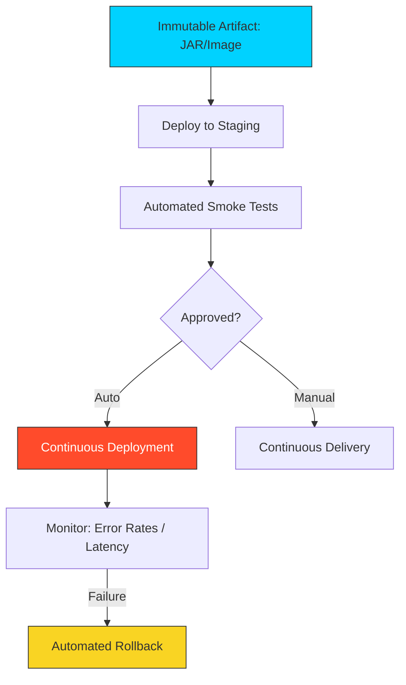

# 🚀 Module 05: Continuous Deployment

> **"A build that stays on the shelf generates no value. Speed of deployment is the ultimate metric of DevOps success."**

## 📚 Overview
You've built the code, tested it, and secured it. Now comes the most exciting—and dangerous—part: **Getting it to the User.** This module covers how to automate the movement of artifacts into production environments while minimizing downtime and maximizing safety.

## 🎓 Learning Objectives
- ✅ Understand **Continuous Delivery vs. Continuous Deployment**.
- ✅ Master the concept of **Immutable Artifacts**.
- ✅ Implement **Blue-Green** and **Canary** deployment patterns (intro).
- ✅ Automate **Smoke Tests** and Health Checks.
- ✅ Understand **Rollback Strategies** when things go wrong.

---

## 🏗️ The Deployment Hierarchy

### 1. The Build (Artifact Creation)
We never deploy raw code. We bundle the code into a JAR, a WAR, or a Docker Image. This is called an **Immutable Artifact**. Once built, it never changes.

### 2. The Promotion
We deploy the *exact same* artifact to Staging, then to Production. If it worked in Staging, we have 99% confidence it will work in Production.

### 3. The Smoke Test
A minimalist test suite run against the *deployed* app. 
- **Example**: "Can the user login?" or "Does the `/health` endpoint return 200 OK?"

---

## 🚀 Professional Pattern: Blue-Green Deployment

Instead of updating the live server, you spin up a **New** set of servers (Green).
1. **Blue**: The current live production (Version 1).
2. **Green**: The new version (Version 2).
3. **The Switch**: Use a **Load Balancer** (like Nginx) to toggle traffic from Blue to Green.

**The Power**: If Version 2 crashes, you simply toggle the switch back to Blue. **Zero Downtime. Zero Stress.**

---

## 🏆 Real-World DevOps Story: The Black Friday Rollback

**The Scenario**: An e-commerce site deployed a "New Checkout Button" on Black Friday. Suddenly, 50% of users couldn't complete their purchases.
**The Crisis**: The database was overloaded by a bug in the new code.
**The Fix**: Because they used an automated CD pipeline, the SRE team didn't try to "Patch" the bug in production. They hit the **Rollback** button. In 30 seconds, the pipeline redeployed the previous Version 1.14. Sales resumed immediately.
**The Lesson**: In production, **speed of recovery** is more important than speed of fixing.

---

## ❓ Interview Preparation

1. **Q: Why is it important to use 'Immutable Artifacts' in a CD pipeline?**
   *A: It ensures consistency. If you compile the code separately for Staging and Production, you risk small differences in the environment (like a different JDK version) causing bugs in Production that didn't appear in Staging. Building once and deploying everywhere eliminates this risk.*

2. **Q: What is a 'Smoke Test'?**
   *A: It's a quick set of tests run immediately after a deployment to ensure the core functionality of the application is working. It's called a smoke test because it captures the most obvious failures (the "smoke" before the fire).*

3. **Q: Explain the 'Blue-Green' deployment strategy.**
   *A: It involves running two identical production environments. Only one (Blue) is live. You deploy to the idle one (Green), test it, and then switch the traffic. If anything goes wrong, you switch back instantly.*

4. **Q: What is a 'Rollback', and why is it part of a mature CD process?**
   *A: A rollback is the process of reverting to a previous successful version of the application. It's a critical safety net because no matter how much you test, production is always different. Being able to revert instantly protects the business from downtime.*

5. **Q: How does a pipeline know when a deployment has failed?**
   *A: By using **Health Checks**. After deployment, the pipeline sends requests to a specific heartbeat endpoint. If the app returns a 500 error or doesn't respond for 60 seconds, the pipeline declares a failure and stops the release.*

---

## 🔗 Next Steps

Automation mastered. Now prove it with the challenges.

Proceed to: **[CHALLENGES.md](../../challenges.md)** →
