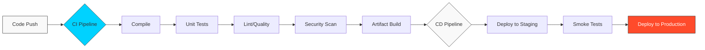

# ♾️ Basic CI/CD: The Heartbeat of DevOps

> **"In the old world, software was 'finished' and then 'released.' In the DevOps world, software is a living stream. CI/CD is the plumbing that ensures that stream remains pure and flows constantly to the user."**

## 📚 Overview

**Continuous Integration (CI)** and **Continuous Deployment (CD)** are the foundational practices of modern software engineering. They remove the human error from the build and release process, allowing teams to ship code faster and with significantly higher confidence.

This curriculum moves from the theoretical concepts of "Pipelines" to the hands-on implementation of automated workflows that power the world's most successful tech companies.

## Core Concept: The Immutability Pattern
**[REFERENCE: Pipeline Governance](reference/pipeline-governance-ref.md)**

The golden rule of CI/CD is: **Build Once, Deploy Many**.
- **The Artifact**: We do not move *code* to production; we move *binaries*.
- **The Flow**: You build a Docker Image or JAR *once* in the CI stage. You then promote that *exact same file* to Staging, and then to Production.
- **Why?** Rebuilding code for each environment introduces variables (different compiler versions, network glitches) that break consistency.

## Enterprise Governance
**[REFERENCE: CI Architecture & Components](reference/ci-architecture-components-ref.md)**

At scale, we don't just run scripts. We manage:
- **Controller/Agent Architecture**: Ensuring the brain (Controller) never executes code directly (Security risk).
- **Secrets Management**: Injecting credentials at runtime, never storing them in code.
- **Gating**: Automated tests are great, but Production often requires a manual "Approval Gate".

## 🎓 Learning Objectives

By the end of this curriculum, you will:

- ✅ Differentiate between **CI, CD (Delivery), and CD (Deployment)**.
- ✅ Build automated workflows using **GitHub Actions**.
- ✅ Orchestrate **Multi-Stage Pipelines** (Build -> Test -> Deploy).
- ✅ Implement **Quality Gates** and Security Scans.
- ✅ Understand **Environment Promotion** (Staging vs. Production).
- ✅ Automate **Artifact Management** and Versioning.

---

## 🗺️ Curriculum Structure

| Part | Topic | Description |
| :--- | :--- | :--- |
| **[🟢 Part 1](./part-01-principles-and-fundamentals/)** | **Foundations** | The Philosophy. Core concepts, terminologies, and the "Pipeline" mindset. |
| **[🟡 Part 2](./part-02-github-actions-core/)** | **Implementation** | The Engine. YAML syntax, Events, Runners, and Components. |
| **[🔴 Part 3](./part-003-advanced-workflows/)** | **Advanced Ops** | Reaching Production. Quality Gates, Security Scans, and CD. |

---

## 🚀 Why CI/CD for DevOps?

### 1. Radical Transparency

Every developer knows the status of the code at any given second. If a commit breaks the build, the "Red Build" is visible to everyone, ensuring immediate correction.

### 2. Reduced Time-to-Market

By automating the "boring" parts (testing and packaging), features that used to take months to release can now be deployed in minutes.

### 3. Safety and Resilience

Automated pipelines act as a safety net. If a deployment fails, the pipeline can automatically rollback to the previous "Known Good" version, preventing outages.

---

## 🏆 Real-World DevOps Story: The 4:55 PM Friday Deployment

**The Scenario**: In 2012, a major financial firm tried to deploy new software manually at 5:00 PM on a Friday. A human engineer made a typo in a configuration path.

**The Crisis**: Within 45 minutes, the company lost **$440 million** as their automated trading systems went haywire. Because there was no automated CI/CD pipeline, it took them hours to manually find the error and revert it.

**The Fix**: Modern companies now use **Immutable Pipelines**. Every change is tested in a replica environment automatically. If the "Smoke Tests" fail, the code is blocked from reaching production.

**The Lesson**: Manual deployments are a massive business risk. **CI/CD is your insurance policy.**

---

## ❓ Interview Preparation (CI/CD)

1. **Q: What is the difference between Continuous Delivery and Continuous Deployment?**
   *A: Continuous Delivery means code is ALWAYS ready to go to production, but the final release requires a human click. Continuous Deployment means the final release happens automatically if all tests pass.*

2. **Q: What is a 'Regression' and how does CI prevent it?**
   *A: A regression is when a new feature breaks an old one. CI prevents this by running the entire suite of Unit Tests on every single commit, catching the break immediately.*

3. **Q: Explain the concept of a 'Artifact Repository'.**
   *A: It is a storage location (like Nexus, Artifactory, or GitHub Packages) where the final, immutable binaries (JARs, Docker Images) are stored after a successful build.*

4. **Q: What is a 'Self-Hosted Runner' in GitHub Actions?**
   *A: It is your own server (on-prem or in your VPC) that runs the GitHub Action jobs, allowing you to access private resources or use specific hardware that GitHub's cloud runners don't provide.*

5. **Q: What are 'Secrets' in a pipeline?**
   *A: Encrypted variables (like API keys or passwords) that are stored safely in the CI tool and injected into the pipeline at runtime so they never appear in the source code.*

---

## 📝 Preliminary Knowledge Check

1. **In a CI/CD pipeline, what usually happens immediately after code is pushed?**
   - [ ] a) Manual Review
   - [x] b) Automated Build/Compile
   - [ ] c) Customer Notification

2. **Which of these is NOT a popular CI/CD tool?**
   - [ ] a) Jenkins
   - [ ] b) GitHub Actions
   - [x] c) Microsoft Word

3. **What is the primary benefit of 'Failing Fast'?**
   - [ ] a) It makes developers quit.
   - [x] b) It catches bugs when they are cheap and easy to fix.
   - [ ] c) It saves electricity.

4. **True or False: A CI/CD pipeline should only contain tests for the new code being added.**
   - [ ] a) True
   - [x] b) False (It should run ALL tests to ensure no regressions).

5. **What file format is most commonly used to define CI/CD pipelines in modern tools?**
   - [ ] a) XML
   - [ ] b) JSON
   - [x] c) YAML

---

## 🔗 Next Steps

Ready to automate the world?

Proceed to: **[Part 1: Principles & Fundamentals](./part-01-principles-and-fundamentals/readme.md)** 🚀
