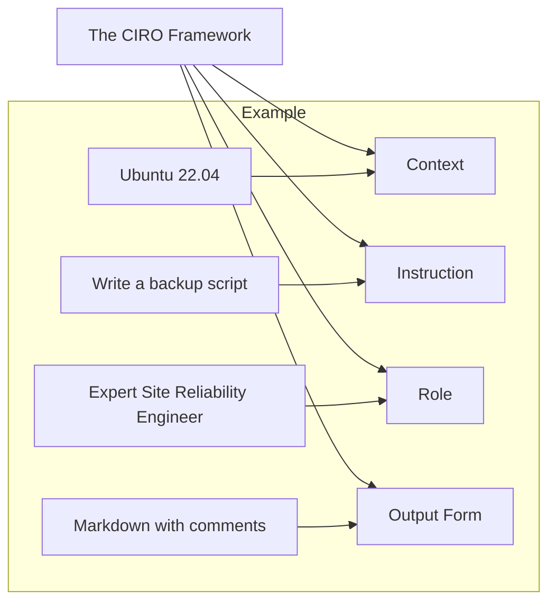

# 🛠️ Module 02: The DevOps Prompt Toolkit

> **"A amateur asks for code. A professional provides a framework. The structure of your prompt determines the stability of your infrastructure."**



## 📚 Overview

Writing good prompts is a repeatable science. In this module, we introduce the **CIRO Framework**, a professional standard for structuring high-stakes DevOps prompts. We also move beyond basic text and explore how to use **Advanced Formatting** (XML tags, Markdown) to help the AI categorize information properly.

## 🎓 Learning Objectives

- ✅ Master the **CIRO (Context, Instruction, Role, Output)** framework.
- ✅ Use **Delimiters** (e.g., `---`, `###`, `xml`) to separate data from instructions.
- ✅ Implement **Few-Shot Prompting** for complex YAML generation.
- ✅ Master **[Slash Commands & Shorthands](./slash-commands.md)** for rapid interaction.
- ✅ Specify **Constraints** to prevent insecure code generation.
- ✅ Learn how to **Iterate** and refine a prompt for 100% accuracy.

---

## 🏗️ The CI/CD of Prompting: The CIRO Framework

To get production-ready results, every prompt should contain these four elements:

### 1. Context (C)

What environment is this for?
*Example: "I am running a Kubernetes cluster on AWS using EKS version 1.27."*

### 2. Instruction (I)

What is the specific task?

*Example: "Generate a HorizontalPodAutoscaler manifest."*

### 3. Role (R)

Who should the AI be?

*Example: "Act as a Senior DevOps Architect with a focus on cost-optimization."*

### 4. Output (O)

What should the response look like?

*Example: "Provide only the YAML blocks. Do not include introductory text."*

---

## 🚀 Advanced Technique: Using XML Delimiters

LLMs can get confused if you paste code and instructions together. Use tags to clear the fog.

**The Prompt**:

```text
I need you to refactor this script.
<script_to_fix>
[Your Code Here]
</script_to_fix>

<constraints>
- Use Python 3.10+
- Must use 'pathlib' instead of 'os.path'
</constraints>
```
**Why it works**: Tags provide clear "Start" and "Stop" signals for the AI's logic, preventing it from mixing instructions with the code it's supposed to analyze.

---

## ⌨️ Rapid Interaction: Slash Commands
For daily tasks, you don't always need a full CIRO structure. Use **Slash Commands** to instantly set the AI's behavior.

- **`/human`**: Strip robotic AI-isms.
- **`/k8s-audit`**: Scan YAML for security holes.
- **`TLDR`**: Get a punchy summary.

👉 **[View the full Slash Command Library](./slash-commands.md)**

---

## 🏆 Real-World DevOps Story: The Vague Disaster

**The Scenario**: A junior engineer asked an AI: "Write a script to clean up old Docker images." 
**The Crisis**: The AI generated a script that deleted ALL images that weren't currently running, including the base images required for the next build. This caused the CI/CD pipeline to break, as it couldn't find the `ubuntu:latest` image it relied on.
**The Fix**: The Senior SRE rewrote the prompt using CIRO: *"Context: Linux CI server. Role: SRE. Instruction: Write a cleanup script that only removes images older than 7 days AND that do not have the 'prod' tag. Output: Bash script with safety checks."*
**The Lesson**: Vague prompts lead to over-aggressive automation. **Constraints are your safety harness.**

---

## ❓ Interview Preparation

1. **Q: What are 'Delimiters', and why are they useful in DevOps prompts?**
   *A: Delimiters are special characters (like `---`, `###`, or XML tags like `<log>`) used to separate different sections of a prompt. They help the AI understand where the context ends and the instruction begins, preventing confusion.*

2. **Q: If an AI provides code in a language you didn't ask for, how do you fix it?**
   *A: Use the 'Output Refinement' technique. Don't start a new chat. Respond with: "Refactor the previous response to use [Desired Language] and ensure it follows the style guidelines of [Specific Company/Standard]."*

3. **Q: Why should you define a 'Persona' or 'Role' in a prompt?**
   *A: Assigning a role (e.g., "Senior Security Engineer") shifts the AI's internal probability weights toward patterns associated with that role, resulting in more professional, secure, and idiomatic code.*

4. **Q: What is the most common mistake made in Prompt Engineering?**
   *A: Being too brief. People treat AI like a search engine instead of a collaborator. Providing too little context (OS, versions, specific goals) is the #1 cause of "Hallucinations."*

5. **Q: How can you use 'Markdown' to improve the quality of AI responses?**
   *A: You can ask the AI to "Use code blocks for all scripts" and "Use tables for comparisons." This makes the output easier for you to read and copy-paste into your terminal or documentation.*

---

## 🔗 Next Steps

The framework is solid. Now let's generate some infrastructure.

Proceed to: **[Module 03: Automating Code & IaC](../../part-02-devops-automation/03-automating-code-and-iac/readme.md)** →
