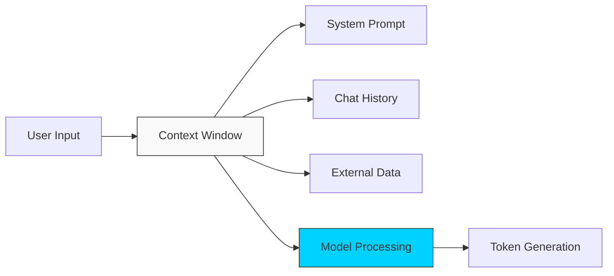

# 🟢 Part 1: The AI Mindset

> **"Prompt Engineering is programming in plain English. The compiler is the LLM, and your words are the syntax."**

## 📖 Overview

In this part, we explore the fundamental mechanics of Large Language Models (LLMs). We move beyond simple questions and learn how to construct **Structured Prompts** using proven frameworks. We also build your professional **Prompt Toolkit**—a collection of reusable personas and instructions for daily DevOps tasks.

## Core Concept: Tokens & Probabilities
**[REFERENCE: LLM Architecture](../reference/llm-architecture-internals-ref.md)**

LLMs do not understand English; they understand **Tokens**.
- **Tokenization**: "DevOps" becomes two integers (e.g., `4521`, `9912`).
- **Probabilistic Nature**: The model predicts the *next likely token*. It does not "Know" facts; it knows "Correlations".
- **Implication**: This is why simple prompts fail on math. They are predicting text patterns, not calculating.

> See **[LLM-Architecture-Internals-Ref.md](../reference/llm-architecture-internals-ref.md)** for the visualizing the Transformer Attention mechanism.

---

## 🧠 The Context Window

---

## 🎯 Learning Objectives

By the end of this part, you will:

- ✅ Understand **Tokenization** and Context Windows.
- ✅ Master the **Role-Task-Format** prompting strategy.
- ✅ Differentiate between **Zero-Shot** and **Few-Shot** prompting.
- ✅ Build a library of **System Prompts** for Linux, Python, and Cloud tasks.

---

## 🗺️ Included Modules

1. **[01-Foundations-and-Mental-Models](./01-foundations-and-mental-models/readme.md)**: How LLMs "think" (probabilities) and how to guide them.
2. **[02-Prompt-Toolkit](./02-prompt-toolkit/readme.md)**: Your personal library of high-fidelity prompts.

---

## 🎓 Career Readiness

**Interview Question:** "What is the difference between a System Prompt and a User Prompt?"

**Strong Answer:** "The **System Prompt** sets the behavior, tone, and constraints of the AI (e.g., 'You represent a Senior Systems Engineer. Be concise and prefer Bash one-liners.'). The **User Prompt** is the specific request or task (e.g., 'Write a script to backup MySQL'). The System Prompt persists and guides *how* the User Prompt is answered."

---

**Next Step**: Start with **[01-Foundations-and-Mental-Models](./01-foundations-and-mental-models/readme.md)** 🚀
