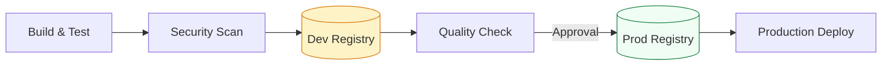

# 📦 Artifact Registry Management: The Secure Warehouse

> **"Code is the blueprint; the artifact is the brick. You don't store your bricks in the architect's office (Git); you store them in a climate-controlled, versioned warehouse (Registry)."**

---

## 🧠 The Mental Model: The Secure Warehouse

**The Junior Struggle**: Storing `.jar` files or Docker images in Git. This makes the Git repository massive, slow to clone, and provides zero metadata or security scanning.

**The Engineer Solution**: Use a **Dedicated Binary Repository**.

Think of an Artifact Registry like a **Quality-Controlled Warehouse**:
1.  **The Intake (Scanning)**: Every crate that enters is checked for contraband (Vulnerabilities/CVEs). If it's dangerous, it's rejected at the door.
2.  **The Label (Versioning)**: Every crate is given a permanent, unchangeable ID (SHA/Version). You never "overwrite" a crate; you add a new one.
3.  **The Climate Control (Retention)**: The warehouse doesn't keep every brick forever. Old, unused bricks (Snapshot/Dev builds) are automatically recycled after 30 days to save space.

---

### 🎨 Visual: Artifact Promotion Flow

---

## 🆚 Junior Way vs. Engineer Way

| Feature | The Junior Way (Problematic) | The Engineer Way (Production-ready) |
|:---|:---|:---|
| **Storage** | Git (Repo bloat) | **Artifact Registry** (Fast, scalable) |
| **Versioning** | `app_v1_final_v2_fix.zip` | Semantic Versioning (`1.4.2`) |
| **Immutability** | Overwriting `latest` tags | Unique tags + Checksum validation |
| **Security** | "Hope it's safe" | Automated **CVE Scanning** (Snyk/Xray) |
| **Cleanup** | Manual deletion (when disk is full) | Automated **Retention Policies** |
| **Source** | Public registries (Risky) | **Proxy Repositories** (Vetted/Cached) |

---

## 🛡️ The "Chain of Trust": Checksums & Signatures

In a professional environment, pulling a file isn't enough; you must prove it hasn't been tampered with.

1.  **Checksums (SHA256)**: Every artifact has a mathematical "fingerprint." When you download it, you verify the print match.
2.  **Signing (Cosign/GPG)**: We "sign" the artifact using a private key. The deployment server checks the signature to ensure the artifact truly came from *our* pipeline, not a hacker.

---

## 🎤 Interview Preparation

### 🎯 Core Concepts
1. **Q: Why should we never store binaries (.exe, .jar, .zip) in a Git repository?**
   - *A: Git is designed for text/source code. Binaries make repo sizes explode, make clones take hours, and Git cannot "diff" binary changes, making versioning useless and bloated.*

2. **Q: What is "Artifact Immutability" and why is it critical?**
   - *A: It means once a version (e.g., `v2.1.0`) is pushed, it can never be changed. If a bug is found, you push `v2.1.1`. This ensures that if you roll back to a specific version, you are getting the *exact* same bits that were tested previously.*

3. **Q: What is a "Retention Policy" in the context of a registry?**
   - *A: A set of rules that automatically deletes old or unused artifacts (e.g., "Delete all dev builds older than 14 days"). This prevents storage costs from spiraling out of control while keeping critical production releases safe.*

### 🚀 Advanced Questions
4. **Q: Explain the difference between a "Proxy" and a "Hosted" repository.**
   - *A: A **Hosted** repository is where YOU upload your company's private code. A **Proxy** repository acts as a middle-man for public sites (like npmjs.com), caching external packages to speed up builds and provide safety if the public site goes down.*

5. **Q: How do Artifact Registries improve security in a pipeline?**
   - *A: Most enterprise registries (JFrog, Nexus, ECR) have built-in **Vulnerability Scanning**. They automatically check every uploaded layer for known CVEs and can "block" a deployment if a high-severity security hole is detected.*

---

## 📝 Knowledge Check

1. **Which registry is most common for storing Docker Images in AWS?**
   - [ ] a) AWS S3
   - [x] b) AWS ECR (Elastic Container Registry)
   - [ ] c) AWS EBS

2. **True/False: Rolling back a deployment is faster using an Artifact Registry than re-building from Git.**
   - [x] **True**. You simply pull the previous pre-built binary instead of waiting for a 10-minute compile.

3. **What is the standard tool for uploading Python packages to a registry?**
   - [x] `twine`.

---

## 🎯 Next Steps
*   **[CHALLENGES](./challenges.md)**: Practice local artifact management.
*   **[Container Orchestration](../../02-container-orchestration/readme.md)**: Learning to package your artifacts into Docker.
