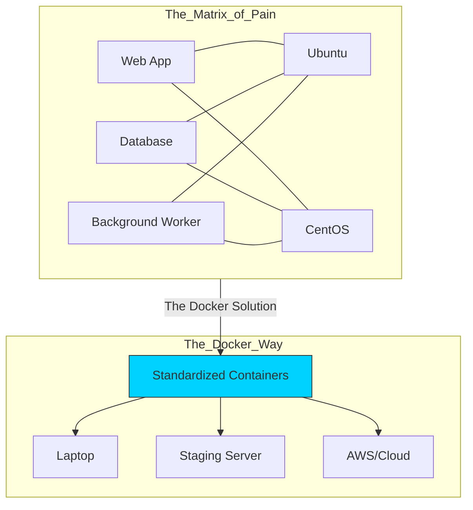
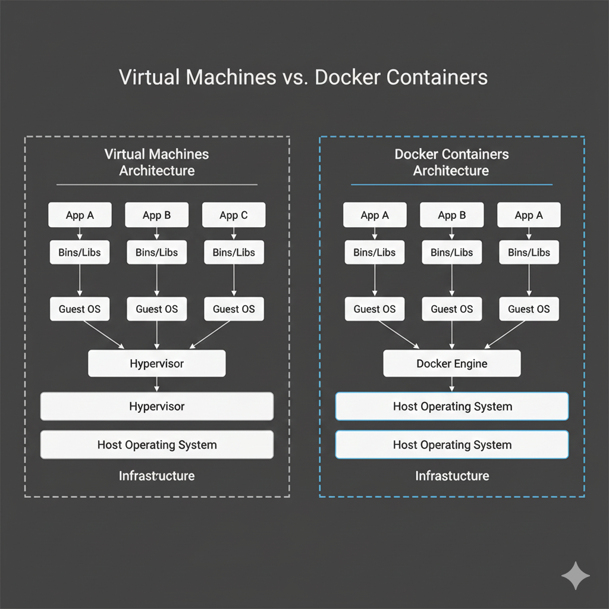
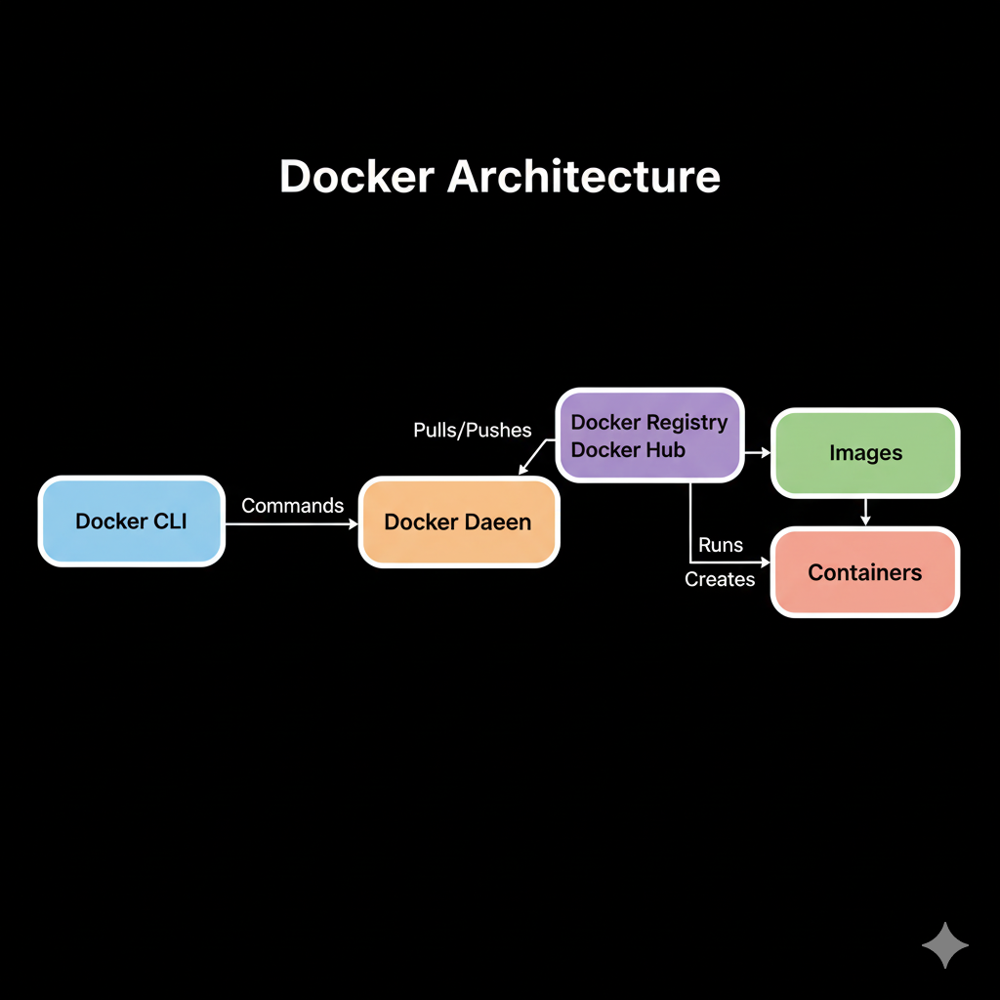
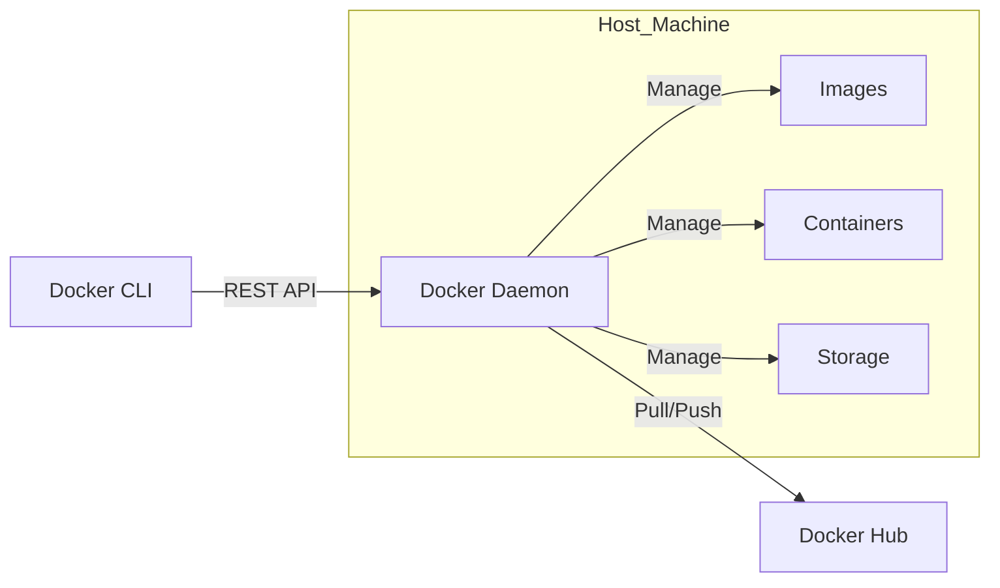

# 🐳 Module 01: Introduction to Docker & Containerization

> **"In the old world, we shipped the code and hoped for the best. In the container world, we ship the entire environment and know it will work."**



## 📚 Overview

Before Docker, the biggest challenge in DevOps was **Environment Drift**. A script that worked on a developer's laptop might fail in production because of a slightly different version of Python, a missing library, or an OS security patch.

**Docker** solves this by using "Containerization"—a way to bundle your code, libraries, and configuration into a single, immutable package that runs exactly the same way on any machine.

## 🎓 Learning Objectives

By the end of this module, you will:

- ✅ Define **Containerization** and its advantages over Virtualization.
- ✅ Understand the **Docker Architecture** (Daemon, Client, Images, and Containers).
- ✅ Install Docker on your local environment.
- ✅ Run your first containerized web server.
- ✅ Internalize the **"Immutable Infrastructure"** philosophy.

---

## 🏗️ Docker vs. Virtual Machines

The key difference lies in the **Kernel**. While VMs virtualize the entire hardware (including a heavy Guest OS), containers virtualize the **Operating System**.



| Feature | Virtual Machines (VMs) | Docker Containers |
| :--- | :--- | :--- |
| **Guest OS** | Full OS (e.g., 2GB Windows/Linux) | None (Shared Host Kernel) |
| **Size** | Gigabytes | Megabytes |
| **Boot Time** | Minutes | Milliseconds |
| **Efficiency** | High Overhead | Near-native performance |
| **Isolation** | Hardware-level (Hypervisor) | OS-level (Namespaces/Cgroups) |

---

## 🧩 The Docker Architecture

Docker follows a **Client-Server** pattern. You (the user) talk to the **Client**, which sends commands to the **Daemon** (the engine behind the scenes).





### The Big Four Components

1. **The Daemon**: The persistent background process that manages all Docker objects.
2. **The Images**: Read-only blueprints for your application. They are built in "layers."
3. **The Containers**: Runnable instances of an image. If the image is a recipe, the container is the cake.
4. **The Registry**: A library of images (like Docker Hub or Azure Container Registry).

---

## 🛠️ Installation & Setup

### Windows & macOS

The easiest way to start is with **Docker Desktop**.

1. Download at [docker.com/products/docker-desktop](https://www.docker.com/products/docker-desktop).
2. **Windows Tip**: Ensure "WSL 2" is enabled for maximum performance.

### Linux (Ubuntu Quick-Install)

```bash
# Update and install Docker
sudo apt update && sudo apt install -y docker.io
# Start and enable the service
sudo systemctl start docker
sudo systemctl enable docker
# Permission fix (avoiding sudo every time)
sudo usermod -aG docker $USER
```

*Note: You may need to log out and back in for the permission change to take effect.*

---

## 🚀 Professional Pattern: Immutable Infrastructure

In the past, engineers would log into a server and manually update packages. Over time, every server became a unique "Snowflake"—impossible to replicate.

Docker introduces **Immutable Infrastructure**:

1. You **never** update a running container.
2. Instead, you update the **Dockerfile**.
3. You build a **new image**.
4. You destroy the old container and start a new one.

This ensures that your environment is always predictable, testable, and version-controlled.

---

## 🏆 Real-World DevOps Story: The Ghost of Python 3.7

**The Scenario**: A financial company was deploying a critical update. It worked perfectly in the "Staging" environment but immediately crashed in "Production," losing $10,000 every minute it was down.
**The Discovery**: After 2 hours of panic, they found the culprit. Staging had Python 3.7.4 installed, while Production had Python 3.7.2. A tiny bug in how the `.sort()` function handled memory in the older version caused the crash.
**The Fix**: They moved the app to Docker. By bundling Python 3.7.4 *inside* the image, they ensured that wherever the image ran, it would use the exact same version.
**The Lesson**: **"It works on my machine" is an unacceptable excuse in modern DevOps.** If it works in Docker, it works everywhere.

---

## ❓ Interview Preparation (Introduction)

1. **Q: How does a Docker container stay so lightweight compared to a VM?**
   *A: Containers do not include a Guest OS. They leverage the host's kernel and use 'Namespaces' and 'Control Groups' (Cgroups) to isolate processes and resources, removing the overhead of hardware virtualization.*

2. **Q: What is the 'Docker Daemon' and what is its role?**
   *A: The Docker Daemon (`dockerd`) is the background service that manages Docker objects such as images, containers, networks, and volumes. It listens to Docker API requests from the CLI client.*

3. **Q: What happens when you run `docker run hello-world` for the first time?**
   *A: The client talks to the daemon. The daemon checks if the image exists locally. Since it doesn't, it pulls it from Docker Hub. It then creates a container from that image, runs it, and streams the output to your terminal.*

4. **Q: Can a Docker container run a Windows application on a Linux host?**
   *A: Generally, no. Containers share the host OS kernel. A Linux container needs a Linux kernel, and a Windows container needs a Windows kernel. However, tools like Docker Desktop use lightweight VMs (like WSL 2) to bridge this gap.*

5. **Q: Why are Docker images called 'Immutable'?**
   *A: Once an image is built, it cannot be changed. If you need to make a change, you create a new version of the image. This ensures consistency across all deployment environments.*

---

## 📝 Knowledge Check

1. **Which component is responsible for managing images and containers on the host?**
   - [ ] a) Docker Client
   - [x] b) Docker Daemon
   - [ ] c) Docker Hub

2. **What technology do containers share with the host machine?**
   - [ ] a) Hardware only
   - [ ] b) The entire Operating System
   - [x] c) The OS Kernel

3. **Which command is used to check the Docker version and health?**
   - [x] a) `docker info`
   - [ ] b) `docker status`
   - [ ] c) `docker check`

4. **In the "Recipe vs. Cake" analogy, the Image is the...**
   - [x] a) Recipe
   - [ ] b) Cake
   - [ ] c) Oven

5. **True or False: You should log into a production container to fix bugs.**
   - [ ] True
   - [x] False (Follow the Immutable Infrastructure pattern)

---

## 🔗 Next Steps

The engine is running. Now let's look at the cargo.

Proceed to: **[Module 02: Images & Containers](../02-images-and-containers/readme.md)** →
