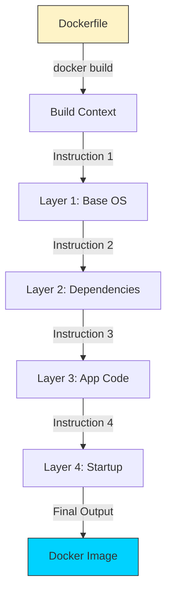

# 📜 Module 03: Dockerfile Basics

> **"If an image is a recipe, the Dockerfile is the chef's precise instructions. It describes exactly what goes into the kitchen and how it's prepared."**



## 📚 Overview

A **Dockerfile** is the "Source Code" of your infrastructure. Instead of manually installing libraries on a server, you write them into this text file. Docker then reads this file to build an image automatically. This ensures that everyone—from developers to the CI/CD pipeline—is using the **exact same** environment.

## 🎓 Learning Objectives

By the end of this module, you will:
- ✅ Master the Core Instructions (`FROM`, `RUN`, `COPY`, `CMD`).
- ✅ Understand **Layer Caching** and build optimization.
- ✅ Differentiate between **`CMD`** and **`ENTRYPOINT`**.
- ✅ Use **`.dockerignore`** to keep images clean and secure.
- ✅ Build a production-ready Python/Node.js image.

---

## 🏗️ The Core Instructions

A Dockerfile follows a simple `INSTRUCTION argument` format.

| Instruction | Purpose                                                 | DevOps Tip                                                     |
| :---------- | :------------------------------------------------------ | :------------------------------------------------------------- |
| `FROM`      | Sets the base image (e.g., `ubuntu`, `python:3.9-slim`) | Always use specific versions, never `latest`.                  |
| `RUN`       | Executes commands during the build (installs software)  | Use `&& \` to combine commands and reduce layers.              |
| `COPY`      | Moves files from your laptop into the image             | Use `.dockerignore` to avoid copying `.git` or `node_modules`. |
| `WORKDIR`   | Sets the "Current Directory" for the app                | Avoid using absolute paths (like `/var/www/html`) repeatedly.  |
| `CMD`       | The default command that runs when a container starts   | There can only be **one** CMD per Dockerfile.                  |

---

## 🚀 Build Optimization: Harnessing the Cache

Docker is smart. It only rebuilds the layers that have changed. To speed up your builds, you should put the things that **change the least** at the top.

### The "COPY" Pattern
**Best Practice**:
```dockerfile
COPY package.json .
RUN npm install
COPY . .
```
*Result: Docker caches the `npm install` layer. It only reruns if you change your `package.json` file.*

---

## 🆚 Junior Way vs. Engineer Way

| Feature | The Junior Way (Problematic) | The Engineer Way (Production-ready) |
|:---|:---|:---|
| **Base Image** | `FROM ubuntu:latest` (Huge) | `FROM alpine` / `slim` (Tiny) |
| **Updates** | `RUN apt update` in separate layer | `RUN apt update && apt install...` |
| **Source** | `COPY . .` (Includes `.git`, etc) | Uses `.dockerignore` for clean builds |
| **Ordering** | Copies code before installing deps | Installs deps first to leverage caching |
| **User** | Running as `root` (Dangerous) | Creating and switching to `non-root` |
| **Multi-Stage**| One giant image with build tools | Multi-stage: Build tools stay in Stage 1 |

---

## 🏗️ The Multi-Stage Build: The Production Gold Standard

As seen in the real-world story, image size is critical. Multi-stage builds allow you to use a "Heavy" image (with compilers, git, and dev tools) to build your app, and then "copy" the finished binary into a "Lightweight" image for production.

**Example (Golang)**:
```dockerfile
# Stage 1: The Builder
FROM golang:1.21-alpine AS builder
WORKDIR /build
COPY . .
RUN go build -o myapp main.go

# Stage 2: The Production Image
FROM alpine:latest
WORKDIR /root/
# Copy ONLY the binary from the builder stage
COPY --from=builder /build/myapp .
CMD ["./myapp"]
```
*Result*: Your image goes from 800MB (Go SDK) to 15MB (Alpine + Binary).

---

## ❓ Interview Preparation (Dockerfile)

### 🎯 Core Concepts
1. **Q: What is the difference between `RUN`, `CMD`, and `ENTRYPOINT`?**
   - *A: `RUN` happens during the build (it adds a layer). `CMD` is the default command when the container starts but can be overridden. `ENTRYPOINT` is the main command that is always executed, often used for containers acting as CLI tools.*

2. **Q: Why should you combine multiple `RUN` commands with `&&`?**
   - *A: Every `RUN` command creates a new layer. Combining them reduces the total layer count, keeping the image size smaller and the metadata cleaner.*

3. **Q: What is the 'Build Context'?**
   - *A: It's the set of files available to the Docker daemon during `docker build`. When you run `docker build .`, the current directory is the context. Using `.dockerignore` prevents bloating this context.*

### 🚀 Advanced Questions
4. **Q: How does Docker's Layer Caching work?**
   - *A: Docker caches the result of each instruction. If an instruction (like `COPY package.json`) and its previous instructions haven't changed, Docker reuses the layer. If one layer changes, all subsequent layers are invalidated.*

5. **Q: What is the difference between `ADD` and `COPY`?**
   - *A: `COPY` is transparent and only copies local files. `ADD` can download files from URLs and automatically extract tarballs. In 99% of cases, `COPY` is preferred for predictability.*

6. **Q: How can you inject environment variables during the build vs. during the run?**
   - *A: Use `ARG` for build-time variables (not available in the running container) and `ENV` for variables that should persist when the container is running.*

---

## 📝 Knowledge Check

1. **Every Dockerfile (except rare cases) must start with which instruction?**
   - [ ] a) `START`
   - [x] b) `FROM`
   - [ ] c) `BASE`

2. **Which instruction is used to copy a local file into a specific image directory?**
   - [ ] a) `MOVE`
   - [x] b) `COPY`
   - [ ] c) `ADD`

3. **True/False: Using 'latest' tags in production is a best practice.**
   - [ ] True
   - [x] **False**. It leads to environment drift when the tag is updated.

4. **Which instruction sets the default directory for all subsequent commands?**
   - [x] `WORKDIR`

5. **Where do you define build-time variables that aren't needed in production?**
   - [x] `ARG`

---

## 🎯 Next Steps

The Chef has a recipe. Now let's learn how to fix the kitchen when things go wrong.

Proceed to: **[Module 04: Troubleshooting & Debugging](../04-debugging/readme.md)** →
