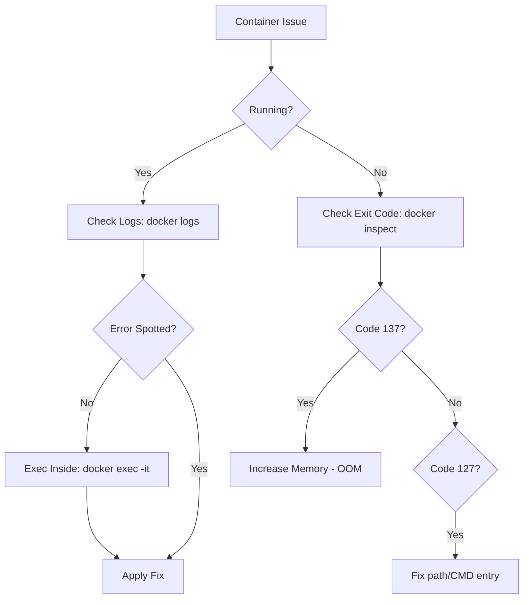

# 🔍 Module 04: Troubleshooting & Debugging

> **"If it's running, it's a living system. If it's stopped, it's a crime scene. Your job is to find the perpetrator between the configuration and the code."**



## 📚 Overview

Containers are isolated black boxes. When things go wrong, you can't just "look" at the screen. You need to use Docker's diagnostic tools to peer inside the namespaces. This module teaches you the systematic "Diagnostic Loop" used by SREs to resolve production outages.

## 🎓 Learning Objectives

By the end of this module, you will:
- ✅ Master the **"Big Four"** diagnostic commands.
- ✅ Decode the secret language of **Exit Codes**.
- ✅ Perform **Interactive Surgery** on running containers.
- ✅ Debug networking issues using **Log Interrogation**.
- ✅ Implement **Health Checks** to prevent "Zombies."

---

## 🛠️ The "Big Four" Diagnostic Tools

| Command | Real-World Use Case |
| :--- | :--- |
| **`docker logs -f`** | Following the "heartbeat" of your app in real-time. |
| **`docker inspect`** | Finding the "Hidden" IP address or environment variables. |
| **`docker stats`** | Identifying "Resource Hogs" that are eating your RAM/CPU. |
| **`docker exec`** | Logged-in exploration to verify files or database connectivity. |

---

## 🚨 Decoding the Rosetta Stone: Exit Codes

When a container dies, it leaves behind a single number. This number tells you everything you need to know.

- **Exit Code 0**: Success. The task finished (e.g., a backup script).
- **Exit Code 1**: General Application Error. The code crashed (Check your Python/JS/Java logs).
- **Exit Code 127**: Command Not Found. You tried to run `python3` but the image only has `python`.
- **Exit Code 137 (SIGKILL)**: **The OOM Killer**. The host server killed the container because it used too much RAM.
- **Exit Code 139 (Segfault)**: Low-level memory error (usually a bug in a C-library or driver).

---

## 🚀 Interactive Surgery

If `docker logs` doesn't show the error, you need to go inside.

### Scenario A: The App is Running but broken
```bash
docker exec -it my-app sh
# Now you are inside! Use 'ls', 'env', or 'ping' to diagnose.
```

### Scenario B: The App crashes immediately
You can't use `exec` on a stopped container. Instead, override the entrypoint:
```bash
docker run --rm -it --entrypoint sh my-buggy-image
# This starts the container into a shell INSTEAD of running the app.
```

---

## 🏆 Real-World DevOps Story: The Ghost of Localhost

**The Scenario**: A developer built a Flask API. On their laptop, it worked. Inside Docker, they ran: `docker run -p 5000:5000 my-api`. The container said "Running on http://127.0.0.1:5000", but when the developer visited that URL, they got "Connection Refused."
**The Discovery**: The app was configured to listen on `127.0.0.1` (Localhost). Inside a container, `localhost` means **"only me."** It does not listen to the outside world (the Docker bridge).
**The Fix**: The developer changed the app config to listen on **`0.0.0.0`** (All Interfaces).
**The Lesson**: **Inside a container, 0.0.0.0 is your best friend.** Localhost is for loners.

---

## 🚀 Professional Pattern: Standard Streams

In the VM world, we used to write logs to `/var/log/myapp.log`. In the Docker world, this is a **Anti-Pattern**.

**Why?**
1.  **Visibility**: `docker logs` can only see things written to `stdout` and `stderr`.
2.  **Storage**: Logs inside a container eat up the thin writable layer and can crash the host.

**The Pro Way**: Configure your application to log directly to the terminal (Console). Docker will capture these and allow you to ship them to ELK, Splunk, or CloudWatch effortlessly.

---

## ❓ Interview Preparation (Debugging)

1. **Q: How do you check the CPU usage of all running containers at once?**
   *A: Use the `docker stats` command. It provide a live, real-time stream of CPU, Memory, and I/O usage for every active container.*

2. **Q: A container is stuck in a 'Restart Loop'. How do you find the cause?**
   *A: First, run `docker ps -a` to see the exit code. Then, run `docker logs --timestamps <id>` to see exactly what the app was doing right before the crash.*

3. **Q: What is the difference between `docker stop` and `docker kill`?**
   *A: `stop` sends a SIGTERM, giving the app time to finish current tasks and shut down gracefully. `kill` sends a SIGKILL, which terminates the process immediately (use this as a last resort).*

4. **Q: How can you find the Internal IP address of a container?**
   *A: Use `docker inspect <id>`. You can filter the results for just the IP using a Go-template: `docker inspect -f '{{.NetworkSettings.IPAddress}}' <id>`.*

5. **Q: Why is 'Exit Code 137' so common in cloud environments?**
   *A: Cloud providers often set strict memory limits on containers. If an app has a memory leak, it grows until the host's OOM (Out of Memory) Killer terminates it with code 137.*

---

## 📝 Knowledge Check

1. **Which command allows you to view the application output in real-time?**
   - [ ] a) `docker view`
   - [x] b) `docker logs -f`
   - [ ] c) `docker cat`

2. **What does Exit Code 127 mean?**
   - [ ] a) Success
   - [ ] b) Out of Memory
   - [x] c) Command Not Found

3. **Which tool would you use to find the specific environment variables a container is using?**
   - [ ] a) `docker ps`
   - [x] b) `docker inspect`
   - [ ] c) `docker top`

4. **True or False: If a container is stopped, you can still use `docker exec` on it.**
   - [ ] True
   - [x] False (It must be running)

5. **What is the best IP address for an application to listen on inside Docker?**
   - [ ] a) `127.0.0.1`
   - [x] b) `0.0.0.0`
   - [ ] c) `192.168.1.1`

---

## 🔗 Next Steps

The kitchen is fixed. Now let's build something massive.

Proceed to: **[Part 2: Orchestration & Architecture](../../../part-02-orchestration-and-architecture/readme.md)** →