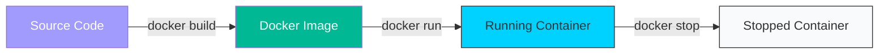

# 🟢 Part 1: Docker Fundamentals

> **"A house is only as strong as its bricks. Docker Images are the bricks of the cloud."**

## 📖 Overview

In this part, we strip away the complexity and focus on the core unit of modern infrastructure: **The Container**. We will learn how to build images, manage the container lifecycle, and write efficient `Dockerfile`s.

---

## 🏗️ The Container Lifecycle

---

## 🎯 Learning Objectives

- ✅ **Build**: Creating images from `Dockerfile`s.
- ✅ **Ship**: Pushing images to a Registry (Docker Hub).
- ✅ **Run**: Managing the container lifecycle (start, stop, logs, exec).
- ✅ **Debug**: Inspecting containers when they fail to start.

---

1. **[01-Docker-Basics](./01-docker-basics/readme.md)**: Introduction to the Docker CLI and Architecture.

---

## 💼 Career Impact: Why this matters

Docker is the **Base Language** of modern DevOps. By mastering this part, you move away from being a "Script Runner" and become a "System Architect."

- **Salary Boost**: Jobs requiring Docker pay on average 20-30% more than standard SysAdmin roles.
- **Portability**: You can now move apps between AWS, Azure, and Google Cloud with almost zero code changes.
- **Speed**: You will be able to set up complex development environments in seconds, not hours.

---

**Next Step**: Build your first container in **[01-Docker-Basics](./01-docker-basics/readme.md)** 🚀
