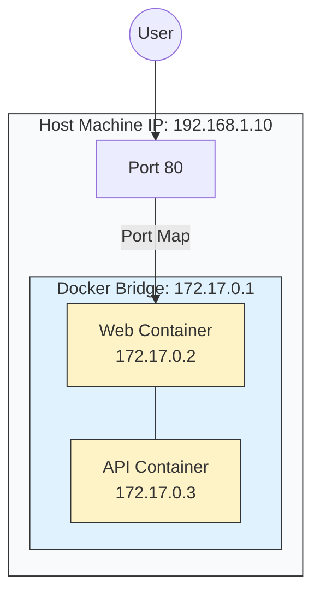

# 🌐 Module 08: Docker Networking

> **"If containers are islands, then networks are the bridges, tunnels, and ferries that allow them to trade data. A container without a network is a library with no doors."**



## 📚 Overview

How does Container A talk to Container B? How do you access a website inside a container from your laptop? Docker Networking is the "Traffic Control" of your dev environment. This module breaks down how Docker creates virtual networks, manages DNS, and secures your services from the public internet.

## 🎓 Learning Objectives

By the end of this module, you will:
- ✅ Differentiate between **Bridge, Host, and None** network drivers.
- ✅ Master **Service Discovery** (Why you should never use IP addresses).
- ✅ Create **Custom Bridge Networks** for isolated application stacks.
- ✅ Implement **Multi-Tier Isolation** (Web vs. Database tiers).
- ✅ Debug connectivity using **`docker network inspect`**.

---

## 🏗️ The Driver Landscape

| Driver | Use Case | DevOps Analogy |
| :--- | :--- | :--- |
| **`bridge`** (Default) | Standard apps on one machine. | A private Wi-Fi network for your containers. |
| **`host`** | High-perf apps (VoIP, High-speed data). | Removing the router and plugging directly into the wall. |
| **`overlay`** | Swarm / Multi-host apps. | A VPN that connects islands across the ocean. |
| **`none`** | Air-gapped / High-security tasks. | A vault with no internet or phone line. |

---

## 🚀 Professional Pattern: IP is Dead, DNS is King

In a traditional server environment, you might configure an app with `DB_URL=192.168.1.50`. **In Docker, this is an Anti-Pattern.**

Containers are ephemeral; they get a new IP address every time they restart. 

**The Solution**: Docker provides an embedded DNS server. If your database container is named `db`, any other container on the same network can just use `db` as the hostname.
```bash
# Instead of this:
ping 172.17.0.3
# Use this:
ping db
```

---

## 🛡️ Multi-Tier Isolation: The "Forbidden Bridge"

In a secure environment, your Database should **never** be on the same network as the Public.

1.  **Public Network**: Contains the Web Server and the Backend.
2.  **Private Network**: Contains the Backend and the Database.

**Result**: The Web Server can talk to the Backend, but it has **no physical way** to talk to the Database. If the Web Server is hacked, the Database remains safe behind the "Backend" gatekeeper.

---

## 🏆 Real-World DevOps Story: The Microservice That Could Only See Itself

**The Scenario**: A developer launched three microservices using the default Docker bridge. They tried to make a request from `auth-service` to `user-service` but kept getting "Host Not Found."
**The Discovery**: They were using the **Default Bridge**. On the default bridge, containers can talk to each other but there is **no automatic DNS**. Service A cannot "see" Service B by name.
**The Fix**: The developer created a **Custom User-Defined Bridge**. 
```bash
docker network create my-app-net
docker run --network my-app-net --name auth ...
docker run --network my-app-net --name user ...
```
**The Lesson**: **Always use User-Defined Networks.** They are faster, more secure, and provide the DNS "magic" that makes microservices work.

---

## ❓ Interview Preparation (Networking)

1. **Q: What is the main drawback of the default 'bridge' network compared to a custom one?**
   *A: The default bridge does not support automatic DNS resolution. Containers must either use legacy '--link' flags or communicate via hardcoded IP addresses, which is fragile and not scalable.*

2. **Q: How does the '--network host' option affect port mapping (`-p`)?**
   *A: When using host networking, the `-p` flag is ignored. The container uses the host's actual IP and ports. If Nginx is running inside the container on port 80, it is immediately accessible on the host's port 80.*

3. **Q: Why would you use the 'None' network driver?**
   *A: For batch processing jobs that handle sensitive data and do not need any external communication. It provides the highest level of network isolation possible.*

4. **Q: What is 'Port Publishing' vs 'Port Exposure'?**
   *A: 'Expose' is just documentation in a Dockerfile. 'Publish' (the `-p` flag) actually opens a door in the host's firewall and directs traffic into the container.*

5. **Q: Can a single container be connected to two networks at the same time?**
   *A: Yes. This is exactly how 'Dual-Homing' or 'Gateway' containers work. They act as a bridge between a public network and a secure private network.*

---

## 📝 Knowledge Check

1. **What is the IP address of the embedded Docker DNS server?**
   - [ ] a) `8.8.8.8`
   - [ ] b) `192.168.1.1`
   - [x] c) `127.0.0.11`

2. **Which command shows you all the containers currently attached to a network?**
   - [ ] a) `docker network show`
   - [x] b) `docker network inspect`
   - [ ] c) `docker network ps`

3. **Which network driver provides the best performance by removing the 'Bridge' overhead?**
   - [ ] a) `bridge`
   - [x] b) `host`
   - [ ] c) `macvlan`

4. **True or False: Containers on different networks can talk to each other by default.**
   - [ ] True
   - [x] False (They are completely isolated)

5. **Which flag allows you to give a container a nickname on the network?**
   - [ ] a) `--name`
   - [x] b) `--network-alias`
   - [ ] c) `--dns-nick`

---

## 🔗 Next Steps

The bridges are built. Now let's learn how to ship our finished images to a global warehouse.

Proceed to: **[Module 02: Docker Volumes](../02-docker-volumes/readme.md)** →