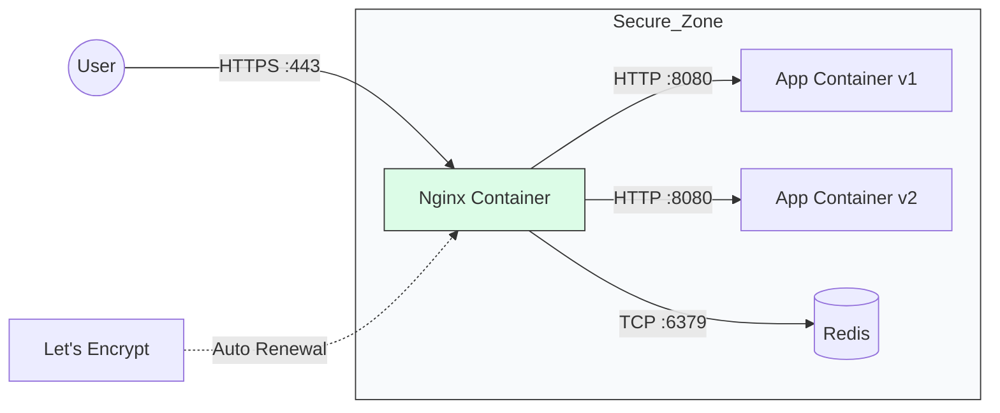

# 🛡️ Module 11: Nginx Reverse Proxy & SSL

> **"Your application should focus on logic. Nginx should focus on the traffic. It is the shield that terminates SSL, balances the load, and keeps your backend safe from the storm of the public internet."**



## 📚 Overview

Why do we put Nginx in front of our apps? It’s because individual app servers (like Flask, Node.js, or Go) aren’t designed to handle thousands of concurrent SSL connections or complex URL routing. **Nginx** acts as a "Reverse Proxy," sitting at the edge of your Docker network, decrypting HTTPS traffic, and passing simple HTTP requests to your internal containers.

## 🎓 Learning Objectives

By the end of this module, you will:
- ✅ Configure Nginx as a **Reverse Proxy** using container names.
- ✅ Implement **SSL Termination** using Let’s Encrypt and Certbot.
- ✅ Set up a **Sidecar Pattern** for automatic certificate renewal.
- ✅ Harden Nginx with **Security Headers** (HSTS, CSP).
- ✅ Manage **Load Balancing** between multiple app containers.

---

## 🏗️ The Reverse Proxy Pattern

Instead of exposing your App container directly to port 80, you expose Nginx on port 80/443 and let it route traffic internally.

**Sample `nginx.conf`**:
```nginx
server {
    listen 80;
    server_name myapp.com;

    location / {
        proxy_pass http://backend-app:8080; # 'backend-app' is the Docker service name
        proxy_set_header Host $host;
        proxy_set_header X-Real-IP $remote_addr;
    }
}
```

---

## 🔐 The SSL Automation (Certbot Sidecar)

In a Docker world, we don't manually renew certificates. We use a **Certbot Sidecar** that shares a volume with Nginx.

```yaml
services:
  nginx:
    image: nginx:alpine
    volumes:
      - ./nginx.conf:/etc/nginx/nginx.conf:ro
      - cert-data:/etc/letsencrypt # Shared volume

  certbot:
    image: certbot/certbot
    volumes:
      - cert-data:/etc/letsencrypt
    entrypoint: "/bin/sh -c 'trap exit TERM; while :; do certbot renew; sleep 12h & wait $${!}; done;'"
```
*This configuration checks for certificate renewals every 12 hours automatically.*

---

## 🏆 Real-World DevOps Story: The Clear-Text Catastrophe

**The Scenario**: A startup launched a medical app. To save time, they didn't use a reverse proxy; they just ran their Node.js app on port 80.
**The Crisis**: A security audit found that all patient data was being sent in "Clear Text" over the internet. Any hacker on a public Wi-Fi could see the patient records.
**The Fix**: The team spent 30 minutes adding an **Nginx container** with Let's Encrypt. 
**The Discovery**: They also found that Nginx handled "Gzip Compression" much better than Node.js, making the app feel 40% faster for users on slow connections.
**The Lesson**: **Never expose your application code directly to the internet.** Use Nginx as a professional gateway for security *and* performance.

---

## 🚀 Professional Pattern: HSTS & Hardening

Don't just provide SSL; enforce it. **HSTS (HTTP Strict Transport Security)** tells the browser to *never* even try to connect via HTTP for the next year.

**Add this to your Nginx Config**:
```nginx
add_header Strict-Transport-Security "max-age=31536000; includeSubDomains" always;
add_header X-Frame-Options "SAMEORIGIN";
add_header X-Content-Type-Options "nosniff";
```
*This makes your containerized app instantly comply with enterprise security standards.*

---

## ❓ Interview Preparation (Nginx & SSL)

1. **Q: What is 'SSL Termination' and why do we do it at the Proxy level?**
   *A: SSL Termination is the process of decrypting HTTPS traffic at the Nginx level. We do this so the internal backend apps don't have to waste CPU cycles on encryption/decryption, and it allows us to manage all certificates in one central place.*

2. **Q: How does Nginx "know" where the Backend container is if its IP changes?**
   *A: Docker provides an internal DNS resolver. When Nginx looks for 'http://backend-app', Docker resolves it to the correct internal container IP automatically.*

3. **Q: What is a 'Sidecar Container'?**
   *A: It's a design pattern where an auxiliary container (like Certbot) runs alongside a main container (like Nginx) to provide a specific helper function (like certificate management) without bloating the main container.*

4. **Q: Why would you use Nginx for 'Static File Serving' instead of letting your app handle it?**
   *A: Nginx is written in C and is incredibly optimized for sending files from disk to the network. It can serve thousands of images or CSS files with negligible RAM usage, whereas an app server like Python or Node would be much slower and more resource-heavy.*

5. **Q: Explain the 'Upstream' directive in Nginx.**
   *A: The `upstream` block defines a group of servers that Nginx can load balance between. You can list multiple container names, and Nginx will distribute traffic between them (e.g., using Round Robin or Least Connections).*

---

## 📝 Knowledge Check

1. **Which Nginx directive is used to forward requests to a backend container?**
   - [ ] a) `proxy_forward`
   - [x] b) `proxy_pass`
   - [ ] c) `route_to`

2. **What is the standard port for HTTPS traffic?**
   - [ ] a) 80
   - [ ] b) 8080
   - [x] c) 443

3. **Why do we use the `:ro` flag when mounting Nginx config files?**
   - [x] a) To prevent the container from modifying our host configuration
   - [ ] b) To make the website load faster
   - [ ] c) To tell Certbot the file is a certificate

4. **True or False: In a Docker Compose network, Nginx can reach a database container even if the database has no 'ports' exposed to the host.**
   - [x] True (Internal communication doesn't need host port mapping)
   - [ ] False

5. **Which tool is commonly used inside a sidecar container to manage Let's Encrypt certificates?**
   - [ ] a) OpenSSL
   - [ ] b) Nginx-SSL
   - [x] c) Certbot

---

## 🔗 Next Steps

The gateway is secure. Now let's learn how to manage the "Hard Parts" of production: scaling, secrets, and high-availability.

Proceed to: **[Module 02: Docker Compose](../../02-docker-compose/readme.md)** →
