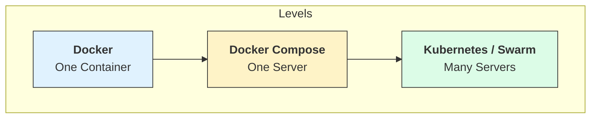

# 🏗️ Module 21: Containers Beyond Compose

> **"A single server is a pet. A cluster is a herd. Orchestration is the art of moving from taking care of individual animals to managing the whole field."**



## 📚 Overview

You have mastered Docker and Docker Compose. You can run complex, multi-container apps on your laptop or a single production server. But what happens when that server catches fire? Or what if you need 100 containers and your server only has enough RAM for 10? This is where **Orchestration** begins. This module introduces the technologies that take your Compose files and spread them across a fleet of servers for high availability and infinite scale.

## 🎓 Learning Objectives

By the end of this module, you will:

- ✅ Identify the **Limitations of Docker Compose** in enterprise settings.
- ✅ Understand the **Docker Swarm Mode** basics and its relationship to Compose.
- ✅ Explore the **Kubernetes Ecosystem** (K8s).
- ✅ Use the **`Kompose`** tool to convert YAML for Kubernetes.
- ✅ Differentiate between **Orchestrators** (Swarm, K8s, Nomad).

---

## 🛑 The Wall: Why Compose isn't enough

Docker Compose is a **Single-Host** orchestrator.
- ❌ **No High Availability**: If the host dies, everything stops.
- ❌ **No Auto-Healing**: If a container crashes because of a hardware fault, Compose can't move it to a different machine.
- ❌ **Manual Scaling**: You are limited by the RAM/CPU of one physical box.

---

## 🐝 The Next Step: Docker Swarm

Swarm is built into Docker. It uses the same `docker-compose.yml` file but adds a **`deploy`** section to manage replicas and resource limits across multiple machines.

```yaml
services:
  web:
    image: my-app:v1
    deploy:
      replicas: 5
      update_config:
        parallelism: 2
        delay: 10s
      restart_policy:
        condition: on-failure
```

---

## ☸️ The Industry Standard: Kubernetes (K8s)

Kubernetes is the "Operating System of the Data Center." It is more complex than Swarm but can manage thousands of servers.

**The Bridge: Kompose**
If you have a Compose file and want to move to Kubernetes, you can use a tool called `kompose`.
```bash
kompose convert -f docker-compose.yml
```
*This generates the 10+ manifest files needed to launch your app on a professional K8s cluster.*

---

## 🏆 Real-World DevOps Story: The Success That Broke The Computer

**The Scenario**: A mobile game went viral. The backend was running on a single massive 64-core server using Docker Compose.
**The Crisis**: The server hit its limit. They tried to buy a 128-core server, but it was on backorder for 2 weeks. The game was lagging, and users were leaving.
**The Fix**: In 24 hours, the team moved the stack to **Docker Swarm**. They added 10 smaller, cheaper servers to the cluster.
**The Discovery**: They realized that 10 small servers were actually more reliable than one "Super Server." When one small server crashed, the other 9 picked up the slack automatically. 
**The Lesson**: **Distribute or Die.** Don't put all your eggs in one container.

---

## 🚀 Professional Pattern: The "Cattle, Not Pets" Mindset

Stop naming your servers "Titan" or "Venus." Name them "node-01," "node-02," etc. 
**Orchestration** allows you to treat servers like **Cattle**—if one gets sick, you replace it with a new one without mourning. If you treat your server like a **Pet**, you'll be up all night trying to save it when it fails.

---

## ❓ Interview Preparation (Orchestration Intro)

1. **Q: What is the main difference between Docker Compose and Docker Swarm?**
   *A: Docker Compose manages containers on a single host. Docker Swarm is a clustering tool that manages containers across a 'swarm' of multiple hosts, providing high availability and load balancing at the cluster level.*

2. **Q: What is 'Self-Healing' in an orchestrator?**
   *A: It is the ability of the system to monitor the state of containers. If a container (or even the entire host) fails, the orchestrator automatically detects the failure and restarts the container on a healthy node to maintain the desired count.*

3. **Q: Why is Kubernetes more popular than Swarm despite being harder to learn?**
   *A: Kubernetes has a much larger ecosystem, better support for complex networking, and cloud-native integrations (like AWS/GCP secrets, load balancers, and storage). It is the standard for large-scale enterprise deployments.*

4. **Q: What does the 'Kompose' tool do?**
   *A: It is a conversion tool that takes a `docker-compose.yml` file and translates it into Kubernetes-compatible YAML manifests (Deployments, Services, Ingresses), lowering the barrier to entry for moving to K8s.*

5. **Q: What is a 'Desired State' in orchestration?**
   *A: You don't tell the orchestrator 'Start a container.' You tell it 'I want 5 copies of this app running at all times.' The orchestrator constantly works to ensure the 'Actual State' matches your 'Desired State'.*

---

## 📝 Knowledge Check

1. **Which tool is a single-host orchestrator?**
   - [ ] a) Kubernetes
   - [x] b) Docker Compose
   - [ ] c) Nomad

2. **What is the command to convert Compose files to Kubernetes files?**
   - [ ] a) `docker convert`
   - [ ] b) `k8s-migrate`
   - [x] c) `kompose convert`

3. **In the 'Cattle vs Pets' analogy, how should we treat production servers?**
   - [ ] a) Pets (Unique and carefully maintained)
   - [x] b) Cattle (Disposable and easily replaced)

4. **True or False: Docker Swarm is a separate software that must be installed on top of Docker.**
   - [ ] True
   - [x] False (It is built-in; just run `docker swarm init`)

5. **Which YAML key is used in Compose to define Swarm-specific deployment rules?**
   - [ ] a) `build`
   - [x] b) `deploy`
   - [ ] c) `orchestrate`

---

## 🔗 Next Steps

You have reached the end of the Docker World. You are now prepared to dive deep into the ultimate orchestrator.

Proceed to: **[Part 3: Advanced Ops & Projects](readme.md)** →
