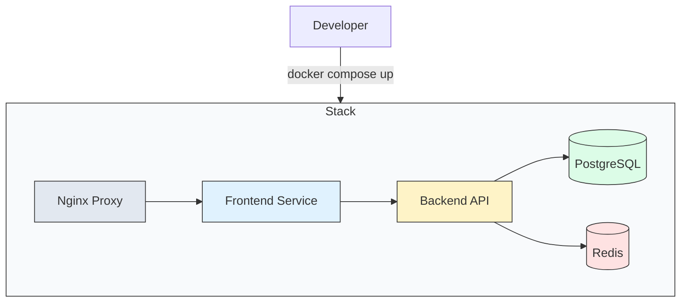

# 🎼 Module 05: Docker Compose Basics

> **"Docker runs a container. Docker Compose runs an application. It is the sheet music that tells every service exactly when to start and how to talk to its neighbors."**



## 📚 Overview

In the previous modules, we learned how to build and run **individual** containers. But modern applications are rarely just one process. They 1 are a **Stack**: a web frontend, a database, a cache, and maybe a background worker. 

**Docker Compose** is the tool that allows you to define this entire stack in a single file (`docker-compose.yml`) and start it with a single command.

## 🎓 Learning Objectives

By the end of this module, you will:
- ✅ Convert complex `docker run` commands into a clean `docker-compose.yml`.
- ✅ Understand the **Services, Networks, and Volumes** hierarchy.
- ✅ Master the lifecycle commands: `up`, `down`, `logs`, and `ps`.
- ✅ Implement **Environment Variables** using `.env` files.
- ✅ Use **`depends_on`** to control the startup order of your cluster.

---

## 🏗️ From Solo to Orchestra

### The "Matrix of Pain" (Without Compose)
To start a simple App + DB stack manually, you'd need:
1. `docker network create my-net`
2. `docker run -d --name db --network my-net -e POSTGRES_PASSWORD=sec postgres`
3. `docker run -d --name app --network my-net -p 8080:80 -e DB_URL=db my-app`

### The "Symphony" (With Compose)
One file, one command:
```bash
docker compose up -d
```

---

## 🧩 Anatomy of a `docker-compose.yml`

```yaml
services:           # 1. What are we running?
  web:
    build: .        # 2. How do we build it?
    ports:
      - "8080:80"   # 3. How do we access it?
    depends_on:
      - db          # 4. What must start first?
      
  db:
    image: postgres # 5. Use an existing image
    environment:
      - POSTGRES_PASSWORD=${DB_PASS} # 6. Use variables
```

---

## 🚀 Lifecycle Management

| Command | Action | DevOps Context |
| :--- | :--- | :--- |
| **`up -d`** | Create & Start | Deploy the entire stack in the background. |
| **`down`** | Stop & Remove | Tear down the stack including the network. |
| **`logs -f`** | Follow Logs | See the output from **all** services simultaneously. |
| **`ps`** | List Services | Verify which services are "Up" or "Exit (1)". |
| **`restart`** | Refresh | Quickly reboot all containers in the stack. |

---

## 🏆 Real-World DevOps Story: The 50-Line Shell Script

**The Scenario**: A startup had a README with 15 steps to set up their local development environment. It involved creating 3 different networks, 4 volumes, and running a shell script that was 50 lines of `docker run` commands. New developers spent a full day just getting the app to "Hello World."
**The Discovery**: One developer spent an hour converting the entire 50-line script into a single `docker-compose.yml` file. 
**The Fix**: Now, new hires simply run `git clone` and `docker compose up`. The setup time dropped from 8 hours to 2 minutes.
**The Lesson**: **If it's more than one container, use Compose.** Infrastructure should be code, not a series of manual terminal commands.

---

## 🚀 Professional Pattern: The `.env` Strategy

Never hardcode your passwords or API keys inside your `docker-compose.yml`. If you push that file to GitHub, your secrets are stolen.

**The Solution**:
1.  Use variables in your YAML: `POSTGRES_PASSWORD: ${DB_PASS}`.
2.  Create a `.env` file (and add it to `.gitignore`):
    ```env
    DB_PASS=super-secret-password-123
    ```
3.  Docker Compose automatically looks for this `.env` file and swaps the values.

---

## ❓ Interview Preparation (Docker Compose)

1. **Q: What is the default network behavior of Docker Compose?**
   *A: Compose automatically creates a single 'Bridge' network for the entire stack. Every service in the file is automatically added to this network and can communicate with others using their service name (e.g., `ping db`).*

2. **Q: Does `depends_on` wait for the database to be 'Ready' or just 'Started'?**
   *A: By default, it only waits for the container to be **Started**. To wait for it to be 'Ready' (e.g., accepting connections), you must use a 'Healthcheck' combined with the `service_healthy` condition.*

3. **Q: What is the difference between `docker compose up` and `docker compose run`?**
   *A: `up` starts all services defined in the YAML file as a cohesive stack. `run` is used for 'One-off' tasks, like running a database migration or a test suite for a specific service.*

4. **Q: How do you handle different configurations for Development vs. Production?**
   *A: Use 'Override' files. You have a base `docker-compose.yml` and a `docker-compose.override.yml` for local dev. For production, you can use `docker-compose.prod.yml` and merge them using the `-f` flag.*

5. **Q: How do you scale a specific service (e.g., the 'worker') to 5 instances?**
   *A: Use the command `docker compose up -d --scale worker=5`. Note that if the service has a hard-coded host port mapping, this will fail because multiple containers cannot bind to the same host port.*

---

## 📝 Knowledge Check

1. **In a Compose file, what is the top-level key that lists the containers to run?**
   - [ ] a) `containers:`
   - [x] b) `services:`
   - [ ] c) `apps:`

2. **Which command stops all containers and REMOVES the internal network?**
   - [ ] a) `docker compose stop`
   - [x] b) `docker compose down`
   - [ ] c) `docker compose rm`

3. **How does Service A talk to Service B in a Compose stack?**
   - [ ] a) Using Service B's IP address
   - [ ] b) Using `localhost`
   - [x] c) Using Service B's name as defined in the YAML

4. **True or False: You must manually create a network before running `docker compose up`.**
   - [ ] True
   - [x] False (Compose creates it automatically)

5. **Which flag is used to start Compose in the background?**
   - [ ] a) `-b`
   - [x] b) `-d` (Detached)
   - [ ] c) `-g`

---

## 🔗 Next Steps

The orchestra is playing. Now let's learn how to make sure they never lose their memory.

Proceed to: **[Module 02: Volumes](../02-volumes/readme.md)** →
