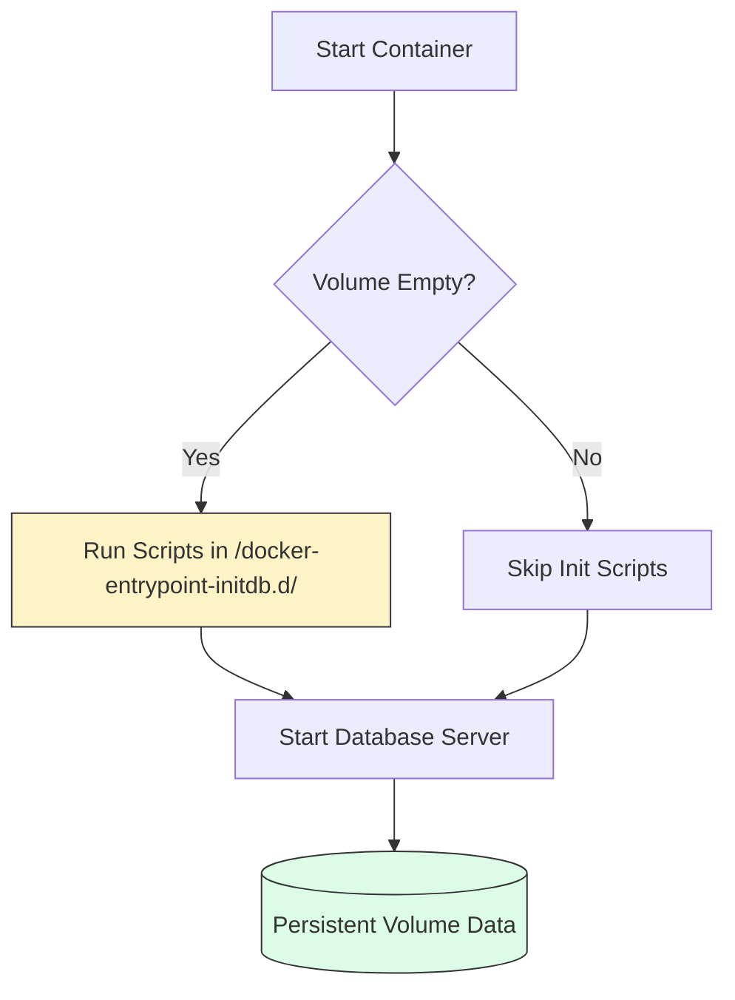

# 🗄️ Module 07: Database Storage Patterns

> **"A database without a volume is just a memory game. A database with a volume is a business."**



## 📚 Overview

In the previous module, we learned *how* volumes work. In this module, we apply that knowledge to the "Big Three" databases: **PostgreSQL, MySQL, and Redis**. You will learn the exact paths required for each and a professional secret: how to automatically set up your database the first time it starts.

## 🎓 Learning Objectives

By the end of this module, you will:
- ✅ Map the correct internal data paths for major databases.
- ✅ Use **Init Scripts** to automate table creation and seeding.
- ✅ Enable **Persistence Modes** in Redis (AOF vs RDB).
- ✅ Configure **Custom Database Parameters** via mounted config files.
- ✅ Design a **Backup Strategy** using sidecar patterns.

---

## 📖 The Database Cookbook

| Database | Internal Data Path | Initialization Folder |
| :--- | :--- | :--- |
| **PostgreSQL** | `/var/lib/postgresql/data` | `/docker-entrypoint-initdb.d/` |
| **MySQL / MariaDB** | `/var/lib/mysql` | `/docker-entrypoint-initdb.d/` |
| **MongoDB** | `/data/db` | `/docker-entrypoint-initdb.d/` |
| **Redis** | `/data` | N/A (Uses `redis.conf`) |

---

## 🏗️ Professional Setup Patterns

### 1. The "Self-Seeding" Database
Tired of manually creating tables? Mount an SQL script to the `initdb.d` folder. Docker will execute it **only once** when the volume is first created.

```yaml
services:
  db:
    image: postgres:15-alpine
    volumes:
      - pg-data:/var/lib/postgresql/data
      - ./infra/init-db.sql:/docker-entrypoint-initdb.d/init.sql:ro
```

### 2. The Persistent Cache (Redis)
By default, Redis is "Forgetful." To make it survive a crash, you must change the startup command.

```yaml
services:
  cache:
    image: redis:alpine
    command: redis-server --appendonly yes # Enables AOF (Append Only File)
    volumes:
      - redis-data:/data
```

---

## 🏆 Real-World DevOps Story: The Empty Production DB

**The Scenario**: A company updated their production application. The update required a new `users` table. The developer planned to log in and create the table manually after the update.
**The Crisis**: The update finished at 2:00 AM. The developer fell asleep. For 4 hours, new users tried to sign up, but the app crashed because the `users` table didn't exist.
**The Fix**: For the next update, they put the `CREATE TABLE` script inside a file and mounted it to `/docker-entrypoint-initdb.d/`. 
**The Discovery**: They realized this only works on *fresh* volumes. For existing databases, they started using "Migration" tools (like Liquibase or Flyway) inside their app containers.
**The Lesson**: **Database setup should be automatic and version-controlled.** Never rely on manual SQL execution in production.

---

## 🚀 Professional Pattern: The Sidecar Backup

How do you back up a database running in a volume? You run a second "Sidecar" container that shares the same network and has access to a backup folder.

```yaml
services:
  db:
      image: postgres
      volumes:
        - pgdata:/var/lib/postgresql/data

  backup-task:
    image: postgres
    volumes:
      - pgdata:/var/lib/postgresql/data:ro # Read-only access to the data
      - ./backups:/backups
    entrypoint: ["pg_dump", "-U", "postgres", "-f", "/backups/daily.sql", "mydb"]
```

---

## ❓ Interview Preparation (Database Storage)

1. **Q: Why is it important to use 'Alpine' versions of database images?**
   *A: Alpine-based images are significantly smaller (MBs vs GBs), which speeds up the 'Pull' time and reduces the security 'Attack Surface' by removing unnecessary OS utilities.*

2. **Q: What happens if you mount a file to a directory that already has files inside the container?**
   *A: The mounted file/folder 'hides' the original content of the container directory. If you mount a host folder to `/var/lib/mysql`, any files baked into the image at that location will disappear while the mount is active.*

3. **Q: How does the `/docker-entrypoint-initdb.d/` folder work?**
   *A: Many official database images are programmed to look in this folder during the VERY FIRST startup. If it finds `.sql`, `.sql.gz`, or `.sh` files, it executes them in alphabetical order to set up the database schema.*

4. **Q: How do you handle database credentials securely in Compose?**
   *A: Use sensitive environment variables (e.g., `POSTGRES_PASSWORD`) sourced from a `.env` file or a secrets management service (like Vault or AWS Secrets Manager). Never hardcode them in the YAML.*

5. **Q: Explain the difference between Redis RDB and AOF persistence.**
   *A: RDB (Redis Database) takes 'Snapshots' at specific intervals (e.g., every 5 minutes). AOF (Append Only File) logs every write operation as it happens. AOF is safer for data but slightly slower and produces larger files.*

---

## 📝 Knowledge Check

1. **Which internal path does PostgreSQL use to store its actual data files?**
   - [ ] a) `/var/db/postgres`
   - [x] b) `/var/lib/postgresql/data`
   - [ ] c) `/data/pg`

2. **When are scripts in `/docker-entrypoint-initdb.d/` executed?**
   - [ ] a) Every time the container starts
   - [x] b) Only the very first time the volume is created
   - [ ] c) Every time you run `docker compose up`

3. **Which Redis flag ensures every single write is logged for maximum safety?**
   - [ ] a) `--save`
   - [x] b) `--appendonly yes`
   - [ ] c) `--persist`

4. **True or False: Using a Bind Mount for a database is usually better than a Named Volume.**
   - [ ] True
   - [x] False (Named Volumes are managed by Docker and handle permissions better for DBs)

5. **Where should you put your database password for local development?**
   - [ ] a) Directly in the `docker-compose.yml`
   - [x] b) In a `.env` file
   - [ ] c) In the `Dockerfile`

---

## 🔗 Next Steps

The data is safe. Now let's build the bridges that let your containers talk.

Proceed to: **[Module 01: Advanced Features](../../intermediate/01-advanced-features/readme.md)** →
