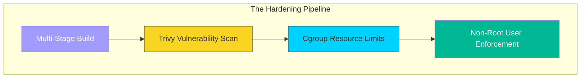

# 🛡️ Module 01: Security & Optimization

> **"A secure container is a minimal container. Every library you don't install is a door you don't have to lock."**

## 📚 Overview

In the previous parts, we focused on making things **Work**. In this module, we focus on making them **Production-Ready**.

Security in Docker is about "Layered Defense." We move from heavy, default images to "Distroless" and "Alpine" bases. We implement CPU/RAM guardrails to prevent a single memory leak from crashing a $100,000 cluster. We treat security as a lifestyle, not an afterthought.

## 🎯 Learning Objectives

- ✅ Implement **Vulnerability Scanning** in the local dev loop.
- ✅ Master **Linux Capabilities** to strip root powers from containers.
- ✅ Decouple application state to allow **Read-Only** filesystems.
- ✅ Prevent **OOM (Out of Memory)** crashes using resource limits.
- ✅ Standardize **Logging Drivers** for enterprise visibility.

## 🆚 Junior Way vs. Engineer Way

| Feature | The Junior Way (Problematic) | The Engineer Way (Production-ready) |
|:---|:---|:---|
| **User** | Running everything as `root` | **Non-root** dedicated app users |
| **Scanning** | "Trusting" the base image | Automated **Vulnerability Scans** (Trivy) |
| **Limits** | No CPU/RAM caps (Unbounded) | Strict **Resource Constraints** |
| **Base Image** | `ubuntu` or `python` (500MB+) | `alpine` or **Distroless** (<20MB) |
| **Secrets** | Hardcoded in Dockerfile/ENV | **Docker Secrets** or External Vaults |
| **Filesystem** | Fully writable (Risk of miners) | **Read-only root filesystem** |

---

## 🏗️ The "Distroless" Revolution

A **Distroless** image is the peak of container optimization. It contains **only** your application and its runtime dependencies. It does NOT contain a shell, a package manager, or even basic tools like `ls` or `cd`.

**Why go Distroless?**
1.  **Security**: If a hacker gets in, they can't run `apt install`, they can't even list files. There is no shell to interact with.
2.  **Size**: These images are often under 10MB.
3.  **Speed**: Faster downloads, faster startups, and lower storage costs.

---

## 🚀 Professional Pattern: The "Least Privilege" Principle

In a professional DevOps environment, we never give a process more power than it absolutely needs.

- **Non-Root**: We create a dedicated user inside the Dockerfile.
- **Read-Only**: We mount the app code as read-only so a hacker can't "deface" the site or install miners.
- **Cap-Drop**: We tell the Linux kernel to remove all "Superuser" powers from the container except the one needed to bind to a port.

---

## 🏆 Real-World DevOps Story: The Bitcoin Miner at Midnight

**The Scenario**: A company was running a Wordpress site in Docker. They used a generic image and ran it as root.
**The Crisis**: An unpatched plugin allowed an attacker to get a shell. Because the container was root, the attacker installed a sophisticated Bitcoin miner that hid its process name as `systemd-worker`.
**The Discovery**: The company only noticed when their cloud bill doubled. The hacker had also used the container's root access to probe the internal database and download the customer list.
**The Fix**: They rebuilt the stack using **Alpine Linux**, forced a **Non-Root** user, and used **Resource Limits** to ensure no container could ever take more than 20% CPU.
**The Lesson**: **If you run as root, you are inviting the world into your server.**

---

## 🗺️ Included Sub-Modules

1. **[01-Docker-Security](./01-docker-security/readme.md)**: Hardening the boundary between app and host.
2. **[02-Resource-Management](./02-resource-management/readme.md)**: Ensuring "Noisy Neighbors" don't crash the system.
3. **[03-Production-Considerations](./03-production-considerations/readme.md)**: The final checklist for Go-Live.

---

## 🎤 Interview Preparation (Security & Optimization)

### 🎯 Core Concepts
1. **Q: How do you secure a Docker container that needs to run on Port 80 (where root is usually required)?**
   - *A: Use a non-root user and grant only the `CAP_NET_BIND_SERVICE` capability. Alternatively, use a reverse proxy (like Nginx) that listens on 80 and passes traffic to a high port (like 8080) where the app runs as a non-privileged user.*

2. **Q: What is a 'Sidecar' container in the context of security?**
   - *A: A sidecar is a secondary container that runs alongside your app to handle security tasks like SSL termination, log shipping, or secret injection, allowing the main app to stay minimal.*

3. **Q: What are CPU and Memory 'Limits' vs 'Reservations'?**
   - *A: **Limits** (Hard Cap) define the maximum resources a container can ever use. **Reservations** (Soft Cap) define the resources the orchestrator guarantees for that container on a node.*

### 🚀 Advanced Questions
4. **Q: Explain how the `--read-only` flag improves container security.**
   - *A: It makes the container's root filesystem immutable. If an attacker gains access, they cannot write malicious scripts, install miners, or modify application configuration. Any needed writes must go to explicitly defined volumes.*

5. **Q: How does `Trivy` or `Snyk` identify vulnerabilities in your images?**
   - *A: These tools scan the package manifests (e.g., `apt`, `pip`, `npm`) inside the image layers and compare them against a database of known CVEs (Common Vulnerabilities and Exposures).*

6. **Q: Why is 'PID 1' management important in Docker?**
   - *A: The process with PID 1 is responsible for reaping "zombie" processes and handling signals (like SIGTERM). If your app doesn't handle these correctly (e.g., a shell script acting as PID 1), the container may take too long to stop or leave orphans behind.*

---

## 📝 Knowledge Check

1. **Which base image is the smallest and most popular for secure containers?**
   - [ ] a) Ubuntu
   - [x] b) Alpine
   - [ ] c) Windows Core

2. **True/False: A 'Distroless' image has no shell (no /bin/bash).**
   - [x] **True**. This is why it's so secure.

3. **Which flag prevents a container from using more than 512MB of RAM?**
   - [x] `--memory="512m"`

---

## 🎯 Next Steps

Start with **[01-Docker-Security](./01-docker-security/readme.md)** 🚀
