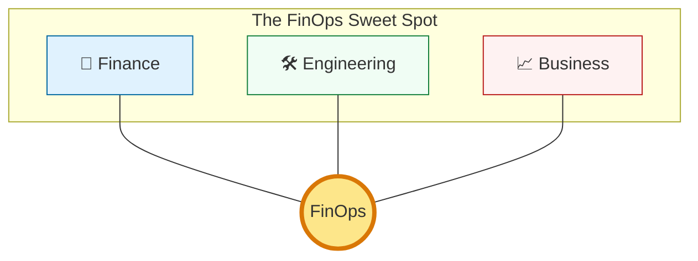
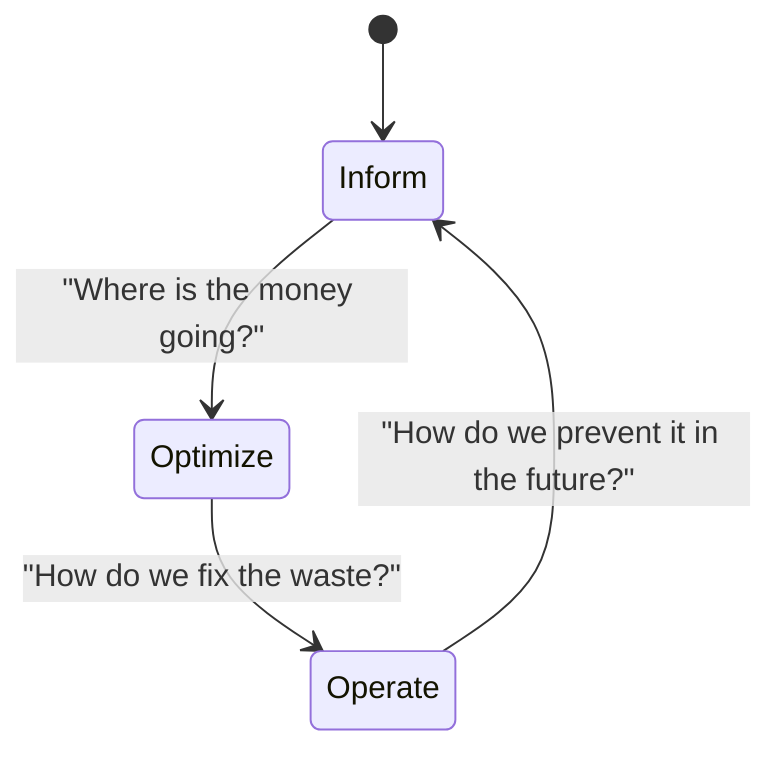

# 💰 Part 01: Introduction to FinOps

> **"In the data center, you paid for the box once. In the cloud, you pay for every second you forget the box is turned on. FinOps is the art of ensuring every cent spent in the cloud delivers a dollar of value."**

## 📚 Overview

**FinOps** (Financial Operations) is an evolving cloud financial management discipline and cultural practice that enables organizations to get maximum business value by helping engineering, finance, technology, and business teams to collaborate on data-driven spending decisions.

It is NOT just about saving money; it is about **making money** by optimizing the unit economics of the cloud.

## 💼 Career Impact: The "Cloud Economist"

As companies spend millions per month in the cloud, they no longer just need engineers who can "build"—they need engineers who can "rationalize."

- **Salary Boost**: FinOps-certified practitioners often see a 15-20% salary premium.
- **Strategic Influence**: You move from being a "cost center" to a "profit enabler," sitting in meetings with the CTO and CFO.
- **Market Demand**: Every Fortune 500 company is currently hiring for FinOps roles to tackle cloud waste.

## 🎓 Learning Objectives

By the end of this module, you will:

- ✅ Define FinOps and its role in modern DevOps environments.
- ✅ Understand the shift from **CapEx** (Fixed) to **OpEx** (Variable) spending.
- ✅ Master the six core **Principles of FinOps**.
- ✅ Identify key stakeholders and their unique responsibilities.
- ✅ Map the **Crawl, Walk, Run** maturity model to your organization.

---

## 🆚 Junior Way vs. Engineer Way

| Feature | The Junior Way (Problematic) | The Engineer Way (Production-ready) |
|:---|:---|:---|
| **Resource Selection** | "I'll use a large instance just in case" | **Right-sized** instances based on CPU/RAM metrics |
| **Idle Resources** | Leaving dev environments on 24/7 | Automated **Shutdown Schedules** (The Reaper) |
| **Cost Awareness** | "Finance handles the bills" | **Ownership** of the cost of every commit |
| **Commitment** | Always pays On-Demand "Retail" | Leverages **Savings Plans** for baseline |
| **Data Flow** | Ignored (NAT/Egress) | Designed for **Network Efficiency** (VPC Endpoints) |

---

## 🧠 The Triple Intersection: Why FinOps?

FinOps is the cultural friction point where three worlds meet. In the past, they spoke different languages. FinOps gives them a common dictionary.

1.  **🛠️ Engineering**: Wants to build fast, scalable, and resilient systems. (Velocity)
2.  **💸 Finance**: Wants to predict, report, and control spending. (Predictability)
3.  **📈 Business**: Wants to ensure every dollar spent drives revenue. (Profitability)

**The SRE FinOps Rule**: If a system is perfectly resilient but costs more than the company makes from it, it's a technical failure.

---

## 🏗️ The Variable Cost Revolution

Traditional IT used **CapEx** (Capital Expenditure): You bought a server, and it sat in a rack for 5 years. In the cloud, we use **OpEx** (Operating Expenditure): You pay for usage by the millisecond. This shift moving the responsibility from the Procurement team to the **Developer's fingers**.

| Feature | Data Center (CapEx) | Cloud (OpEx) |
| :--- | :--- | :--- |
| **Commitment** | Upfront (Large sum) | Zero (Pay-as-you-go) |
| **Scaling** | Hard (Order more hardware) | Instant (API call) |
| **Visibility** | Simple (One bill for hardware) | Complex (Millions of individual line items) |
| **Responsibility** | Procurement Team | **The Developer** (via code/CLI) |

---

## 🚀 The FinOps Lifecycle

FinOps is not a one-time event; it is a continuous loop consisting of three phases:

1. **Inform**: Mapping spend to teams, tags, and projects. (Visibility)
2. **Optimize**: Finding "Low-Hanging Fruit" like unused disks or over-sized servers. (Action)
3. **Operate**: Automating policies so the "Inform" and "Optimize" steps happen without human intervention. (Governance)

---

## 🏆 Real-World DevOps Story: The Over-Provisioned Sandbox

**The Scenario**: A startup's engineering team launched a "Sandbox" environment for testing a new feature. They used powerful GPU instances (p3.16xlarge) to ensure performance wasn't a bottleneck during development.
**The Crisis**: The developer forgot to shut down the cluster on Friday evening. By Monday morning, the cluster had cost the company **$15,000** over one weekend for a sandbox that no one was using.
**The Fix**: The FinOps team implemented a simple **"Nightly Reaper"** script that automatically shuts down any instance tagged as `env: sandbox` at 8:00 PM and on weekends.
**The Lesson**: **Cloud spending is decentralized.** If you don't build automated guardrails, human error will eventually blow your budget.

---

## 🚀 Professional Pattern: The "Tag or Perish" Policy

The foundation of FinOps is **Tagging**. If a resource isn't tagged, you don't know who to charge for it.

**The Pro Standard**: Use an IAM Policy or AWS Service Control Policy (SCP) that **denies** the creation of any resource (EC2, S3, RDS) unless it includes mandatory tags:
- `Project`: Which app is this?
- `Owner`: Who is the human responsible?
- `CostCenter`: Which budget pays for this?

---

## 🎤 Interview Preparation (FinOps Foundations)

### 🎯 Core Concepts
1. **Q: How would you explain FinOps to a CEO who only cares about the bottom line?**
   - *A: FinOps isn't just about saving money; it's about transparency. It allows the business to see exactly how much profit we make per customer by accurately mapping cloud costs to products, enabling better pricing and investment decisions.*

2. **Q: Why is FinOps considered a "Cultural Shift" rather than just a set of tools?**
   - *A: In the cloud, engineers are the "procurement department." A single line of code can spend $100k. FinOps requires developers to take ownership of the financial impact of their technical decisions.*

3. **Q: What is the difference between "Showback" and "Chargeback"?**
   - *A: 'Showback' is informational (telling a team what they spent). 'Chargeback' actually deducts costs from their departmental budget.*

4. **Q: Explain the 'Crawl, Walk, Run' maturity model.**
   - *A: **Crawl**: Basic visibility and manual tagging. **Walk**: Manual policy enforcement and occasional right-sizing. **Run**: Automated governance and real-time policy enforcement.*

5. **Q: What are 'Unit Economics' in the context of Cloud spend?**
   - *A: It's measuring cost against a business metric (e.g., cost per user transaction). This tells you if your infrastructure is becoming more or less efficient as you scale.*

### 🚀 Advanced Questions
6. **Q: In a 'Shared Responsibility' model, how do you attribute costs for a shared Kubernetes cluster?**
   - *A: By using namespace-level resource requests/limits or labels to calculate the percentage of total cluster resources each team is consuming and weighting the bill accordingly.*

7. **Q: How does the shift from CapEx to OpEx change a company's tax strategy?**
   - *A: CapEx (hardware) is depreciated over years. OpEx (cloud) is a direct business expense in the month it occurs, providing more immediate tax deductions but requiring tighter monthly cash flow management.*

8. **Q: What is an 'Automated Reaper' and why is it essential for FinOps?**
   - *A: A script or tool that automatically terminates or stops resources that meet certain criteria (e.g., untagged, idle for 48h, or tagged as `env:dev` after 8 PM) to prevent waste.*

9. **Q: How do you handle 'Cost Anomalies' in a high-growth startup?**
   - *A: Implement daily spend alerts with Z-score logic (detecting deviations from the mean). Investigate spikes immediately to determine if they are 'Good Spend' (increased traffic) or 'Bad Spend' (bug/leak).*

10. **Q: What are the 6 Principles of FinOps?**
    - *A: 1. Teams need to collaborate. 2. Decisions are driven by the business value of cloud. 3. Everyone takes ownership for their cloud usage. 4. FinOps reports should be accessible and timely. 5. A centralized team (CCoE) facilitates FinOps. 6. Take advantage of the variable cost model.*

---

## 📝 Knowledge Check

1. **What is the primary reason for the existence of FinOps?**
   - [x] To manage the variable spend model of the cloud.

2. **Which FinOps phase involves right-sizing over-provisioned instances?**
   - [x] Optimize.

3. **In the 'Crawl, Walk, Run' model, what characterizes the 'Run' stage?**
   - [x] Automated optimization and real-time governance.

4. **True/False: FinOps is purely the responsibility of the Finance department.**
   - [x] **False**.

5. **Which 'Tag' is critical for mapping spend back to a specific department?**
   - [x] `CostCenter`.

6. **CapEx stands for:**
   - [x] Capital Expenditure.

7. **OpEx stands for:**
   - [x] Operating Expenditure.

8. **A single EC2 instance serves 3 teams. This is a challenge for:**
   - [x] Cost Attribution.

9. **What is 'Waste' in cloud terms?**
   - [x] Paying for resources that are not being used or delivering value.

10. **The centralized team facilitating FinOps is often called the:**
    - [x] CCoE (Cloud Center of Excellence).

---

## 🔗 Next Steps

Proceed to: **[Part 02: Cloud Billing Basics](../part-02-cloud-billing-basics/readme.md)** →
