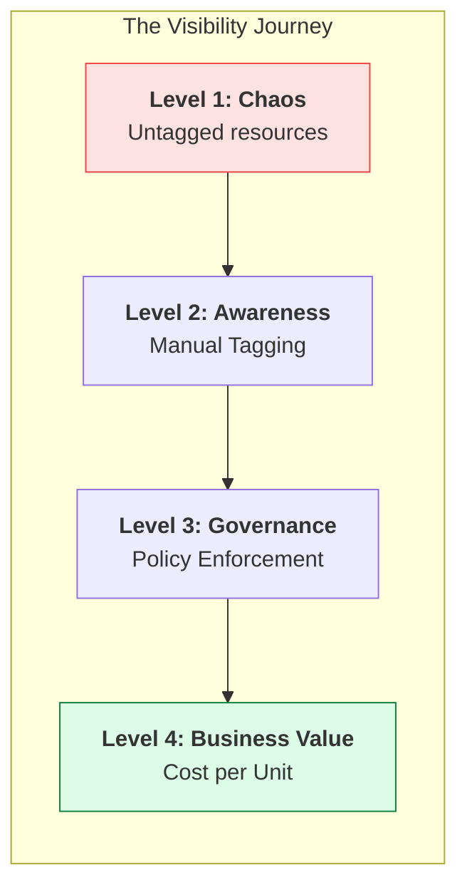
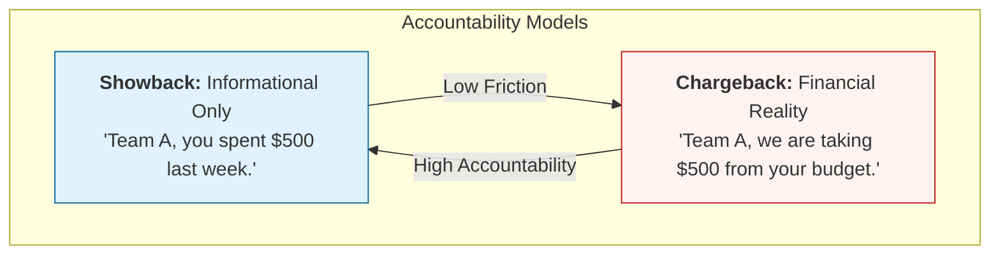
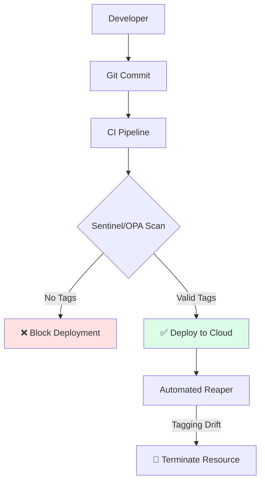

# 👁️ Part 03: Cost Visibility & Tagging

> **"You cannot manage what you cannot measure. Without tags, a cloud bill is just a list of random charges; with tags, it's a strategic map of your business operations."**



## 📚 Overview

Cost visibility is the ability to map cloud spend back to the teams, products, and business units that generated it. This is primarily achieved through **Tagging**. In this module, we move from simply seeing the total bill to deconstructing it into "Attributable Spend." You will learn how to design a tagging schema that survives scale and how to enforce it using technical guardrails.

## 💼 Career Impact: The "Cloud Auditor"

Visibility is the foundation of trust between Engineering and Finance.

- **Reporting Excellence**: You gain the ability to create boardroom-ready reports that explain the "Why" behind the "How Much."
- **Governance Specialization**: Mastering enforcement via Policy-as-Code makes you an ideal candidate for Cloud Governance and Compliance teams.
- **Influence**: When you can prove exactly where money is being wasted, your recommendations for architectural changes carry significantly more weight.

## 🎓 Learning Objectives

By the end of this module, you will:

- ✅ Design a **Professional Tagging Schema** for enterprise scale.
- ✅ Master **Enforcement Strategies** (Policy-as-Code).
- ✅ Differentiate between **Showback and Chargeback** models.
- ✅ Find and audit **Untagged Resources** using the CLI.
- ✅ Build **Cost Allocation Reports** that stakeholders actually understand.

---

## 🏷️ The Global Tagging Standard

A "Good" tag is consistent, lowercase, and hyphenated. A "Bad" tag is inconsistent (e.g., `Environment` vs `env` vs `ENV`).

| Key          | Standard Value              | Description                                          |
| :----------- | :-------------------------- | :--------------------------------------------------- |
| `env`        | `prod`, `stag`, `dev`       | Critical for separating stable vs exploratory costs. |
| `team`       | `platform`, `billing`, `ui` | Who owns the technical resource?                     |
| `costcenter` | `cc-804`, `eng-ops`         | Which spreadsheet cell does this money come from?    |
| `project`    | `migration-v2`              | Useful for tracking one-off initiative costs.        |
| `owner`      | `john.doe`                  | The human to Slack when the resource is idle.        |

---

## 🛡️ Professional Pattern: Enforcement via IaC

Don't ask developers to tag resources—**force them**. Senior DevOps engineers use "Policy as Code" or Terraform modules to ensure every resource has the required labels before it even reaches the cloud.

### Example: Terraform Mandatory Tags

```hcl
resource "aws_instance" "app" {
  ami           = "ami-12345678"
  instance_type = "t3.micro"

  tags = {
    env         = "prod"
    team        = "api"
    # If the next line is missing, the CI/CD pipeline fails
    costcenter  = "eng-800" 
  }
}
```

---

## 🏆 Real-World DevOps Story: The Ghost in the Data Warehouse

**The Scenario**: A large e-commerce company noticed their **BigQuery** (GCP) costs tripled in one month, jumping from $5,000 to $15,000.
**The Crisis**: Because they had poor tagging on their data datasets, they couldn't tell if the increase was due to more customers or a rogue script.
**The Fix**: They implemented mandatory `project_id` and `user_id` labels on every query.
**The Discovery**: They found a "Ghost" script—a forgotten analytics job from a former intern that was running every hour, scanning 50TB of raw logs to look for information that was no longer used by anyone.
**The Lesson**: **Visibility is an investigative tool.** Without tags, you are trying to find a needle in a haystack while the haystack is on fire.

---

## 💰 Allocation Models: Showback vs Chargeback



---

## 🆚 Junior Way vs. Engineer Way

| Feature | The Junior Way (Problematic) | The Engineer Way (Production-ready) |
|:---|:---|:---|
| **Naming** | `Environment`, `env`, `Env` (Mixed case) | **Strict lowercase** hyphenated keys |
| **Enforcement** | "Please remember to tag" | **Policy-as-Code** (Terraform/OPA) |
| **Audit** | Checking the bill at month-end | **Automated Scanners** (Cloud Custodian) |
| **Shared Costs**| "Unattributed" bucket | **Proportional Allocation** algorithms |
| **IaC** | Hardcoded tags in every resource | **Default Tags** applied at provider level |

---

## 🏗️ Tagging Compliance: The Sentinel Pattern

In a mature DevOps organization, we don't just "audit" tags; we prevent untagged resources from ever existing.



---

## 🎤 Interview Preparation (Visibility & Tagging)

### 🎯 Core Concepts
1. **Q: What happens to costs that cannot be tagged? (e.g., Shared Support, Data Transfer)**
   - *A: These are 'Unallocated Costs.' They are usually handled using a **Proportional Split**. For example, if Team A uses 60% of direct resources, they are billed for 60% of the shared support cost.*

2. **Q: How do you handle 'Tagging Drift'—where resources exist but their tags are outdated?**
   - *A: Use automated scanners (like Cloud Custodian or AWS Config) that find resources with outdated tags. We can then either auto-apply a 'Default' tag or send an automated Slack alert to the owner.*

3. **Q: Is it better to have many tags or just a few?**
   - *A: Fewer is better. Follow the '80/20 Rule': 5-7 core tags (`env`, `team`, `owner`, `project`, `costcenter`) usually provide 80% of the visibility needed.*

4. **Q: How can you enforce tagging on legacy resources that weren't built with IaC?**
   - *A: Use 'Reactive Governance.' Tools can automatically stop or terminate any resource that doesn't meet tagging compliance after a short grace period (e.g., 24 hours).*

5. **Q: Why should we use lowercase for tag keys?**
   - *A: Tag keys are often case-sensitive. If one developer uses `Owner` and another uses `owner`, the billing tool will treat them as separate categories, breaking your reports.*

### 🚀 Advanced Questions
6. **Q: Explain how you would automate cost attribution for a multi-tenant Kubernetes cluster.**
   - *A: Use tools like **Kubecost**. It maps Kubernetes resource usage (CPU/RAM requests) to cloud billing data, allowing you to see the cost per Namespace, Deployment, or even specific Label.*

7. **Q: What is a 'Tagging Policy' and how is it different from a 'Tagging Schema'?**
   - *A: A **Schema** defines the keys and allowed values (e.g., `env` can only be `prod`, `dev`). A **Policy** defines the enforcement—where and how those tags must be applied (e.g., "All EC2 instances must have an `owner` tag").*

8. **Q: How do you attribute 'Network Egress' costs to a specific team in a shared VPC?**
   - *A: This is one of the hardest problems in FinOps. We usually use **VPC Flow Logs** to analyze traffic patterns per Elastic Network Interface (ENI). Since each ENI belongs to an instance with a tag, we can map the egress cost back to the instance owner.*

9. **Q: What is 'Default Tags' in Terraform and why is it a best practice?**
   - *A: It allows you to define a set of tags at the provider level that are automatically applied to **every** resource created by that provider. This ensures consistency and reduces code duplication.*

10. **Q: What is the 'Business Value' of 100% Tagging Compliance?**
    - *A: It enables **Unit Economics**. You can calculate exactly how much it costs in cloud resources to support a specific customer or feature, transforming infrastructure from a 'black box' into a transparent business driver.*

---

## 📝 Knowledge Check

1. **Which tag is most important for mapping spend to an internal financial budget?**
   - [x] `costcenter`.

2. **What is the name of the model where costs are actually deducted from a team's budget?**
   - [x] Chargeback.

3. **Which character is the standard separator for multi-word tag values?**
   - [x] Hyphen (`-`).

4. **Where should tagging enforcement ideally happen?**
   - [x] In the CI/CD pipeline (IaC).

5. **True or False: Tag keys are usually case-sensitive.**
   - [x] **True**.

6. **What is 'Unallocated Spend'?**
   - [x] Costs that cannot be directly mapped to a specific tag or owner.

7. **Which tool is a industry standard for automated cloud tagging remediation?**
   - [x] Cloud Custodian.

8. **What does OPA stand for in the context of policy enforcement?**
   - [x] Open Policy Agent.

9. **Which tag is used to identify the specific application a resource belongs to?**
   - [x] `project` or `app`.

10. **A report that tells a team they spent $5k without taking the money is called:**
    - [x] Showback.

---

## 🔗 Next Steps

Visibility is set. Now let's learn how to draw a line in the sand and ensure we don't cross it using **Budgets**.

Proceed to: **[Part 04: Budgeting Basics](../part-04-budgeting-basics/readme.md)** →
