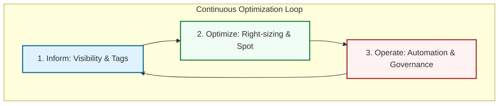
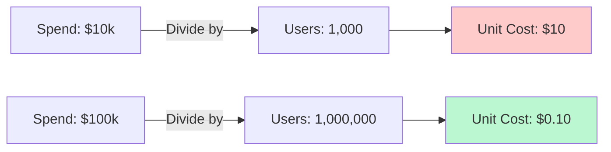

# 💰 FinOps Mastery: The Cloud Financial Architect

> **"In the cloud, every architectural decision is also a financial decision. Engineering without financial awareness is just expensive guessing."**

---

## 🧠 The Mental Model: The Variable Utility Bill

**The Junior Struggle**: "I'm an engineer, not an accountant. I just want to build cool stuff. Why do I need to care about the bill?"
**The Engineer Solution**: You realize that in the Cloud, **Code is Money**. 

Think of it like an **Electricity Bill**:
- **Legacy (CapEx)**: You bought a generator. It costs the same whether you use 1 light or 100 lights.
- **Cloud (OpEx)**: You pay for every single lightbulb second. FinOps is the art of building **Sensors** and **Timers** (Automation) to make sure only the lights you need are on.

---

## 🆚 Junior Way vs. Engineer Way

| Feature | The Junior Way (Problematic) | The Engineer Way (Production-ready) |
|:---|:---|:---|
| **Provisioning** | "Click and hope" (Oversized) | **Right-sizing** based on metrics |
| **Visibility** | Monthly "Bill Shock" | Real-time **Anomaly Detection** |
| **Tagging** | Random or missing tags | **Enforced Tagging** via Terraform/OPA |
| **Strategy** | 100% On-Demand pricing | Mix of **RIs, Savings Plans, and Spot** |
| **Ownership** | "Finance's problem" | **Unit Economics** (Cost per Transaction) |
| **Automation** | Manual shutdown scripts | Automated **"Reapers"** and Auto-scaling |

---

## 🏗️ The FinOps Lifecycle: Inform, Optimize, Operate

---

## 🚀 The Unit Economics Mindset

We don't care about total spend; we care about **efficiency**.

---

## 🗺️ Curriculum Path

1. **[Part 01: Introduction](./part-01-introduction/readme.md)**: The "Who, what, and why" of Cloud Financial Management.
2. **[Part 02: Billing Basics](./part-02-cloud-billing-basics/readme.md)**: Compute, Storage, and the "Hidden Tax" of Egress.
3. **[Part 03: Cost Visibility](./part-03-cost-visibility/readme.md)**: Tagging, reporting, and mapping spend to business units.
4. **[Part 04: Budgeting](./part-04-budgeting-basics/readme.md)**: Setting guardrails and automating "The Reaper."

---

## 🏆 Real-World DevOps Story: The $5,000 NAT Gateway

**The Scenario**: A company moved their application to a private subnet for security. They used a Managed NAT Gateway for updates.
**The Crisis**: Misconfigured logs uploaded 10TB of raw data daily through that NAT Gateway, costing **$450/day**.
**The Fix**: Replaced the NAT path with an **S3 VPC Endpoint** (Free) for all S3 traffic.
**The Lesson**: **"Invisible" networking components are often the most expensive.** Always look for cloud-native endpoints.

---

## 🎤 Interview Preparation (Core)

1. **Q: What are the three phases of the FinOps lifecycle?**
   - *A: **Inform** (getting visibility into spend), **Optimize** (finding and acting on savings), and **Operate** (implementing continuous governance and automation).*

2. **Q: Explain 'Unit Economics' in the context of Cloud.**
   - *A: It's measuring cost against a specific business outcome (e.g., cost per user, cost per order) rather than just looking at the total bill. This helps determine if spend growth is healthy or wasteful.*

3. **Q: Why is 'Tagging' considered the foundation of any FinOps strategy?**
   - *A: Without tags, cloud resources are anonymous. Tagging allows you to attribute every dollar spent to a specific project, team, or cost center, enabling 'Chargeback' or 'Showback'.*

4. **Q: What is the difference between Showback and Chargeback?**
   - *A: **Showback** informs teams of their costs for awareness. **Chargeback** actually deducts those costs from their departmental budgets.*

5. **Q: How does a Savings Plan differ from a Reserved Instance?**
   - *A: **Reserved Instances** are tied to specific instance types or families. **Savings Plans** offer more flexibility, allowing a commitment to a dollar amount per hour across multiple instance types or even serverless services like Lambda.*

6. **Q: Name 3 'Hidden Costs' in cloud environments.**
   - *A: Data Egress fees, Zombie Snapshots (orphaned data), and idle Managed Services (NAT Gateways, Load Balancers).*

7. **Q: What is 'Right-sizing'?**
   - *A: The process of matching instance types and sizes to your actual workload performance requirements to minimize waste.*

8. **Q: When would you use a Spot Instance?**
   - *A: For stateless, fault-tolerant, or batch workloads that can handle interruptions, such as CI/CD runners or background data processing.*

9. **Q: What is a 'Cost Anomaly'?**
   - *A: A sudden, unexpected spike in spend that deviates from historical patterns, often caused by misconfiguration or a security breach.*

10. **Q: What is the 'Crawl, Walk, Run' maturity model?**
    - *A: **Crawl**: Basic reporting and manual tagging. **Walk**: Manual policy enforcement and occasional right-sizing. **Run**: Proactive governance and automated cost-saving actions.*

---

## 📝 Knowledge Check

1. **Which pill of cloud cost usually charges for data leaving the network?**
   - [x] Networking (Egress)

2. **True/False: FinOps is only the responsibility of the Finance team.**
   - [x] **False**. It's a cross-functional cultural practice.

3. **What is the most aggressive discount model offered by cloud providers?**
   - [x] Spot Instances (Up to 90% discount).

4. **Which tag identifies the human responsible for a resource?**
   - [x] `Owner`.

5. **Which lifecycle phase handles 'Setting up Budgets and Alerts'?**
   - [x] Operate.

6. **If an instance has 2% CPU usage for 30 days, what action should be taken?**
   - [x] Right-size (Downsize) or Terminate.

7. **What does OpEx stand for?**
   - [x] Operating Expenditure.

8. **Which service reduces cost for S3 traffic without leaving the private network?**
   - [x] VPC Endpoint.

9. **What is a 'Zombie Resource'?**
   - [x] An orphaned, unused resource still incurring costs (like an unattached volume).

10. **Mapping spend to Teams is part of which phase?**
    - [x] Inform.

---

## 🔗 Next Steps
The financial blueprint is ready. Let's start with the foundations.
1. Proceed to: **[Part 01: Introduction](./part-01-introduction/readme.md)** →
2. Return to: **[01-Phase-3 Hub](../readme.md)** →
