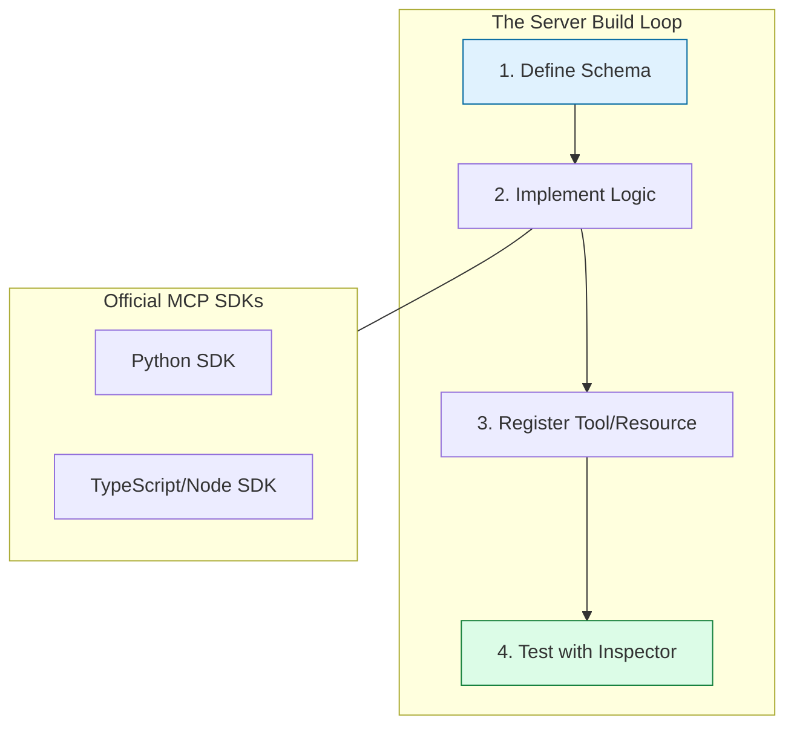

# ⚒️ Part 03: Building Custom Servers

> **"If a tool doesn't exist, build it. MCP SDKs make it trivial to turn any Python script or Node.js module into an AI-powered capability."**



## 📚 Overview

The true maturity of a DevOps engineer is the ability to build custom tooling. In the context of MCP, this means building a server that exposes your company's internal APIs, database schemas, or proprietary CLI tools to an AI.

In this module, we explore how to use the official MCP SDKs to build, test, and deploy your own custom servers.

## 💼 Career Impact: The "Tooling Engineer"

Building custom MCP servers moves you into a "Product Engineer" mindset within DevOps.

- **Platform Engineering**: You are essentially building an "Internal Developer Platform" (IDP) that is navigated by AI instead of humans.
- **Unique Value**: You become the person who can "AI-enable" legacy systems that don't have modern interfaces.
- **Intellectual Property**: Designing specialized MCP servers for your organization's specific tech stack is a high-value skill.

## 🎓 Learning Objectives

By the end of this module, you will:

- ✅ Set up a development environment using the **Python or Node.js SDK**.
- ✅ Define **Tool Input Schemas** using JSON Schema.
- ✅ Implement **Error Handling** that helps the AI self-correct.
- ✅ Use the **MCP Inspector** to debug your server without an AI client.

---

## 💻 Code Example: A Simple Python Tool

Below is a snippet of how to define a "Kubernetes Status" tool using the Python SDK.

```python
from mcp.server.fastmcp import FastMCP

# Create the server
mcp = FastMCP("K8s-Helper")

@mcp.tool()
async def check_pod_status(namespace: str = "default") -> str:
    """Checks the status of all pods in a given namespace."""
    # Logic to call kubectl or k8s API would go here
    return f"All pods in {namespace} are healthy!"

if __name__ == "__main__":
    mcp.run()
```

---

## 🚀 Professional Pattern: The "Detailed Error" Feedback

LLMs are excellent at fixing their own mistakes **if** the error message is descriptive.

- **Bad Error**: `{"error": "Failed to run command"}`
- **Pro Standard**: `{"error": "Permission denied. The service account 'mcp-agent' does not have 'list' permissions on secrets in namespace 'prod'. Hint: Try checking the 'dev' namespace instead."}`

**Why this matters**: A detailed error allows the AI to pivot its strategy immediately, rather than getting stuck in a "retry loop."

---

## 🏆 Real-World DevOps Story: The "Legacy API" Whisperer

**The Scenario**: A company had a 15-year-old internal deployment tool with no documentation and a complex command-line interface. New engineers took weeks to learn how to deploy a simple hotfix.
**The Solution**: An engineer built a **Custom MCP Server** that wrapped the legacy CLI. They defined high-level tools like `deploy_service` and `rollback_service` with clear JSON schemas.
**The Result**: New engineers could now just tell the AI: *"Deploy the latest build of 'payments-api' to staging."* The AI handled the complex CLI flags and parsed the arcane error codes via the MCP server.
**The Lesson**: **MCP creates a modern interface for legacy technical debt.**

---

## ❓ Interview Preparation (Building Servers)

1. **Q: What is the 'MCP Inspector' and why is it useful?**
   *A: The Inspector is a web-based testing tool. It allows you to connect to your MCP server and manually trigger Tools or Resources. This is critical for verify that your logic works BEFORE you introduce the unpredictability of an AI model.*

2. **Q: How do you define what arguments a Tool accepts?**
   *A: In both the Python and Node.js SDKs, you use 'JSON Schema' (usually via Pydantic or Zod). This provides the AI with the names, types, and descriptions of every parameter it needs to provide.*

3. **Q: What is the benefit of the 'FastMCP' (Python) or 'easy-mcp' (Node) wrappers?**
   *A: These high-level SDKs handle the boilerplate of the JSON-RPC protocol, allowing the engineer to focus purely on the Python or TypeScript logic of the tool itself.*

---

## 📝 Knowledge Check

1. **Which SDK feature is used to describe a tool to the AI model?**
   - [ ] a) Transport
   - [ ] b) JSON Schema / Docstrings
   - [x] c) Both a and b

2. **What is the most effective way to help an AI recover from a tool error?**
   - [ ] a) Restarting the server
   - [x] b) Providing a descriptive error message with a 'Hint'
   - [ ] c) Reducing the AI's temperature

3. **True or False: You can build an MCP server in any language as long as it supports JSON-RPC over stdio.**
   - [x] True
   - [ ] False

---

## 🔗 Next Steps

You can now build and use your own tools. The final piece of the puzzle is ensuring that these "hands" are used safely and ethically.

Proceed to: **[Part 04: Security & Best Practices](../part-04-security-and-best-practices/readme.md)** →
