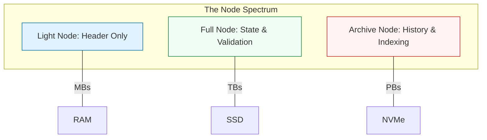

# 🤖 Part 01: Architecture & Node Types

> **"In the decentralized world, the node is the server, the database, and the lawyer. Understanding node types is the first step toward managing blockchain infrastructure."**

## 📚 Overview

Blockchain nodes are the individual computers that make up a network like Ethereum or Bitcoin. From a DevOps perspective, a node is a **State Machine**. It processes transactions and updates a local copy of a global ledger.

In this module, we explore how these machines work and how to choose the right "Node Strategy" for your application.

## 💼 Career Impact: The "Node Operator"

Managing blockchain nodes is a specialized niche in high demand.

- **Salary Premium**: Web3 infrastructure roles often pay 20-30% more than traditional DevOps roles.
- **Protocol Ownership**: You gain the ability to run infrastructure for DAOs and Decentralized Finance (DeFi) protocols.
- **Foundational Skill**: This knowledge is the basis for all "Layer 2" (Scaling) and "Validator" operations.

## 🎓 Learning Objectives

By the end of this module, you will:

- ✅ Define the difference between **Proof of Work (PoW)** and **Proof of Stake (PoS)**.
- ✅ Master the node hierarchy: **Light, Full, and Archive**.
- ✅ Understand the concept of **State** and **Block History**.
- ✅ Learn how nodes reach **Consensus** via the network.

---

## 🏗️ The Node Hierarchy

| Node Type | Technical Responsibility | Use Case |
| :--- | :--- | :--- |
| **Light Node** | Stores block headers only. | Mobile wallets and low-power devices. |
| **Full Node** | Stores current state and validates all blocks. | 95% of DeFi and NFT applications. |
| **Archive Node** | Stores the entire execution history of the chain. | Block explorers (Etherscan) and data analytics. |

---

## 🚀 Professional Pattern: The "Snapshot" Sync

Syncing a node from "Block Zero" (the Genesis block) can take weeks. Professional DevOps engineers avoid this by using **Snapshots**.

- **The Flow**:
    1. Download a trusted, compressed snapshot of the blockchain data (e.g., from a specialized provider or a backup).
    2. Extract it into your node's data directory.
    3. Start the node; it only needs to sync the last few hundred blocks to reach the "Head" of the chain.

**Why this matters**: This reduces your "Disaster Recovery" time from weeks to minutes.

---

## ❓ Interview Preparation (Node Types)

1. **Q: Why would a company pay for an Archive node if a Full node can validate transactions?**
   *A: A Full node knows what the balance of an account is *now*. Only an Archive node knows what the balance was *3 years ago*. Companies building audit tools or analytics platforms need the full history.*

2. **Q: What is 'Pruning' in a blockchain node?**
   *A: Pruning is the process of deleting old state data that is no longer needed for current validation. It allows a node to keep its disk usage manageable (e.g., keeping an ETH node under 1TB).*

---

## 📝 Knowledge Check

1. **Which node type stores the most data?**
   - [ ] a) Light Node
   - [ ] b) Full Node
   - [x] c) Archive Node

2. **True or False: A Full Node validates every block on the network.**
   - [x] True
   - [ ] False

---

## 🔗 Next Steps

Architecture is understood. Now let's talk about the raw power required to run these machines.

Proceed to: **[Part 02: Infrastructure & Resources](../part-02-infrastructure-and-resources/readme.md)** →
