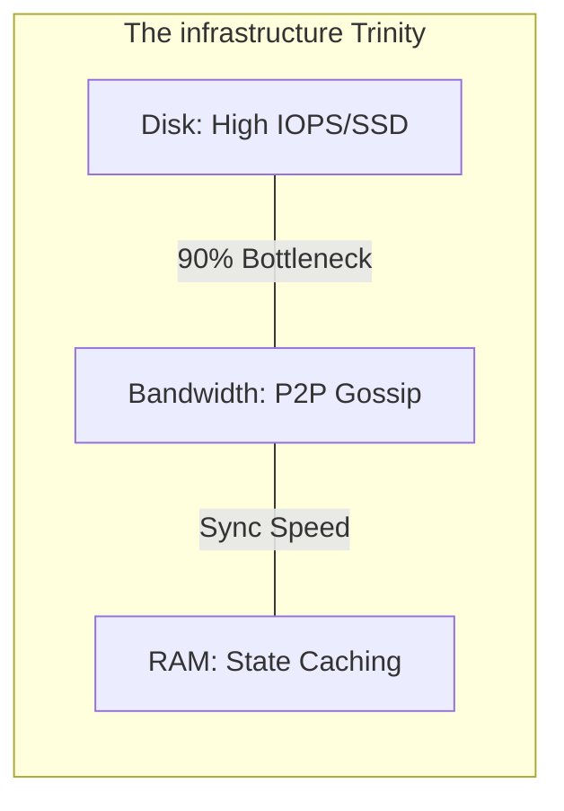

# 💾 Part 02: Infrastructure & Resources

> **"In the blockchain world, Disk I/O is the ultimate bottleneck. If your hardware is slow, the network will leave you behind."**

## 📚 Overview

Running a blockchain node is unlike running a web server. Web servers are usually CPU-bound; nodes are **Disk-bound**. Because the node has to constantly read from and write to a database of millions of accounts (The State), the speed of your storage counts more than anything else.

In this module, we explore the specific hardware and networking requirements for a professional node setup.

## 💼 Career Impact: The "Infrastructure Specialist"

Mastering the physical and virtual resource needs of blockchain makes you a critical asset.

- **Cost Optimization**: You know how to size cloud instances (AWS/GCP) to avoid paying for over-provisioned CPU while ensuring sufficient Disk IOPS.
- **Reliability Excellence**: You move from "Setting up a node" to "Architecting a high-availability network hub."

## 🎓 Learning Objectives

By the end of this module, you will:

- ✅ Identify the absolute **Minimum Specs** for a production node.
- ✅ Understand why **NVMe SSDs** are non-negotiable for Ethereum.
- ✅ Configure **P2P Networking** ports and firewall rules.
- ✅ Manage **Bandwidth Egress** costs in a gossip-heavy environment.

---

## 🏗️ Hardware Standards: The "NVMe" Mandate

| Resource | Professional Standard | Why? |
| :--- | :--- | :--- |
| **Storage** | **NVMe SSD** (Required) | Traditional SSDs are too slow for the random read/writes of the Ethereum state database. |
| **RAM** | 16GB - 32GB | Used to cache the "State Trie" and reduce disk lookups. |
| **CPU** | 4 - 8 Cores | Needed to verify cryptographic signatures of transactions. |
| **Bandwidth** | 100Mbps+ (Uncapped) | P2P gossip requires constant data exchange with dozens of peers. |

---

## 🚀 Professional Pattern: The "Dedicated Disk" Strategy

Never share a disk volume between your Operating System and your Blockchain Data (`chaindata`).

- **The Pro Standard**:
    1. Mount a dedicated, high-speed volume (e.g., AWS EBS `io2` or `gp3`) specifically for the node's data directory.
    2. Use a filesystem like **XFS** or **Ext4** that handles massive amounts of small files efficiently.

**Why this matters**: If your OS fills up with logs, your chaindata remains safe. Conversely, if your node fills its disk, the OS still functions, allowing you to troubleshoot.

---

## ❓ Interview Preparation (Resources & I/O)

1. **Q: Why does a blockchain node need high 'Random Read' speed?**
   *A: To verify a transaction, a node has to check the sender's balance. This balance is stored in a complex database called a 'Merkle Patricia Trie'. Finding one account's data requires jumping through many small files on disk, which is a random read operation.*

2. **Q: How do you protect a node from 'Disc Exhaustion'?**
   *A: Implement strict **Monitoring** (Prometheus/Grafana) with alerts at 80% usage. Use **Data Pruning** periodically to delete old state, or use cloud-native 'Auto-Expanding' volumes.*

---

## 📝 Knowledge Check

1. **What is the primary hardware bottleneck for an Ethereum node?**
   - [ ] a) CPU speed
   - [ ] b) RAM amount
   - [x] c) Disk I/O (IOPS)

2. **True or False: Running a node on a mechanical Hard Drive (HDD) is acceptable as long as it has 10TB of space.**
   - [ ] True
   - [x] False (The speed is too slow to stay in sync)

---

## 🔗 Next Steps

Hardware is ready. Now let's dive into the operational logic of reaching consensus and managing RPCs.

Proceed to: **[Part 03: Decentralized Operations](../part-03-decentralized-operations/readme.md)** →
