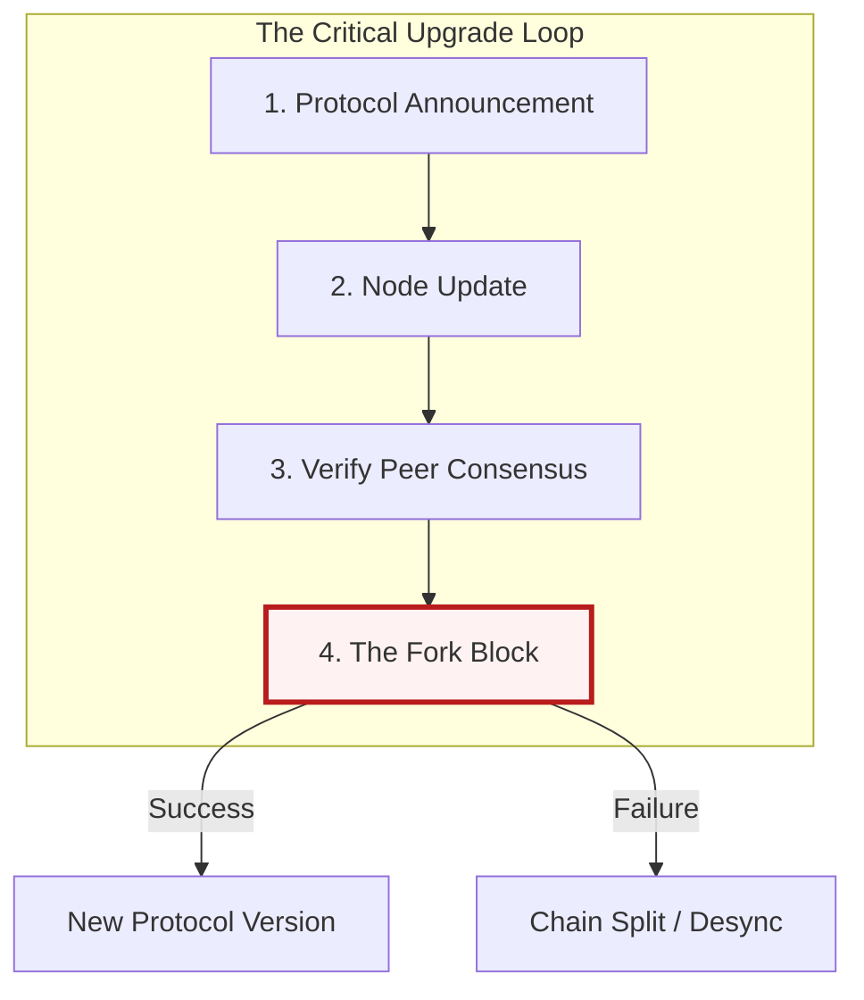

# 🛠️ Part 04: Maintenance & Governance

> **"In traditional DevOps, you deploy when you are ready. In Blockchain, the network wait for no one. Mastering forks and upgrades is the ultimate test of a DecOps engineer."**

## 📚 Overview

Blockchain protocols are constantly evolving. Unlike a centralized database where you can control the maintenance window, blockchain networks have a "Fork Height"—a specific block number where a new rule set goes into effect. If your node isn't updated by then, it gets kicked off the network.

In this module, we focus on safe upgrades, health monitoring, and the "Social Consensus" of blockchain governance.

## 💼 Career Impact: The "Reliability Governor"

Performing high-stakes upgrades on thousands of nodes simultaneously is a master-level skill.

- **Crisis Management**: You learn to operate under the pressure of a fixed, unmovable deadline.
- **Observability Mastery**: You develop the ability to detect subtle network desyncs before they become catastrophic failures.

## 🎓 Learning Objectives

By the end of this module, you will:

- ✅ Perform a **Zero-Downtime Node Upgrade**.
- ✅ Understand the difference between **Hard Forks** and **Soft Forks**.
- ✅ Configure **Prometheus & Grafana** for blockchain-specific metrics.
- ✅ Master the **Alerting Strategy** for sync desync and peer loss.

---

## 🏗️ The Fork Matrix

| Fork Type | Definition | Operational Impact |
| :--- | :--- | :--- |
| **Soft Fork** | Backward compatible upgrade. | Optional but recommended for performance. |
| **Hard Fork** | Non-backward compatible. | **Mandatory**. Failure to upgrade leads to node isolation. |
| **Grey Fork** | Unplanned network split. | Requires manual intervention and "Social Consensus." |

---

## 🚀 Professional Pattern: The "Rolling Upgrade"

For high-availability RPC layers, you must upgrade nodes without stopping user traffic.

- **The Pro Standard**:
    1. Remove one node from the Load Balancer pool.
    2. Upgrade the software and perform a **Quick-Sync**.
    3. Verify the node is at the correct "Fork Height."
    4. Add it back to the pool and repeat for the next node.

**Why this matters**: This ensures that your users never experience a 502 error during a network-wide mandatory update.

---

## 🏆 Real-World DevOps Story: The block 12,965,000 Crisis

**The Scenario**: A major Ethereum hard fork was scheduled for block 12,965,000 (The London Fork). A company had 10 nodes serving a popular wallet.
**The Crisis**: One engineer forgot to update the config file on 2 of the nodes. When the block height was reached, those 2 nodes started returning "False" balances because they were on the "Old" chain that nobody else was using.
**The Fix**: The monitoring system detected a "Consensus Desync" alert. The Load Balancer automatically purged the 2 old nodes within 30 seconds of the fork.
**The Lesson**: **Automated monitoring must check 'Block Height', not just 'Process Running'.**

---

## ❓ Interview Preparation (Upgrades & Monitoring)

1. **Q: What is the most important metric to monitor on a blockchain node?**
   *A: **'Time Behind Head'**. If this number is increasing, your disk is too slow or you've lost connection to your peers. You are effectively offline from the world's truth.*

2. **Q: How do you know if a Hard Fork was successful?**
   *A: By checking the **'Fork Version'** and the **'Peer Count'**. If your peer count drops to zero after a fork, you are likely on the wrong version of the software.*

---

## 📝 Knowledge Check

1. **At what point does a Hard Fork actually occur?**
   - [ ] a) When the lead developer says so
   - [x] b) At a specific, pre-defined Block Number (Height)
   - [ ] c) Every Tuesday at midnight

2. **True or False: A 'Soft Fork' requires every node to upgrade immediately.**
   - [ ] True
   - [x] False

---

## 🔗 Next Steps

**Congratulations!** You have completed the **Phase 3: Blockchain DevOps Fundamentals**.

You are now ready to step into the world of **Intermediate Level** infrastructure, where we combine these skills into complex, multi-cloud enterprise architectures.

Return to: **[The Phase 3 Hub](../readme.md)** →
Proceed to: **[Phase 4: Intermediate Level](../../../../readme.md)** →
