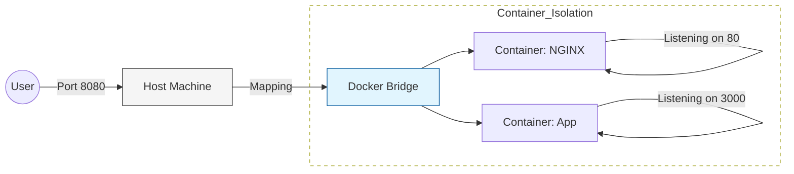

# 🌐 Networking & Connectivity: Crossing the Bridge

Containers provide isolation, but isolation is useless if your services can't talk to each other or to the users. Understanding the **Bridge Driver** is the key to container communication.

## 🏗️ The Docker Network Stack

When you install Docker, it creates a default virtual network called `bridge`. 

*   **Host**: Your physical or virtual machine.
*   **Container**: The isolated guest process.
*   **The Bridge**: The virtual switch that connects them.

### 1. The Bridge Pattern


### 2. Port Forwarding (`-p`)
This "punches a hole" in the container isolation so the outside world can reach the service.
```bash
# [Host Port]:[Container Port]
docker run -p 8080:80 nginx
```

### 2. User-Defined Networks (Container-to-Container)
In production, you should create a custom network so containers can talk to each other by **name** (DNS) rather than unstable IP addresses.

```bash
# 1. Create a network
docker network create my-app-net

# 2. Run the database on the network
docker run -d --name db --network my-app-net mongo

# 3. Run the app on the same network
# The app can connect to the DB using the hostname 'db'
docker run -d --name app --network my-app-net -e DB_HOST=db my-app
```

---

## 🆚 Host vs. Bridge vs. None

| Driver | Description | Use Case |
| :--- | :--- | :--- |
| **Bridge** | Default. Isolated with Port mapping. | Standard web apps/services. |
| **Host** | Removes isolation; uses Host's network directly. | High-performance apps (VoIP, Games). |
| **None** | No networking at all. | Batch processing / Security research. |

---

## 🔒 Senior Tip: Minimal Exposure
Never expose your database port (`-p 3306:3306`) to the public Internet. Keep the database inside a private Docker Network and only expose the Web/API port. 

---

## ⚠️ Common Pitfalls

### ❌ The "Localhost" Trap
**Pitfall**: Configuring your app to connect to `localhost:5432` to find a database.
**Consequence**: The app looks for the database *inside its own container* and fails.
**Fix**: Use the container name (e.g., `postgres`) and ensure both are on the same Docker Network.

### ❌ Port Conflicts
**Pitfall**: Trying to run two containers on the same host port (e.g., two Nginx instances both on `-p 80:80`).
**Consequence**: "Bind for 0.0.0.0:80 failed: port is already allocated."
**Fix**: Change the Host port but keep the Container port the same: `-p 8081:80`.

---

## 🧪 Diagnostic Commands
```bash
# List all networks
docker network ls

# Inspect which containers are on a specific network
docker network inspect bridge

# Test connectivity from inside a container
docker exec -it my-app ping db
```
