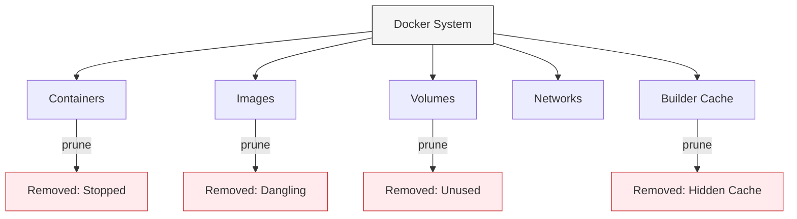

# 🧹 Cleanup & System Maintenance: The Pruning Guide

Docker is a "Disk Hog." Every failed build, old image, and stopped container leaves behind metadata and files. Without regular maintenance, your server will eventually hit **100% Disk Usage** and crash.

## 🪓 The Power of `prune`



The `prune` command is your primary weapon against disk bloat.

| Target | Command | Result |
| :--- | :--- | :--- |
| **Containers** | `docker container prune` | Removes all stopped containers. |
| **Images** | `docker image prune` | Removes all "Dangling" images (untagged). |
| **Volumes** | `docker volume prune` | Removes all volumes not used by a container. |
| **Nuclear** | `docker system prune -a` | **CAUTION**: Removes ALL unused images, containers, and networks. |

---

## 🚀 Professional Workflow: The SRE Script
In a production environment, we use CRON jobs or script triggers to keep our build servers clean.

```bash
#!/bin/bash
# cleanup.sh - Professional Maintenance script

# 1. Remove all exited containers
docker rm $(docker ps -a -q -f status=exited)

# 2. Remove images older than 7 days
docker image prune -a --force --filter "until=168h"

# 3. Check disk usage
docker system df
```

---

## 🔒 Senior Tip: The "Buildkit" Trap
Modern Docker uses **BuildKit** for faster builds. It keeps a cache that doesn't show up in `docker images`. If your disk is full and you don't see why, use:
```bash
# Clear the hidden build cache
docker builder prune --all
```

---

## ⚠️ Common Pitfalls

### ❌ Pruning Production Data
**Pitfall**: Running `docker volume prune` on a database host.
**Consequence**: You might delete a volume that was temporarily detached for maintenance, losing all user data.
**Fix**: Always check `docker volume ls` before pruning.

### ❌ The "Ghost" dangling images
**Pitfall**: Rebuilding an image with the same name (`docker build -t app:v1 .`) multiple times.
**Consequence**: The old `v1` image becomes a `<none>:<none>` dangling image.
**Fix**: Use semantic versioning (`v1.1`, `v1.2`) or run `docker image prune` after successful builds.

---

## 📊 Monitoring Disk Health
```bash
# Get a breakdown of space used by types
docker system df

# See the most verbose details of space usage
docker system df -v
```
