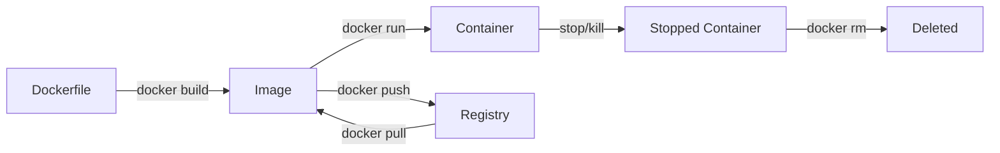

# 🗺️ Master Map: Foundational Containers

Welcome to the **Master Map** of Docker and Containerization. This curriculum is designed to take you from "What is a container?" to "How do I ship production-grade immutable infrastructure?"

## 📍 Navigational Roadmap

### Phase 1: The Engine & Architecture
*   **[01-Introduction](./01-docker-basics/01-introduction/readme.md)**: Hardware vs. Software isolation (VMs vs. Containers) and the Client-Server Architecture (Daemon vs. CLI).
    *   *Key Concept*: The OS Kernel and Namespaces.
*   **[02-Mastering the Lifecycle](./01-docker-basics/02-images-and-containers/readme.md)**: Moving from Images (Blueprints) to Containers (Running Instances).
    *   *Key Concept*: Layered File Systems and the "Thin Writable Layer."

### Phase 2: Building the Artifacts
*   **[03-Dockerfile Fundamentals](./01-docker-basics/03-dockerfile-basics/readme.md)**: The core instructions (`FROM`, `RUN`, `COPY`, `CMD`).
*   **[🆕 04-Dockerfile Best Practices & Modern Standards](./02-dockerfile-best-practices.md)**: Pinned versions, `docker init`, non-root security, and Multi-stage builds.
    *   *Key Concept*: Minimizing the attack surface and image bloat.

### Phase 3: Operational Connectivity & Persistence
*   **[🆕 05-Persistence & Storage](./03-persistence-and-storage.md)**: How to stop your data from vanishing when a container dies.
    *   *Key Concept*: Bind Mounts vs. Named Volumes.
*   **[🆕 06-Networking Deep Dive](./04-networking-and-connectivity.md)**: Connecting containers to each other and the outside world.
    *   *Key Concept*: The Docker Bridge Driver and Port Forwarding.

### Phase 4: Maintenance & Reliability
*   **[07-Troubleshooting & Diagnostics](./01-docker-basics/04-debugging/readme.md)**: Logs, Inspect, and Exit Codes.
*   **[🆕 08-Cleanup & System Maintenance](./05-cleanup-and-maintenance.md)**: Managing disk space and pruning the graveyard of old containers.

---

## 🏗️ Architectural Overview
```mermaid
graph TD
    subgraph Client
        CLI[Docker CLI]
    end

    subgraph Docker_Host_Daemon
        Daemon[Docker Daemon (dockerd)]
        Images[Images]
        Containers[Containers]
        Volumes[Volumes]
        Network[Networks]
        
        Daemon --> Images
        Daemon --> Containers
        Daemon --> Volumes
        Daemon --> Network
    end

    subgraph Registry
        Hub[Docker Hub / GCR / ECR]
    end

    CLI -- REST API / Socket --> Daemon
    Daemon -- docker pull --> Hub
    Hub -- Image Layers --> Daemon
```

## 🔄 The Lifecycle Flow


---
*Last Updated: 2026 DevOps Audit*
