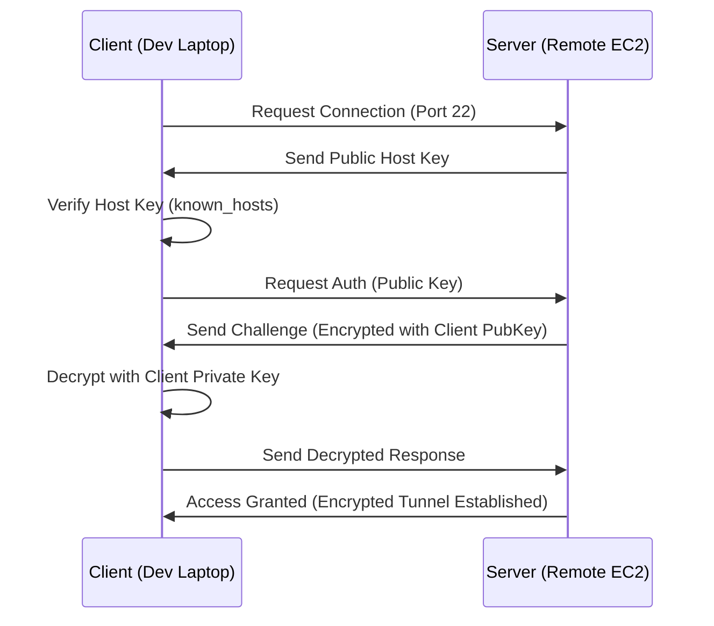

# SSH Mastery for DevOps

SSH (Secure Shell) is the primary gateway for managing remote Linux servers. For a DevOps engineer, SSH is not just a login tool—it's the foundation for automation (Ansible), secure file transfer (SCP), and network tunneling.

---

## 🔐 SSH Architecture & Flow

SSH uses public-key cryptography to authenticate the remote computer and allow it to authenticate the user.



---

## 🛠️ Key Management: The Secure Way

**Never use passwords for SSH.** Always use SSH Keys.

### 1. Generating Keys
```bash
# Generate a modern, highly secure Ed25519 key
ssh-keygen -t ed25519 -C "admin@company.com"
```
### 2. Copying Keys to Server
```bash
# Automates adding your public key to ~/.ssh/authorized_keys
ssh-copy-id -i ~/.ssh/id_ed25519.pub user@remote-host
```

---
## ⚙️ Configuration Mastery

### Client Side: `~/.ssh/config`
Stop typing long commands like `ssh -i ~/keys/prod.pem user@10.0.1.50 -p 2222`. Use a config file:

```text
Host prod-app
    HostName 10.0.1.50
    User ec2-user
    Port 2222
    IdentityFile ~/keys/prod.pem
    ProxyJump bastion-host
```
Now just type: `ssh prod-app`

### Server Side: `/etc/ssh/sshd_config` (SRE Hardening)
```text
Port 2222                 # Move off default port to reduce bot noise
PermitRootLogin no        # NEVER allow root to login directly
PasswordAuthentication no  # Force SSH Keys only
MaxAuthTries 3            # Brute force protection
AllowUsers deploy-user    # Only allow specific users
```

---

## 🚀 Advanced SSH: Tunnels & Jump Hosts

### 1. The Jump Host (Bastion)
When your database is in a private subnet, you hop through a public "Bastion" host.
```bash
ssh -J bastion-user@bastion-ip internal-user@internal-ip
```

### 2. Port Forwarding (Local Tunnel)
Access a remote database service (running on 3306) as if it were on your local machine:
```bash
ssh -L 8888:localhost:3306 user@remote-db-server
# Now connect your local tool to localhost:8888
```

---

## 🩺 Troubleshooting SSH

**The Golden Command**: `ssh -vvv user@host` (Triple verbose mode).

| Error | Likely Cause | Fix |
| :--- | :--- | :--- |
| **Connection Refused** | Service not running or wrong port. | Check `sshd` status or firewall (Security Groups). |
| **Permission Denied (publickey)** | Key not authorized or wrong key used. | Check `authorized_keys` on server. |
| **Host Key Verification Failed** | Server re-installed or Man-in-the-Middle. | Remove old key: `ssh-keygen -f "~/.ssh/known_hosts" -R "hostname"`. |
| **Permissions too open** | Private key is not `600`. | `chmod 600 ~/.ssh/id_rsa`. |

---

## 🌟 Real-Life SRE Scenario: The Lockout

**Situation**: You accidentally enabled `PasswordAuthentication no` and `PermitRootLogin no` before adding your SSH key to the `authorized_keys` file for the deploy user.

**The Fix**:
1.  **Cloud Console**: Use the cloud provider's web-based serial console (e.g., AWS EC2 Serial Console or Azure Serial Console) if enabled.
2.  **User Data**: If it's an EC2 instance, you can stop it, edit the "User Data" to append your key to the file, and restart it.
3.  **Drive Swap**: Detach the root volume, mount it to another running instance, fix the file, and move it back.

---

## 🔗 Related Resources
- [Linux Commands](../03-commands/readme.md)
- [Filesystem Mastery](../02-filesystem/readme.md)
- [Permissions & Security](../04-permissions/readme.md)
