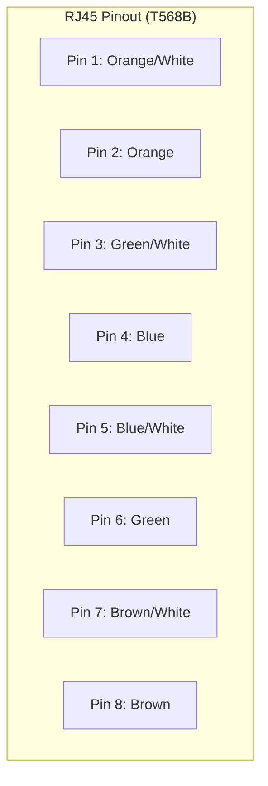
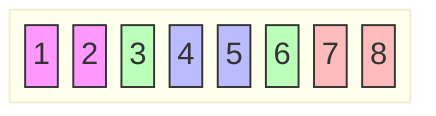

When working with 10BaseT and 100BaseT wiring, commentators, and adapters from different vendors, it is possible to connect everything and get no communication between file servers and workstations. When there are several unknown variables, it is difficult to determine which component is broken.

### T568B Standard Wiring (Most Common)



# Ethernet 10/100/1000Base-T and 100Base-T4 Crossover

This cable can be used to cascade hubs, or for connecting two Ethernet stations back-to-back without a hub. It works with 10Base-T, 100Base-TX, 100Base-T4 and 1000Base-T. Use a good enough cable, if you are confused about categories of cables then use category 5(enhanced) and you'll be fine even at 1000Base-T.

RJ45 MALE CONNECTOR to network interface card 1.

RJ45 MALE CONNECTOR to network interface card 2.

(1000Base-T names in parentheses)

|Name|NIC1|Color|NIC2|Name|
|---|---|---|---|---|
|TX+ (BI_DA+)|1|White/Orange|3|RX+ (BI_DB+)|
|TX- (BI_DA-)|2|Orange|6|RX- (BI_DB-)|
|RX+ (BI_DB+)|3|White/Green|1|TX+ (BI_DA+)|
|- (BI_DC+)|4|Blue|7|- (BI_DD+)|
|- (BI_DC-)|5|White/Blue|8|- (BI_DD-)|
|RX- (BI_DB-)|6|Green|2|TX- (BI_DA-)|
|- (BI_DD+)|7|White/Brown|4|- (BI_DC+)|
|- (BI_DD-)|8|Brown|5|- (BI_DC-)|

That means that the white/orange cable connected to NIC 1 pin 1 should go to NIC 2 pin 3 and NIC 1 pin 2 to NIC 2 pin 6 etc.

_Note 1: It's important that each pair is kept as a pair. TX+ & TX- must be in the pair, and RX+ & RX- must together in another pair. (Just as the table above shows)._

_Note 2: While 10Base-T and 100Base-TX only uses 2 pairs, please connect all four since 100Base-T4 and 1000Base-T needs them and save yourself some future debugging :)_

_Note 3: The colors originate from the numbering and name on NIC1._

**RJ-45 Connectors - Patch Cables for Category 5 Wire**

*(See Pinout diagrams above)*

||REMEMBER<br><br>To hold the RJ45 connector with the 'clip' on the bottom.<br><br>To have to the 'opening' (where you insert the cable) facing you.||
|---|---|---|
|CAT5 Standard Patch Cord||CAT5 Cross-over Cable|
||REMEMBER<br><br>For a cross-over cable make one end like the Standard Patch Cord, and one end like the Cross-over Cable.||
|Straight-Through vs. Cross-Over<br><br>In general, the patch cords that you use with your Ethernet connections are "straight-through", which means that pin 1 of the plug on one end is connected to pin 1 of the plug on the other end. In this particular case it is not then important to wire them as above. Pin 1 is Pin 1 etc etc. However for the sake of uniformity it may be best to wire your cables with the same colour sequence. Cross-Over cables are  "crossed" end to end  data cables aren't. If you have a network hub that has an uplink port on it then you do not need to make (or purchase a cross-over cable). Just switch the port on the hub to the 'uplink' mode. If your hub does not have an 'uplink' port on it then the only way to cascade another hub or attach a cable modem is to use a cross-over cable. It helps for future reference to mark or attach a tag to the cross-over cable so that you do not attempt to use it as a 'normal' patch lead at some time in the future.<br><br>The only time you cross connections in 10/100BaseT is when you connect two Ethernet devices directly together without a hub. This can be two computers connected without a hub, or two hubs via standard Ethernet ports in the hubs. Then you need a "cross-over" patch cable, which crosses the transmit and receive pairs, the orange and green pairs in normal wiring. In a cross-over cable, one end is normal, and the other end has the cross-over configuration. Remember you can only network two computers together with Cat5 cable. To add extra PC's to your network you will require a hub.|||

**When working with 10Base-T wiring, concentrators, and adapters from different vendors, it is possible to connect everything and get no communication between file servers and workstations. When there are several unknown variables, it is difficult to determine which component is broken.**

**Troubleshooting Techniques**

**The following article describes troubleshooting techniques that can be applied to 10Base-T twisted-pair networks.**

**First, know whether your equipment is compliant with the 10Base-T standard, or if it was manufactured before the standard was set ("pre-10Base-T"). This is particularly important for concentrators (hubs or repeaters). Although the two specifications may appear similar, small differences can cause a network to not function properly. Following are the most common problems encountered when working with pre-10Base-T and 10Base-T equipment.**

**Common Problems with Differing Standards:**

**By definition, 10Base-T requires that twisted-pair wiring has an impedance of 100 ohms. Pre-10Base-T hubs and adapters may be configurable within an impedance range of anywhere between 75 and 150 ohms. When attempting to connect a 10Base-T adapter to a pre-10Base-T hub, there can be an obvious impedance mismatch, which causes the adapter to malfunction. Make sure that both the hub and adapter are configured to the same impedance setting.**

**Note: Most 10Base-T adapters are designed so that they are compatible with both pre-10Base-T and 10Base-T hubs. The impedance range is jumper selectable on the adapter.**

**Network specialists also have many problems making 10Base-T compliant cables. To connect a file server or netstation to a hub, the correct 10Base-T cable must be used. An RJ-45 connector is used at both ends of the twisted-pair cable, which consists of four wires (two pairs). Following are the pin-outs for the cable:**

**+----------------+ +----------------+**

**| Pin 1 TD+ |-------------------| TD+ Pin 1 ---|**

**| Pin 2 TD- |-------------------| TD- Pin 2 ---|**

**| Pin 3 RD+ |-------------------| RD+ Pin 3 ---|**

**| Pin 4 | | Pin 4 ---|**

**| Pin 5 | | Pin 5 ---|**

**| Pin 6 RD- |-------------------| RD- Pin 6 ---|**

**| Pin 7 | | Pin 7 ---|**

**| Pin 8 | | Pin 8 ---|**

**+----------------+ +----------------+**

**RJ-45 RJ-45**

**A straight through cable is used to go from the adapter to the hub. The hub performs an internal crossover so that the signal can go from TD+ to RD+ and TD- to RD-. When looking at an RJ-45 connector from the front (that is, the opposite side from where the wires enter the connector), pin 1 is identified on the right hand side when the metal contacts are facing up.**

**Make sure that the TD+ and TD- wires are twisted together, and that the RD+ and RD- wires are twisted together. Using wires from opposing pairs can cause signals to be lost in the imbalance thus created.**

**Troubleshooting Hubs:**

**When there is doubt whether a hub is performing correctly or if the impedance settings are in question, a crossover cable can help the specialist isolate the troublesome component. If a file server and a net-station can be connected back to back, the specialist can at least know that the adapters and network operating system are properly configured. To make a crossover cable, simply connect TD+ to RD+ and TD- to RD-. The cable performs the crossover which is usually performed by the hub. Following are the pin-outs for the crossover cable:**

**TD+ Pin 1 -------------------- Pin 3 RD+**

**TD- Pin 2 -------------------- Pin 6 RD-**

**RD+ Pin 3 -------------------- Pin 1 TD+**

**RD- Pin 6 -------------------- Pin 2 TD-**

**If the file server and net-station function together as a small network, then either the existing cabling or the hub is the culprit.**

**Note: There should only be one crossover, and it should be performed by the hub. If a section of installed cable is configured as a crossover cable, it cancels the hub's crossover and creates a straight through connection.**

**Many adapter manufacturers (including 3Com) design an LED into the adapter which tells the network specialist whether or not the cabling has been wired properly. If there is a proper crossover, then the LED lights up. If there is a straight through connection, the LED is dark. A blinking LED indicates that there is a polarity mismatch (that is, TD+ to RD- instead of TD+ to RD+). The wiring is close and the adapter may or may not function; if it functions at all, it will function poorly.**

**When working with 10Base-T wiring, concentrators, and adapters from different vendors, it is possible to connect everything and get no communication between file servers and workstations. When there are several unknown variables, it is difficult to determine which component is broken. The following article describes troubleshooting techniques that can be applied to 10Base-T twisted-pair networks.**

**First, know whether your equipment is compliant with the 10Base-T standard, or if it was manufactured before the standard was set ("pre-10Base-T"). This is particularly important for concentrators (hubs or repeaters). Although the two specifications may appear similar, small differences can cause a network to not function properly. Following are the most common problems encountered when working with pre-10Base-T and 10Base-T equipment.**

**Common Problems with Differing Standards:**

**By definition, 10Base-T requires that twisted-pair wiring has an impedance of 100 ohms. Pre-10Base-T hubs and adapters may be configurable within an impedance range of anywhere between 75 and 150 ohms. When attempting to connect a 10Base-T adapter to a pre-10Base-T hub, there can be an obvious impedance mismatch, which causes the adapter to malfunction. Make sure that both the hub and adapter are configured to the same impedance setting.**

**Note: Most of 3Com's 10Base-T adapters are designed so that they are compatible with both pre-10Base-T and 10Base-T hubs. The impedance range is jumper selectable on the adapter.**

**Network specialists also have many problems making 10Base-T compliant cables. To connect a file server or netstation to a hub, the correct 10Base-T cable must be used. An RJ-45 connector is used at both ends of the twisted-pair cable, which consists of four wires (two pairs). Following are the pin-outs for the cable:**

**+----------------+ +----------------+**

**| Pin 1 TD+ |-------------------| TD+ Pin 1 ---|**

**| Pin 2 TD- |-------------------| TD- Pin 2 ---|**

**| Pin 3 RD+ |-------------------| RD+ Pin 3 ---|**

**| Pin 4 | | Pin 4 ---|**

**| Pin 5 | | Pin 5 ---|**

**| Pin 6 RD- |-------------------| RD- Pin 6 ---|**

**| Pin 7 | | Pin 7 ---|**

**| Pin 8 | | Pin 8 ---|**

**+----------------+ +----------------+**

**RJ-45 RJ-45**

**A straight through cable is used to go from the adapter to the hub. The hub performs an internal crossover so that the signal can go from TD+ to RD+ and TD- to RD-. When looking at an RJ-45 connector from the front (that is, the opposite side from where the wires enter the connector), pin 1 is identified on the right hand side when the metal contacts are facing up.**

**Make sure that the TD+ and TD- wires are twisted together, and that the RD+ and RD- wires are twisted together. Using wires from opposing pairs can cause signals to be lost in the imbalance thus created.**

**Troubleshooting Hubs:**

**When there is doubt whether a hub is performing correctly or if the impedance settings are in question, a crossover cable can help the specialist isolate the troublesome component. If a file server and a netstation can be connected back to back, the specialist can at least know that the adapters and network operating system are properly configured. To make a crossover cable, simply connect TD+ to RD+ and TD- to RD-. The cable performs the crossover which is usually performed by the hub. Following are the pinouts for the crossover cable:**

**TD+ Pin 1 -------------------- Pin 3 RD+**

**TD- Pin 2 -------------------- Pin 6 RD-**

**RD+ Pin 3 -------------------- Pin 1 TD+**

**RD- Pin 6 -------------------- Pin 2 TD-**

**If the file server and net-station function together as a small network, then either the existing cabling or the hub is the culprit.**

**Note: There should only be one crossover, and it should be performed by the hub. If a section of installed cable is configured as a crossover cable, it cancels the hub's crossover and creates a straight through connection.**

**Many adapter manufacturers (including 3Com) design an LED into the adapter which tells the network specialist whether or not the cabling has been wired properly. If there is a proper crossover, then the LED lights up. If there is a straight through connection, the LED is dark. A blinking LED indicates that there is a polarity mismatch (that is, TD+ to RD- instead of TD+ to RD+). The wiring is close and the adapter may or may not function; if it functions at all, it will function poorly.**

<b>1. LAN cables are generically called UTP</b>
<details>
<summary>Show Answer</summary>
Answer: Unshielded Twisted Pair or in the new ISO/IEC designation U/UTP) and are identified with a category rating. When installing new cable, unless there is a very good reason not to, you should be using category 5e or 6 UTP which is rated for 10mb, 100mb or Gigabit LAN operation. If you are moving to the exotic world of 10G LAN you will need category 6a wiring to go the full 100m (~330ft). Downhill, with a following wind, you can run 10G LANs over category 6 wiring [over reduced distance](https://www.zytrax.com/tech/layer_1/cables/tech_lan.htm#10g). [Info on Shielded Twisted Pair (STP) cabling.](https://www.zytrax.com/tech/layer_1/cables/tech_lan.htm#stp
</details>


1. UTP comes in two forms **SOLID** or **STRANDED**. SOLID refers to the fact that each internal conductor is made up of a single (solid!) wire, STRANDED means that each conductor is made up of multiple smaller wires. **Stranded** cable (which is typically more expensive) has a smaller 'bend- radius' (you can squeeze the cable round tighter corners with lower loss) and due to its flexibility should be used where you plug and unplug the cable frequently. All other things being equal, the performance of both types of cable is the same. In general, solid cable is used for backbone wiring and stranded for PC to wall receptacle (patch) cables. **Beware:** Each type of wire, solid or stranded, and each cable category (5e, 6, 6a) needs [its own connector type](https://www.zytrax.com/tech/layer_1/cables/tech_lan.htm#hints).

1. **Straight** and **crossed** cables are still shown in the various diagrams. **Crossed** cables are now practically irrelevant for anything but older equipment. Modern switches (and hubs - if they still even exist) auto-sense the connections meaning that you can use **straight** cables almost everywhere - but when using older equipment you may still need a **crossed** cable.

1. **100M LAN Notes:** When working with 100M LANs you CAN use 100base-TX wiring with a 10base-T network (but not always the other way round). In general, ALWAYS use 100baseTX/T4 wiring standards. If you are using category 5, 5e or 6 wiring EVERYWHERE in a 100M LAN you can use the 100base-TX standard (this only uses 2 pairs , 4 conductors). Most of the information below assumes you are using category 5, 5e or 6 cables. If you are using category 3 or 4 cables with 100M LANs ANYWHERE you MUST use the 100Base-T4 standard and this has ADDITIONAL RESTRICTIONS documented throughout (it uses all 4 pairs, 8 conductors). LAN connections/pinouts are defined by IEEE 802.3u.

1. **Gigabit and Gigabit+ LAN Notes:** While 100M LANs allowed a 2-pair (4 conductor) wiring version (100base-TX) gigabit LANs require 4-pairs (all 8 conductors) which is functionally similar to 100base-T4 wiring. Even if gigabit LANs are still in the future - use 100base-T4/1000base-T (4-pair) wiring. If you still have 100base-TX (or even 10base-T) wiring in a gigabit LAN it will still function but auto-negotiation will limit speeds on those segments to 100Mbit/s.

1. Maximum LAN cable runs or segments are 100 meters (~330ft) unless otherwise noted. Segments can be joined using hubs (Class II repeaters) in which case up to 5 such segments (500m or ~1650 feet) are allowed for 10Base-T. When using 100Base-T/TX 2 hubs are allowed (200m or ~660 feet). When modern switches are used with 100M and Gigabit LANs these limits are raised and the switch vendors specification should be consulted. We were recently, hurtfully, accused of short changing those using the, dare we say it, older imperial units such as feet, inches and other stuff. In situations where size really does matter 100 meters is actually 100 x 3.28 (OK, 3.28008399 if it's really important) = 328 feet. Far from short changing those using their good old feet our normal 100 meters = ~330 feet is generous by a whole 2 feet. Both of which you could sensibly use to walk away from the whole issue.

1. We provide a [Cabling FAQ](https://www.zytrax.com/tech/layer_1/cables/cables_faq.htm) which provides additional information or background.

1. If you are curious about the format of LAN data packets (the stuff sent using the cables you are carefully crafting) then you may find [this page a useful beginning](https://www.zytrax.com/tech/protocols/lan/802_3_frame.htm) - then again you may not.

1. We have added an article on [mixing 10/100 MB LAN and Telephony](https://www.zytrax.com/tech/layer_1/cables/mixed.html) on a single category 5(e) or 6 cable. It can be done, but you must be very, very cautious. If you use Gigabit LANs this requires use of all 4 pairs( 8 conductors) thus eliminating the possibility of mixing LAN and telephony on the same wiring.

1. We have updated most of the material for [1000base-T](https://www.zytrax.com/tech/layer_1/cables/tech_lan.htm#1000) (Gigabit Ethernet 802.3ab) which uses all 4 pairs (8 conductors) and added notes where relevant about [Power-over-Ethernet](https://www.zytrax.com/tech/layer_1/cables/tech_lan.htm#poe) (PoE 802.3af and 802.3at).

1. A copper standard for [10GB Ethernet](https://www.zytrax.com/tech/layer_1/cables/tech_lan.htm#10g) (802.3an) was published by the IEEE in 2006 and is known as 10GBASE-T. It requires category 6A cables (ANSI/TIA-568-C.2/ISO 11801 Amendment 2) for 100m (~330ft) operation but will run shorter distances over category 6 cables that meet TIA-155-A (ISO TR 24750) specifications.

## Crossed and Straight cables - when to use them

### The following diagram shows the 

**

### Normal

**

###  use of Crossed and Straight cables (see also the notes below).

```mermaid
graph LR
    subgraph "Straight-Through"
    S1[Pin 1] --- S1_2[Pin 1]
    S2[Pin 2] --- S2_2[Pin 2]
    S3[Pin 3] --- S3_2[Pin 3]
    S6[Pin 6] --- S6_2[Pin 6]
    end

    subgraph "Crossover (10/100)"
    C1[Pin 1 (TX+)] --- C3_2[Pin 3 (RX+)]
    C2[Pin 2 (TX-)] --- C6_2[Pin 6 (RX-)]
    C3[Pin 3 (RX+)] --- C1_2[Pin 1 (TX+)]
    C6[Pin 6 (RX-)] --- C2_2[Pin 2 (TX-)]
    end
```

### **Notes:**

1. We show Straight cables as **BLUE** and Crossed as **RED**. That is our convention. The cable color can be anything you choose or, more likely, the vendor decides.

1. To avoid the need for Crossed cables many vendors provided **UPLINK** ports on Hubs or Switches - these were specially designed to allow the use of a STRAIGHT cable when connecting back-to-back Hubs or Switches. Read the manufacturers documentation carefully.

1. Increasingly vendor hubs (can you still buy them?) and switches will auto-detect the connection type and internally switch the connectors so that STRAIGHT cables can be used everywhere.

## Standards Summary

### The various standards can get a tad complicated and messy. We get occasional email requesting a summary of the standards - this is our attempt to provide a quick overview.

|Standard|Required Pairs|10M|100M|1000M|10G|Cable|Notes|
|---|---|---|---|---|---|---|---|
|10base-T|2 (1/2 and 3/6)|yes|yes|no|no|cat 3, 4, 5, 5e, 6|100m support only if no cat 3/4 in run|
|100base-TX|2 (1/2 and 3/6)|yes|yes|no|no|cat 5, 5e, 6|100m support only if no cat 3/4 in run|
|100base-T4|4 (1/2, 3/6, 4/5 and 7/8)|yes|yes|yes|yes|cat 3, 4, 5, 5e, 6|max of 100m if cat 3 or 4 in network|
|1000base-T|4 (1/2, 3/6, 4/5 and 7/8)|yes|yes|yes|yes|cat 5e, 6|Functionally identical to 100base-T4. Some cat 5 cables may be acceptable.|
|10Gbase-T|4 (1/2, 3/6, 4/5 and 7/8)|yes|yes|yes|yes|cat 6a|cat 6 cables may be used but have distance limitations.|

## Category 5(e) (UTP) colour coding table

### The following table shows the normal colour coding for category 5 cables (4 pair) based on the two standards supported by TIA/EIA (see also our 

### primer

###  on this topic)

### We get occasional email about the difference between 568A and 568B wiring. Which one you use is a matter of local decision. These standards apply to the color code used within any SINGLE cable run - BOTH ENDS MUST USE THE SAME STANDARD. However, since they both use the same pinout at the connectors you can mix 568A and 568B cables in any installation.

*(Refer to T568B pinout above)*

## 10baseT Straight Cable (PC to HUB/SWITCH)

### Straight cables are used to connect PCs or other equipment to a HUB or Switch. If your connection is PC to PC or HUB to HUB you MAY need to use a 

### Crossed cable

###  with older equipment. Most modern Hubs and Switches provide auto-sensing which means a 

**

### straight

**

###  cable can always be used.

### The following cable description is for the wiring of both ends (RJ45 Male connectors) with the 568B category 5(e) 

### wiring colors

###  you could, of course, use the 568A colour scheme.

|Pin No.|strand color|Name|
|---|---|---|
|1|white and orange|TX+|
|2|orange|TX-|
|3|white and green|RX+|
|4|NC|*|
|5|NC|*|
|6|green|RX-|
|7|NC|*|
|8|NC|*|

### **NOTE:**

###  Items marked * are not necessary for 10M LANs (10base-T) but since you will be moving shortly to 100MB or Gigabit LANs (won't you) you will save yourself a 

**

### LOT OF TIME

**

###  finding crappy cable (that you made) that does not work. Instead we suggest you wire to 

### 100Base-T4 standards

### . After all you gotta stick the ends somewhere man.

### We use 

**

### BLUE

**

###  for 10base-T straight cables. NOTE: All our wiring is now done to the 100base-T4 spec which you can use with 10base-T networks - but NOT necessarily the other way around.

## 10baseT Crossed cable (PC to PC or HUB to HUB)

### Crossed cables are used to connect PCs to one other PC or to connect a HUB to a HUB. Crossed cables are sometimes called Crossover, Patch or Jumper cables. If your connection is PC to HUB you MUST use a 

### Straight cable

### .

### The following description shows the wiring at both ends (male RJ45 connectors) of the crossed cable.

|One end<br><br>RJ45 Male|Other end<br><br>RJ45 Male|
|---|---|
|1|3|
|2|6|
|3|1|
|4 *|5 *|
|5 *|4 *|
|6|2|
|7 *|8 *|
|8 *|7 *|

### **NOTES:**

1. Items marked * are not necessary for 10M LANs but since you will be moving shortly to 100MB or Gigabit LANs (won't you) you will save yourself a **LOT OF TIME** finding crappy cable (that you made) that does not work. Instead we suggest you wire to [100BaseT standards](https://www.zytrax.com/tech/layer_1/cables/tech_lan.htm#100c).
2. We use **RED** for crossed cables (or more commonly now a red heat-shrink collar at each end).
3. All our crossed wiring is done to the 100base-T4 spec which you can use with 10baseT networks - but NOT always the other way around.

## 100base-T Straight Cable (PC to HUB/SWITCH)

### Straight cables are used to connect PCs or other equipment to a HUB or Switch. If your connection is PC to PC or HUB to HUB you MAY need to use a 

### Crossed cable

###  with older equipment. Most modern Hubs and Switches provide auto-sensing which means a 

**

### straight

**

###  cable can always be used.

### The following cable description is for the wiring of BOTH ends (RJ45 Male connectors) with your 

### category 5 wiring colors

###  (TIA/EIA 568A or 568B though the example uses 568B colors).

|Pin No.|conductor color|Name|
|---|---|---|
|1|white and orange|TX_D1+|
|2|orange|TX_D1-|
|3|white and green|RX_D2+|
|4|blue|BI_D3+ **|
|5|white and blue|BI_D3- **|
|6|green|RX_D2-|
|7|white and brown|BI_D4+ **|
|8|brown|BI_D4- **|

### We use 

**

### BLUE

**

###  for 100baseT straight cables.

### **NOTES:**

1. Wires marked ** are ABSOLUTELY NECESSARY for 100Base-T4 networks - used when any combination of category 3/4/5 cables are present, when using 1000base-T (GigE) and MAY be required for Power-over-Ethernet (PoE) - see below.

1. Wires marked ** are not essential for 100Base-TX (using cat 5/5e6/6a ONLY cables) and CAN be used for other purposes, for example, telephony but, **[.. beware](https://www.zytrax.com/tech/layer_1/cables/cables_faq.htm#q16)** [.. read this FAQ](https://www.zytrax.com/tech/layer_1/cables/cables_faq.htm#q16) and our [LAN plus Telephony article](https://www.zytrax.com/tech/layer_1/cables/mixed.html) before you wire your entire neighbourhood for surround sound.

1. The Power-over-Ethernet spec (802.3af) allows three schemes where power may be supplied. Two of these schemes use pairs 4,5 and 7,8 (marked ** in above table) for power (called Midspan PSE and Alternative B or Mode B), one scheme uses ONLY pairs 1,2 and 3,6 (Endpoint PSE, Alternative A or Mode A) for both signals and power. Depending on which scheme you use pairs 4,5 and 7,8 may be required. See [Power over Ethernet (PoE)](https://www.zytrax.com/tech/layer_1/cables/tech_lan.htm#poe).

1. [Gigabit Ethernet requires all 4 pairs (8 conductors)](https://www.zytrax.com/tech/layer_1/cables/tech_lan.htm#1000).

1. All our wiring is now done to the 100base-T4 spec which you can use with 1000base-T and even 10baseT networks - but NOT the other way around.

## 100base-T Crossed cable (PC to PC or HUB to HUB)

### Crossed cables are used to connect PCs to one other PC or to connect a HUB to a HUB. Crossed cable are sometimes called Crossover, Patch or Jumper cables. If your connection is PC to HUB you MUST use a 

### Straight cable

### . Most modern Hubs and Switches provide auto-sensing which means a 

**

### straight

**

###  cable can always be used.

### The following description shows the wiring at both ends (male RJ45 connectors) of the crossed cable. 

**

### Note:

**

###  The diagrams below shows crossing of all 4 pairs and allows for the use of cat3/4 cables with 100m LANs (100base-T4). Pairs 4,5 and 7,8 do not NEED to be crossed in 100base-TX wiring. See notes below.


### We use 

**

### RED

**

###  for crossed cables (or more commonly now a red heat-shrink collar at each end).

### **NOTES:**

1. All our crossed wiring is now done to the 100base-T4 spec (uses all 4 pairs, 8 conductors) which you can use with 1000base-T and even 10base-T networks - but NOT necessarily the other way around.
2. Many commercial 100m LAN patch cables seem not to cross pairs 4,5 and 7,8. If there is no cat3/4 wiring in the network this perfectly acceptable.
3. Gigabit Ethernet uses all 4 pairs so requires the full 4 pair (8 conductor) cross configuration (shown above).
4. If you are using Power-over-Ethernet (802.3af) then Mode A or Alternative A uses pairs 1,2 and 3,6 for both signals and power. Mode B or alternative B uses 4,5 and 7,8 to carry power. In all cases the spec calls for polarity insensitive implementation (using a diode bridge) and therefore crossing or not crossing pairs 4,5 and 7,8 will have no effect. See [Power over Ethernet (PoE)](https://www.zytrax.com/tech/layer_1/cables/tech_lan.htm#poe).

## 1000base-T Gigabit Ethernet

### 1000base-T is the copper based version of the gigabit Ethernet standard defined by 802.3ab which, since it is over 12 months old, is available free of charge from the enlightened IEEE. Great work. In passing, if you want to see sophistry raised to an art form read the EIA's justification for charging for their specifications. (

**

### Note:

**

###  The original EIA statement is, unfortunately, no longer available on-line. This is a great loss to the development of the English language in general, and comedy writing in particular.) The following notes apply to the 1000base-T spec:

1. The standard defines auto-negotiation of speed between 10, 100 and 1000 Mbit/s so the speed will fall to the maximum supported by both ends - ensuring inter-working with existing installations.

1. The cable specification base-line is ANSI/TIA/EIA-568-A-1995 (which you have to pay for). This means that if you **know** your cat5 cable was manufactured to this standard (there was a lower rated 1991 version of this specification) then it will support Gigabit Ethernet. Cat5 cable manufactured to the old specification may work or it may not - you need to run some tests. Cat 5e and cat 6 being higher spec cables will support Gigabit Ethernet.

1. Maximum runs are the standard 100m (~330ft).

1. Gigabit Ethernet uses all 4 pairs (8 conductors). The transmission scheme is radically different from 10 and 100 Mbit/s standards (PAM-5: a 5 level amplitude modulation scheme) and each conductor is used for send and receive.

1. Crossed Gigabit Ethernet cables must [cross all 4 pairs](https://www.zytrax.com/tech/layer_1/cables/tech_lan.htm#100c) however it should be noted that since all 1000base-T equipment includes automatic crossover detection, crossed 1000base-T cables are extremely rare.

1. Because of the higher speeds everything about a Gigabit cable must be correct. Specifically the connectors must be rated for Gigabit operation with minimal untwisting of the cable when adding the connector. [See also cabling hints](https://www.zytrax.com/tech/layer_1/cables/tech_lan.htm#hints).

1. When Cat6 cables are used these will also support 10 Gbit/s operation up to 55m. When Cat6a cables are used these will support 10 Gbit/s operation up to 100m.

## 10Gbase-T 10 Gigabit Ethernet

### This is serious stuff only for server-server installations at this time - most PCs have a hard time even driving Gigabit networks. 10Gbase-T defines 10 gigabit Ethernet over copper cables (multiple other PHYs also exist within the 10G Ethernet ecosystem). Originally defined in 802.3an (2006) this has now been consolidated into the base 802.3-2008 spec (available at no cost from the IEEE). The followings notes apply to 10Gbase-T:

1. The standard allows for auto-negotiation and thus 10Gbase-T will interwork with 10base-T, 100base-TX/T4 and 1000base-T networks but default, obviously, to the highest common speed supported on any given point-to-point connection.

1. All 4 pairs - 8 connectors are required - it uses 1000base-T (or 100base-T4) wiring.

1. 10Gbase-T requires category 6a wiring defined by ANSI/TIA-568-C.2 (ISO 11801 amendment 2) to support 100m (~330ft) runs. Category 6a wiring is bigger (standard allows up to 0.35 inch cable diameter vs ~0.20 for cat 5e and ~0.23 for cat 6) and currently (2011) around 30% more expensive than cat 6 which is around 50% more expensive than cat 5e.

1. Category 6 wiring will support 10Gbase-T at up to 55m (~185ft) in electrically quiet environments and up to 37m (~81ft) in electrically noisy environments (such as in cable bundles, elevator shafts, proximity to fluorescent lights). The measurement of electrical noise threshold levels (especially cross-talk) for cat 6a cables is defined by TIA-155-A (and ISO TR 24750) both of which you will have the dubious pleasure of paying for - handsomely.

1. To maintain 10G speeds needs serious attention to all wiring practices. Minimum bending radii, careful attention to connectors and minimum untwisting of pairs are all crucial - this is not amateur stuff. [STP may be a safer option](https://www.zytrax.com/tech/layer_1/cables/tech_lan.htm#stp) (a view not always shared by the cable suppliers) or optical.

## Power over Ethernet (PoE)

### The original PoE specification was 802.3.af (2003) which has been superseded by 802.3at (2009). The primary differences are that the new 802.3at specification includes support for Gigabit LANs and raises the power levels available when using certain cable types. The following notes apply:

1. The power available at each end-point with 802.3af is **13.0 Watts (W)**. The maximum input voltage is 44V DC at a current of 350ma which gives a figure of 15.4 W (44 x 350/100) but due to power losses in cables the **13.0 W** value is guaranteed even at maximum (100m - ~330ft) runs on category 5, 5e and 6 wiring.

1. The current 802.3at standard spilts systems into two categories for PoE levels based on the cable type. Type 1 covers cat 5 cables and these remain limited to the 802.3af limits of **13 W**. Type 2 covers cat 5e (the actual minimum spec is ANSI/TIA/EIA-568-A-1995 which does cover some late cat 5 cables which only became available some time after 1995) and cat 6 cables and increases the maximum current to 600ma giving a maximum power figure of 44 x 600/100 = 26.4 W. Again due to losses over distance (lower than with Type 1 systems) this gives a figure of **25.5** W which is available even at maximum (100m - ~330ft) runs.

1. Power Wiring: 802.3at defines two Alternatives (A and B) depending on your wiring system.
2. If you are using 10base-T or 100base-TX (both only **need** 2 pairs - 4 connectors) then Alternative A wiring sends power over the signal pairs 1,2 and 3,6 since these may be the only ones connected. Alternative B wiring uses the unused pairs 4,5 and 7,8 for power and will clearly only work for systems which have connected all 4 pairs (and are therefore using 100base-T4 wiring!).

- If you are using 100base-T4 or 1000base-T (both **need** 4 pairs - 8 connectors) then Alternative A wiring sends power over the signal pairs 1,2 and 3,6. Alternative B wiring uses the signal pairs 4,5 and 7,8. Since 100base-T4 and 1000base-T need all 4 wires connected there is no functional difference between Alternative A and B in this case.

## RJ45 Connector (Plug and Receptacle) Pin Numbering

### RJ45 Male Connector (Plug) and Female Connector (Receptacle)


*(Viewed from front, clip down)*

### **Notes:**

1. While most commonly referred as an RJ45, it is a [modular connector](https://www.zytrax.com/tech/layer_1/cables/cables_jacks.htm) with the catchy name of 8P8C (8 **P**ositions, 8 **C**onnections). RJ - in case you were wondering - means Registered Jack.

1. Today the male connector is more normally called a **plug** and the female connector a **receptacle**. Historically, the term Registered Jack described both parts of the connector leading to a dazzling (and confusing) array of terms used to describe the separate parts. Thus today's plug was sometimes called the male connector or a jack and the receptacle was called the female part or a wall-jack, or even just a jack. It's complicated.

1. The receptacle numbering is shown using a FRONT view (left to right, pin 1 - 8). Beware however, receptacles are wired from the REAR and hence the numbering will be inverted. Viewed from the REAR the numbering will be left to right, pin 8 - 1.

## RJ45 Connections - some hints

### We get mail saying 'Help. I've wired it correctly but it does not work'. Here are some simple notes that may help. Remember: it's more difficult that you think.

### Use the best crimp tool you can afford or borrow. A cheap magnifying glass can sometimes help enormously. LAN cable testers are available in a range of prices from $10s to $100s of dollars and if you are going to do a lot of wiring are well worth the investment.

1. The RJ45 connector is the critical connection. Always use the highest quality connectors you can afford and rated for the cable category (using category 5e rated connectors with category 6/6a cable is a stupid economy). The most common cause of connection faults are bad connectors.

There are different connectors for stranded and solid cable and manufacturers do not always do a good job at differentiating them. Spend the time to make sure you have the right connector type. Category 6/6a cables have higher rated (read - more expensive) connectors - always use them - don't penny-pinch. If you use the wrong type of connector the cable may work initially but it will almost certainly fail very quickly - then you'll spend hours debugging the problem. It will all end in tears as mothers throughout the world used to say, and probably still do.

1. Make and test practice cables until you get it right every time - especially before you destroy a cable you just spent 2 hours fitting.

1. When installing cable runs ensure the bend radius is within the cable specification and avoid kinks and excessive cable twisting. While the bend radius for Cat5/5e/6 is defined to be approximately 1 inch, in general this should be avoided and a more generous 3 - 6 inches should be allowed unless absolutely necessary.

1. When cutting the exterior cover of the cable be very careful not to cut the insulation cover of the conductors since this can cause shorts. Bottom line: the cable won't work.

1. Expose a maximum of 1 inch of individual conductors when preparing the cable for connection.

1. Untwist the pairs and line up all the conductors according to the wiring standard you are using. **Only untwist the exposed connector pairs that lie outside of the exterior cover. Do not allow the untwisting operation to propagate under the exterior cover.**

1. Measure the cable end by placing it beside the RJ45 and trim the conductor ends so they are are all the same length and no conductor wire is visible outside the plastic cover of the RJ45 connector. This procedure also ensures the absolute minimum of untwisted cable is used. Untwisting too much cable can easily cause reduced speed - especially when running Gigabit connections.

1. Carefully slide the prepared cable into the RJ45 connector making sure the end of the conductors reaches the end of the RJ45 connector.

1. Place the crimp tool carefully over the connector and make the connection with a single firm squeeze operation.

1. Visually inspect the connection and test the cable before fitting if possible.

### **Note:**

###  If you are having problems, throwing the crimp tool across the room or beating your head against the nearest wall rarely improves the situation. Inspect the connection with a magnifying glass to see what is going wrong and then go and sit down in a dark room for 30 minutes (a.k.a. take a break) before trying again. This sometimes works.

## Shielded Twisted Pair

### Shielded Twisted Pair (STP) comes in a variety of formats. It is typically used in three applications:

1. Where there is significant EMI (Electro-Magnetic Induction) in the environment such as that caused by high-powered electric motors (for example, in elevator shafts), fluorescent lighting, heavy industrial equipment, etc. In this case the ethernet signals in the cable require protection against external interference from either adjacent pairs or the environment.

1. Where there is extremely sensitive electrical/electronic equipment in the surrounding environment or where security requirements demand elimination of eavesdropping possibilities from radiated LAN signals (TEMPEST). In this case the ethernet signals in the shielded cable are contained and prevented from polluting, or escaping into, the external environment.

1. Where maximum performance - either speed or distance - is required. The problem here is normally Alien Crosstalk (ANEXT) such as can occur in very high speed (gigabit and 10gb) LANs and is caused by interference from signals in adjacent pairs within the cable. As Ethernet speeds continue to increase either fiber or Shielded Twisted Pair is becoming increasingly common. For instance, to reach 100m distances at 10Gb speeds on copper cables will require shielded cable (limited to 55m for UTP).

### Shielded cable comes in three broad types with a confusing range of terminology:

1. Where there is a single foil (FTP - Foil Twisted Pair) or braided (ScTP - Screened Twisted Pair) shield inside the jacket covering all four pairs. Suitable for applications 1 and 2 above.

1. Where there is a foil shield covering each pair. This is frequently referred to as PiMF (Pairs in Metal Foil) and is designed primarily to eliminate Alien Cross-talk (ANEXT) from adjacent pairs. Suitable for application 3 above.

1. Where there is a foil shield covering each pair and a (Foil or Braided) shield covering the whole cable. This is frequently referred to as SSTP (Double Shield Twisted Pair) or even PiMF - since many manufacturers also add a jacket shield to foil covered pair cables. Suitable for applications 1, 2 and 3 above.

### In almost all cases there is a single ground wire (called a drain) which allows for connection to secondary grounding sources.

### The diagram below illustrates the differences:


### As ever the standards bodies, with their motto of "Better late than never", have risen to the occasion by defining a cable naming convention after years of profoundly confusing terminology back here in the real world. ISO/IEC 11801 defines a cable description convention whose format is:

### X/YZ

### **Where:**

###  X defines the cable covering and which may take the values U - unshielded, F - foil shielded, S - braid shielded. Y defines the pair covering and which may take the same values as X (U - unshielded, F - foil shielded, S - braid shielded) and Z defines the pair properties and typically takes the value TP - twisted pair. Thus, the following table shows a variety of cable types with their bright and shiny ISO/IEC designations:

|ISO/IEC Name|Cable Cover|Pair Cover|Notes:|
|---|---|---|---|
|U/UTP|None|None|aka UTP|
|U/FTP|None|Foil|aka PiMF|
|S/UTP|Braid|None|aka ScTP|
|F/UTP|Foil|None|aka FTP|
|S/FTP|Braid|Foil|aka SSTP|

### **Notes:**

1. Shielded cable of any variety has a greater diameter than UTP and will therefore occupy more space in cable ducting and raceways. In addition shielded cable has a larger bending radius than UTP which may mean new cable paths or raceways are required.

1. Connecting shielded cable is more complex and time consuming - but not excessively so - than conventional UTP. Manufacturers specifications vary enormously, especially with respect to grounding, and should be followed closely.

1. In shielded cable installations the plugs and receptacles are typically made of metal and the cable shield (foil or braid) is connected electrically to the connector and thence through the metal receptacle to a suitable ground provided by the end equipment.

1. Foil covered pairs are typically not connected to ground and thus provide only alien crosstalk immunity from adjacent pairs (ANEXT).

1. Manufacturers specifications and measurements suggest that shielded cables do NOT create antenna effects - indeed experiments show that UTP creates a substantially greater antenna effect (~40db) over correctly grounded shielded cables.

1. Even ungrounded shielded cables provide better performance (by ~20db) than conventional unshielded twisted pair (UTP).

1. The drain wire provides a secondary or auxiliary ground method in cases where metallic path grounding is provided by the connectors and, as such, is optional. In cases where metal connectors are not being used (there is no grounding via the connectors) the drain wire may be used as the primary grounding method and needs to be routed independently to a suitable ground. The drain wire (cable ground) needs to be exposed before the connector is added. This process could require a considerable length of exposed drain wire depending on the location of the ground source. A plastic insulating sheath should be placed over the exposed drain wire to minimize electrical hazards.

1. In all cases where both ends of a shielded cable are grounded this should be done using a common (building) ground to avoid ground potential loops which, if they exceed 1V, will have serious effects on cable performance. It is also important to note that 'grounding both ends' means final equipment terminations. Intermediate jacks or faceplates must maintain electrical continuity throughout the cable run but are not themselves grounded. TIA-J-STD-607-B (US) defines electrical requirements for cabling infrastructure and differentiates between grounding and bonding. Current practice is that while both cable ends are grounded the connection at the equipment room (TR) end must be bonded to a suitable earthing point. **Note:** For safety and performance reasons users should be thoroughly familiar with grounding and bonding principles and techniques before installing shielded cable. [This app note from AMP](https://www.zytrax.com/tech/layer_1/cables/Commscope-AMP-grounding-bonding.pdf) provides a detailed explanation.