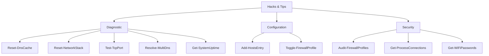

# PowerShell Hacks & Tips using Native Modules

This directory contains professional-grade snippet files for common DevOps and SysAdmin tasks on Windows 11. All scripts are designed to be idempotent and safe to run on clean installs.

## Usage
*   Open the specific `.md` file.
*   Copy the code block within.
*   Run in your PowerShell terminal (pay attention to "Permissions").

## Standards
*   **No Registry Hacks**: All settings use `Set-` or `New-` cmdlets.
*   **Native Only**: No reliance on Chocolatey, Scoop, or PSGallery modules.
*   **Idempotency**: Configuration scripts check state before exploring.
