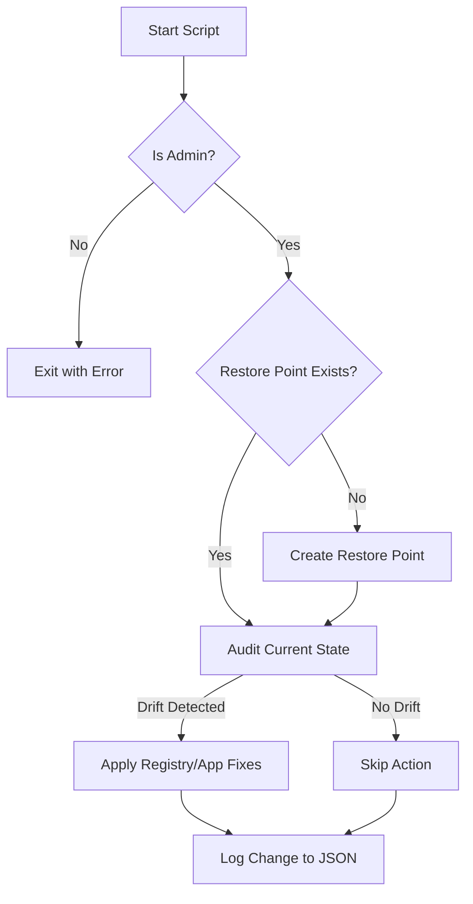

# Audit Report: Windows 11 Debloat Script

**Target Artifact**: `windows11Debloat.ps1` (Hypothetical/Community Standard)  
**Audit Level**: Level 2 (Scripted) $\to$ Level 3 (Integrated/Safe)  
**Auditor**: DevOps & Platform Engineering Team  

---

## 1. Executive Summary

Community "debloat" scripts often violate core DevOps principles by executing destructive actions without state verification or rollback capabilities. This audit identifies critical risks related to **Idempotency** and **Safety** and prescribes code remediation to meet Engineering Rigor standards.

## 2. Risk Matrix

| Risk ID | Severity | Category | Description |
| :--- | :--- | :--- | :--- |
| **R-01** | **Critical** | Safety | Script executes without creating a System Restore Point. |
| **R-02** | High | Idempotency | Registry keys are overwritten blindly, resetting user configurations on re-runs. |
| **R-03** | Medium | Error Handling | `Get-AppxPackage | Remove-AppxPackage` throws red text errors if the package is already gone. |
| **R-04** | High | Stability | Disabling critical services (e.g., Windows Search) without checking dependencies. |

---

## 3. Technical Analysis & Remediation

### Issue 1: Lack of Rollback Mechanism (R-01)

**Current State (Unsafe):**

```powershell
# Script starts immediately removing apps
Get-AppxPackage *xbox* | Remove-AppxPackage
```

**Remediation (Safe):**
Enforce a `Checkpoint-Computer` before any modification.

```powershell
$RestorePoint = Get-ComputerRestorePoint | Where-Object { $_.Description -eq "Pre-Debloat-Snapshot" }
if (-not $RestorePoint) {
    Write-Warning "Creating System Restore Point..."
    Checkpoint-Computer -Description "Pre-Debloat-Snapshot" -RestorePointType "MODIFY_SETTINGS"
}
```

### Issue 2: Non-Idempotent Registry Edits (R-02)

**Current State (Destructive):**

```powershell
# Always overwrites, even if the user changed it back intentionally
Set-ItemProperty -Path "HKCU:\Software\Microsoft\Windows\CurrentVersion\Explorer\Advanced" -Name "TaskbarAl" -Value 0
```

**Remediation (Idempotent):**
Check the current value before writing. Only write if "Drift" is detected.

```powershell
$RegPath = "HKCU:\Software\Microsoft\Windows\CurrentVersion\Explorer\Advanced"
$Name = "TaskbarAl"
$DesiredValue = 0

$Current = Get-ItemProperty -Path $RegPath -Name $Name -ErrorAction SilentlyContinue
if ($null -eq $Current -or $Current.$Name -ne $DesiredValue) {
    Set-ItemProperty -Path $RegPath -Name $Name -Value $DesiredValue
    Write-Host "Fixed: Taskbar alignment set to Left." -ForegroundColor Green
} else {
    Write-Host "Skip: Taskbar alignment already correct." -ForegroundColor Gray
}
```

### Issue 3: Noisy Error Handling (R-03)

**Current State (Noisy):**

```powershell
Get-AppxPackage *candycrush* | Remove-AppxPackage
# Output: Red error text if *candycrush* is missing.
```

**Remediation (Clean):**
Filter first, then process.

```powershell
$App = Get-AppxPackage -Name "*candycrush*" -ErrorAction SilentlyContinue
if ($App) {
    $App | Remove-AppxPackage -ErrorAction Stop
    Write-Host "Removed: $($App.Name)"
}
```

## 4. Architecture: The Safe-Debloat Flow



## 5. Conclusion

The script must be refactored to support **Idempotency**. Running the script 100 times should result in 1 change (the first run) and 99 "No Change" logs.
