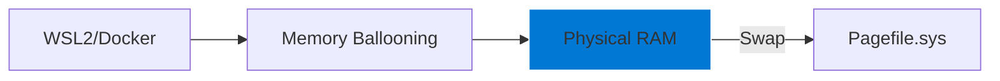

# 02: Memory Management and Swap

## 📊 Core Metric: `Available MBytes` & `Page Faults/sec`
This module targets the optimization of RAM allocation and virtual memory (Pagefile) behavior to prevent thrashing during high-concurrency container workloads.

## 🚀 DevOps Impact
- **Docker stability**: Prevents "Out of Memory" (OOM) errors when running multi-container stacks.
- **WSL2 Memory Ballooning**: Ensures the Windows kernel efficiently reclaims RAM from the Linux subsystem.
- **Compiling**: Speeds up large builds that require massive RAM buffers for linking (e.g., C++/Rust).

## 🗺️ Architecture

## ⚠️ Risk Assessment
- **Caution**: Disabling the Pagefile entirely is **not recommended** even with large RAM amounts, as some Windows kernel components require it for crash dumps and memory commit limits.
- **VBS Impact**: Virtualization-Based Security can slightly increase memory latency; this folder contains tools to audit that overhead.
