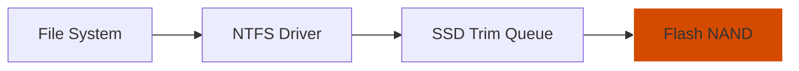

# 03: Storage I/O Optimization

## 📊 Core Metric: `Avg. Disk Queue Length`
Focuses on minimizing metadata overhead and ensuring high sequential and random I/O throughput.

## 🚀 DevOps Impact
- **Database Performance**: Critical for local Postgres/MySQL Docker containers.
- **Git Operations**: Speeds up `git status` on massive monorepos by reducing NTFS LastAccess writes.

## 🗺️ Architecture

## ⚠️ Risk Assessment
- **Caution**: Disabling LastAccess writes may affect some legacy backup software that relies on that timestamp to detect changes.
