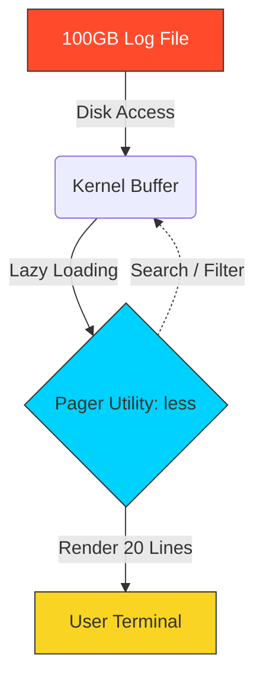

# 📜 Paging Files: Mastering Massive Data

> **"A senior engineer never drinks from the firehose. They use a pager to sip precisely what is needed."**



## 📚 Overview
In DevOps, log files are the "black boxes" of our infrastructure. When an application crashes, it doesn't leave a note; it leaves a trace—sometimes gigabytes in size. Attempting to `cat` or `vim` a 50GB file will lock up your terminal or crash your server by consuming all available RAM.

**Paging Utilities** solve this through **Lazy Loading**. They allow you to navigate massive data streams with surgical precision, constant memory usage, and powerful search capabilities. Mastering these tools is critical for Site Reliability Engineering (SRE) and high-stakes troubleshooting.

---

## 💼 The Automation Why: Don't Drink from the Firehose

**The Beginner's Question**: "Why not just use `cat` to view files?"

**The Answer**: **Because `cat` loads the ENTIRE file into memory. A 10GB log file will freeze your terminal for 5 minutes.**

### Real-World Incident: The Terminal That Never Responded

**Alert**: "Database crashed! Check the logs!"

**The Mistake**:
```bash
$ cat /var/log/postgresql/postgresql.log

# Terminal starts scrolling...
# ...and scrolling...
# ...10 seconds pass...
# ...30 seconds pass...
# ...Ctrl+C doesn't work (buffering)...
# ...SSH session frozen...
# ...1 minute passes...
# ...Terminal STILL scrolling...
```

**What Went Wrong**:
- PostgreSQL log: 12GB (3 months of queries)
- `cat` tried to print **12 BILLION bytes** to the terminal
- Terminal tried to **render all text** in its buffer
- SSH connection **saturated** (slow network)
- **You can't stop it** (Ctrl+C ignored due to buffer overflow)

**The Professional Solution**:
```bash
# Use 'less' (memory-mapped file reading)
$ less /var/log/postgresql/postgresql.log

# Instantly shows FIRST page
# Uses <2MB RAM (no matter how big the file!)
# Keyboard shortcuts:
# - G → Jump to END (finds crash immediately)
# - /ERROR → Search for errors
# - q → Quit anytime

# Find the error in 5 seconds:
$ less /var/log/postgresql/postgresql.log
# Press: G (jump to end)
# Press: ?ERROR (search backwards)
# Found: "FATAL: could not open file metadata/db.conf"
# Fixed! ✅
```

**Time to diagnosis**:
- With `cat`: Still waiting for 12GB to scroll (5+ minutes)
- With `less`: **5 seconds**

---

### The Book Analogy: Reading vs. Loading

Think of file viewing like **reading a book vs. looking at all photos in your camera roll**:

```
┌──────────────────────────────────────────────────┐
│            VIEWING A HUGE FILE                   │
├──────────────────────────────────────────────────┤
│                                                  │
│  cat (The Wrong Way):                           │
│  📸 "Load ALL 10,000 photos into RAM at once!"  │
│      → Computer freezes                          │
│      → You can't browse                          │
│      → Waste gigabytes of memory                 │
│                                                  │
│  less (The Pro Way):                            │
│  📖 "Open book to page 1, read, turn page"      │
│      → Only loads what fits on screen           │
│      → Can jump to any page instantly (G, gg)   │
│      → Uses constant 2MB RAM                     │
│                                                  │
└──────────────────────────────────────────────────┘
```

**Key Commands**:
- `less <file>` → Open the "book"
- `Space` / `Enter` → Turn pages forward
- `b` → Go back one page
- `G` → Jump to last page (END of file)
- `gg` → Jump to first page (START of file)
- `/pattern` → Find text (like Ctrl+F)
- `q` → Close the book

**Production Habit**: **NEVER `cat` a log file in production. Always use `less` or `tail`.**

---

## 🎓 Learning Objectives
By the end of this module, you will:
- ✅ Master **Bidirectional Navigation** inside the `less` pager.
- ✅ Implement **Real-Time Monitoring** with `tail -f` and `tail -F`.
- ✅ Understand **Memory-Mapped I/O** (why pagers handle petabytes efficiently).
- ✅ Perform **In-Pager Searching** using forward (`/`) and backward (`?`) logic.
- ✅ Combine pagers with pipes for high-speed output filtering.

---

## 🏗️ Paging Architecture: The Pager Ecosystem

In Unix, a "Pager" is a specialized filter designed to manage the human-to-kernel interface. It allows users to view content larger than the terminal buffer while maintaining zero performance impact on the system.

### 1. The Power of `less` (Lazy Loading Logic)

The older tool `more` can only move forward and must load chunks of the file into memory sequentially. `less` is a modern, memory-mapped replacement:

- **Kernel Seek vs. Sequential Scan**: When you open a 100GB file and press `G`, `less` doesn't read 100GB of text. It uses the `lseek()` system call to jump directly to the end of the file descriptor. Only the last few KB are actually read into memory.
- **Constant Memory Profile**: Because `less` only populates its display buffer with exactly enough bytes to fill your terminal lines, its RAM consumption remains static (usually < 2MB), regardless of whether you are viewing a configuration file or a petabyte-scale data stream.
- **The `$PAGER` Variable**: Most Unix systems use the `PAGER` environment variable. By setting `export PAGER='less'`, tools like `git log`, `man`, and `systemctl` will automatically use your preferred navigation settings.

### 2. Slicing Operations: `head` and `tail`

While `less` is for human browsing, `head` and `tail` are for **Precision Slicing** of data streams.

- **`head -n 20`**: Essential for inspecting file headers, magic numbers, or YAML configuration keys that determine how a service starts.
- **`tail -n 20`**: The "Snapshot" tool. Used to identify the absolute last state of a system before a crash.

---

## 🚀 Professional Patterns for Automation

Production log monitoring requires **Rotation-Awareness** and **Non-Blocking** logic.

### Pattern A: The "Rotation-Aware" Follower (`tail -F`)

Logs on production servers are often "rotated" (e.g., `app.log` becomes `app.log.1.gz`).

- **The Pitfall**: `tail -f` follows the **Inode** (the specific file object). When rotation happens, the inode is archived, and `tail -f` continues following the *old* empty or archived file.
- **The Pro Fix**: Use `tail -F`. The capital `-F` (Follow) instructs the tool to follow the **Filename**. If the file is deleted and replaced by a new one with the same name (standard rotation behavior), it will automatically pick up the new stream.

### Pattern B: The Buffered Live Filter

When piping log data into search tools, the shell often "buffers" the output, causing a delay in visibility.

```bash
# --line-buffered ensures that every line of text is flushed through the pipe instantly
tail -F /var/log/nginx/access.log | grep --line-buffered " 404 " | tee 404_errors.log
```

### Pattern C: Jumps and Markers in `less`

When auditing a massive file, use **Marks** to create internal shortcuts:
1. Navigate to a line you'll need to revisit.
2. Press `m` followed by a letter (e.g., `ma`).
3. Scroll away. To jump back, press `'` (single quote) followed by the letter (`'a`).

### Pattern D: Paging Non-Interactive Commands (`LESS=FRX`)

Sometimes you want a command to page output ONLY if it's too long, and automatically exit otherwise.

```bash
# F: Quit if one screen, R: Raw colors, X: Don't clear screen on exit
export LESS='FRX'
ls -al /etc | less
```

---

## 🏆 Real-World DevOps Story: The 100GB Freeze

**The Scenario**: An intern tried to debug a database crash by running `cat database.log`. The log was 120GB.
**The Discovery**: The terminal attempted to render 120GB of text. The SSH session froze, the server CPU spiked (due to I/O interrupts), and the entire team was locked out of the maintenance window.
**The Fix**: A senior engineer used `less`. By running `less database.log`, only a few kilobytes were read to fill the screen. They pressed `G` (capital G), which tells the kernel to seek to the end of the file descriptor immediately. The actual crash error was found in **300 milliseconds** without stressing the system.

---

## ❓ Interview Preparation (Paging)

1. **Q: How does `less` handle a 10TB file without running out of memory?**
   *A: It uses Lazy Loading. It only reads the specific bytes from the disk that are currently displayed on the terminal screen, rather than loading the entire file into the RAM.*

2. **Q: What is the difference between `tail -f` and `tail -F`?**
   *A: `-f` follows the file descriptor and stops if the file is renamed or replaced. `-F` follows the filename and will continue following if the file is rotated, deleted, or recreated.*

3. **Q: How do you jump to the end of a file while inside `less`?**
   *A: Press the `G` (capital G) key.*

4. **Q: How can you use a pager to read the output of a very long command like `ls -R /`?**
   *A: Pipe the command into `less`: `ls -R / | less`.*

5. **Q: How do you search for a pattern backwards while paging?**
   *A: Use the `?` followed by your keyword (e.g., `?CRITICAL`). Press `n` to find the next match in that same up-ward direction.*

---

## 📝 Knowledge Check

1. **Which command is used to see the FIRST 10 lines of a file?**
   - [ ] a) `tail`
   - [x] b) `head`
   - [ ] c) `cat`

2. **What does the `-f` flag do in `tail -f`?**
   - [ ] a) Fast execution
   - [x] b) Follow the file (continuous output)
   - [ ] c) Force read

3. **How do you exit from a `less` session?**
   - [ ] a) `Ctrl + C`
   - [ ] b) `Esc`
   - [x] c) `q`

4. **Which key is used to jump to the very START of a file in `less`?**
   - [x] a) `g` (lowercase g)
   - [ ] b) `0`
   - [ ] c) `Home`

5. **True or False: `cat` is recommended for files larger than 1GB.**
   - [ ] a) True
   - [x] b) False (It creates significant I/O overhead and can slow down the system)

---

## 🔗 Next Steps

Now that you can navigate massive data, let's learn how to find the manuals for every tool you use!

Proceed to: **[Man Pages](readme.md)** →
