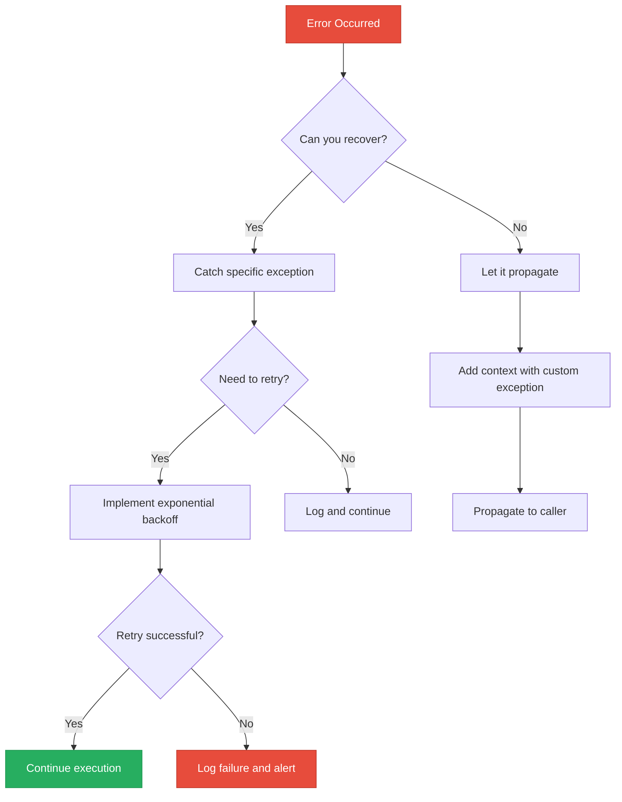

# 🛡️ Error Handling: The Resilience Shield

> **"In DevOps, failure is not an option—it's a certainty. The difference between a script that crashes at 3 AM and one that recovers gracefully is how you handle the unexpected."**


---

## 🧠 The Mental Model: Error Handling as Infrastructure Resilience

**The Junior Struggle**: "My script works perfectly on my laptop, but it crashes in production."

**The Engineer Solution**: Production environments are **hostile**. Networks fail, APIs rate-limit, disks fill up, and permissions change. Error handling isn't about "catching bugs"—it's about **building systems that survive chaos**.

### 🏗️ The Infrastructure Analogy

Think of error handling like **building safety systems into a data center**:

| Safety System | Python Equivalent | Purpose |
|:--------------|:------------------|:--------|
| **Fire Suppression** | `try/except` | Detect and contain failures before they spread |
| **Backup Generator** | Retry logic with exponential backoff | Automatically recover from temporary failures |
| **Emergency Shutdown** | `finally` block | Always clean up resources, even during disasters |
| **Alarm System** | Custom exceptions | Alert the right team with precise context |
| **Redundancy** | Fallback values with `.get()` | Continue operating even when data is missing |

---

## 📚 Why This Module Matters for Juniors

**Before this module**, your scripts look like this:

```python
# ❌ The Fragile Script (Crashes on first error)
def deploy_app():
    config = open("config.json").read()  # Crashes if file doesn't exist
    server_ip = config["server"]["ip"]   # Crashes if key is missing
    deploy_to_server(server_ip)          # Crashes if network is down
```

**After this module**, your scripts look like this:

```python
# ✅ The Resilient Script (Survives chaos)
def deploy_app():
    try:
        with open("config.json") as f:
            config = json.load(f)
    except FileNotFoundError:
        print("⚠️  Config file missing, using defaults")
        config = {"server": {"ip": "localhost"}}
    except json.JSONDecodeError as e:
        print(f"❌ Invalid JSON: {e}")
        return False
    
    server_ip = config.get("server", {}).get("ip", "localhost")
    
    try:
        deploy_to_server(server_ip)
    except ConnectionError:
        print("🔄 Network issue, retrying...")
        time.sleep(5)
        deploy_to_server(server_ip)
    
    return True
```

**The Difference**: The second script can survive missing files, malformed JSON, and network hiccups. This is **production-grade**.

---

## 🎯 Learning Objectives

By the end of this module, you will:

- ✅ **Master the Try/Except/Else/Finally flow** for complete error lifecycle management
- ✅ **Implement Exponential Backoff with Jitter** for resilient API calls
- ✅ **Design Custom Exception Hierarchies** for enterprise-grade debugging
- ✅ **Understand EAFP vs LBYL** (the Pythonic philosophy)
- ✅ **Build Idempotent Operations** that can safely retry
- ✅ **Orchestrate Graceful Shutdowns** using context managers
- ✅ **Prevent Silent Failures** that hide critical errors

---

## 🚀 Part 1: The Anatomy of Resilient Code

### 🔧 The Full Try Block Flow

**The Junior Question**: "What's the difference between `except`, `else`, and `finally`?"

**The Engineer Answer**: Each block has a specific job in the error lifecycle:

```python
try:
    # 🎯 The Risky Operation (only put the dangerous code here)
    print("Attempting to connect to database...")
    conn = database.connect(timeout=5)
    
except ConnectionError as e:
    # 🚨 The Failure Handler (runs ONLY if an error occurs)
    print(f"❌ Connection Failed: {e}")
    log_to_syslog(f"DB connection failed: {e}")
    send_alert_to_slack("Database unreachable")
    
else:
    # ✅ The Success Handler (runs ONLY if NO error occurred)
    print("✅ Connection Established!")
    run_migrations(conn)
    
finally:
    # 🧹 The Cleanup Crew (ALWAYS runs, error or not)
    print("🧹 Cleaning up resources...")
    if 'conn' in locals():
        conn.close()
```

### 🎨 Visual: The Execution Flow

```
┌─────────────────────────────────────────┐
│         try:                            │
│           risky_operation()             │ ──┐
└─────────────────────────────────────────┘   │
                                              │
                ┌─────────────────────────────┘
                │
                ├─── ❌ Error Occurred ──────────┐
                │                                │
                │    ┌──────────────────────┐   │
                │    │  except ErrorType:   │   │
                │    │    handle_error()    │   │
                │    └──────────────────────┘   │
                │                                │
                └─── ✅ No Error ────────────────┤
                                                 │
                     ┌──────────────────────┐   │
                     │  else:               │   │
                     │    success_logic()   │   │
                     └──────────────────────┘   │
                                                 │
                     ┌──────────────────────┐   │
                     │  finally:            │◄──┘
                     │    cleanup()         │ (ALWAYS runs)
                     └──────────────────────┘
```


### 🧠 Why Does This Matter for a Junior?

**The Junior Confusion**: "Why not just put everything in the `try` block?"

**The Engineer Answer**: **Specificity**. You want to catch errors from the **risky operation only**, not from your error handling code itself.

```python
# ❌ The Junior Way (Too broad)
try:
    conn = database.connect()
    run_migrations(conn)  # If THIS fails, we can't tell what went wrong
    send_success_email()  # If THIS fails, it looks like a DB error!
except Exception as e:
    print(f"Something failed: {e}")  # Which operation failed?

# ✅ The Engineer Way (Precise)
try:
    conn = database.connect()
except ConnectionError as e:
    print(f"Database connection failed: {e}")
else:
    # Only runs if connection succeeded
    try:
        run_migrations(conn)
    except MigrationError as e:
        print(f"Migration failed: {e}")
    else:
        send_success_email()
finally:
    if 'conn' in locals():
        conn.close()
```

---

## 🏗️ Part 2: Exception Types & The Hierarchy

### 📊 The Python Exception Family Tree

```
BaseException
├── SystemExit (Ctrl+C, sys.exit())
├── KeyboardInterrupt (User pressed Ctrl+C)
└── Exception (← This is what you should catch)
    ├── ValueError (Wrong value type)
    ├── TypeError (Wrong data type)
    ├── KeyError (Missing dictionary key)
    ├── FileNotFoundError (File doesn't exist)
    ├── ConnectionError (Network issues)
    │   ├── TimeoutError
    │   └── BrokenPipeError
    └── ... (many more)
```

### 🛡️ The Golden Rule: Never Catch `BaseException`

```python
# ❌ NEVER DO THIS (Catches Ctrl+C, making script unstoppable)
try:
    long_running_task()
except BaseException:
    pass  # This will catch SystemExit and KeyboardInterrupt!

# ✅ ALWAYS DO THIS (Catches errors, but allows Ctrl+C)
try:
    long_running_task()
except Exception as e:
    print(f"Error: {e}")
```

### 🎯 The DevOps Exception Matrix

| Exception Type | When It Happens | DevOps Use Case | How to Handle |
|:---------------|:----------------|:----------------|:--------------|
| **FileNotFoundError** | File doesn't exist | Config file missing | Use default config or fail gracefully |
| **PermissionError** | No access rights | SSH key not readable | Check file permissions, log error |
| **ConnectionError** | Network failure | API unreachable | Retry with exponential backoff |
| **TimeoutError** | Operation too slow | Cloud API slow | Increase timeout or retry |
| **KeyError** | Dict key missing | API response changed | Use `.get()` with defaults |
| **ValueError** | Invalid value | User input wrong | Validate input, show helpful error |
| **JSONDecodeError** | Invalid JSON | Malformed config | Log the bad JSON, use defaults |

---

## 🔄 Part 3: Resilient Retries (Exponential Backoff)

### 🧠 The Mental Model: The Polite Retry

**The Scenario**: You're calling a cloud API that's temporarily overloaded.

**The Junior Way**: Try once, fail, give up.

**The Engineer Way**: Try multiple times with increasing delays (exponential backoff) plus randomness (jitter) to avoid the "thundering herd" problem.

### 🚀 Professional Pattern: Retry with Exponential Backoff + Jitter

```python
import time
import random
from typing import Callable, Any

def retry_with_backoff(
    func: Callable,
    max_retries: int = 3,
    base_delay: float = 1.0,
    max_delay: float = 60.0
) -> Any:
    """
    Retry a function with exponential backoff and jitter.
    
    Args:
        func: The function to retry
        max_retries: Maximum number of retry attempts
        base_delay: Initial delay in seconds
        max_delay: Maximum delay between retries
    
    Returns:
        The result of the function call
    
    Raises:
        The last exception if all retries fail
    """
    last_exception = None
    
    for attempt in range(max_retries):
        try:
            return func()
        except Exception as e:
            last_exception = e
            
            if attempt == max_retries - 1:
                # Last attempt failed, give up
                raise
            
            # Calculate exponential backoff: 1s, 2s, 4s, 8s, 16s...
            delay = min(base_delay * (2 ** attempt), max_delay)
            
            # Add jitter (randomness) to prevent thundering herd
            jitter = random.uniform(0, delay * 0.1)
            total_delay = delay + jitter
            
            print(f"⚠️  Attempt {attempt + 1} failed: {e}")
            print(f"🔄 Retrying in {total_delay:.2f}s...")
            time.sleep(total_delay)
    
    # This should never be reached, but satisfies type checker
    raise last_exception


# 🎯 Usage Example: Calling a flaky API
def call_cloud_api():
    """Simulate a flaky API that fails 50% of the time"""
    import random
    if random.random() < 0.5:
        raise ConnectionError("API temporarily unavailable")
    return {"status": "success", "data": [1, 2, 3]}

# ✅ Resilient API call
try:
    result = retry_with_backoff(call_cloud_api, max_retries=5)
    print(f"✅ Success: {result}")
except Exception as e:
    print(f"❌ All retries exhausted: {e}")
```

### 🎨 Visual: Exponential Backoff Timeline

```
Attempt 1: ──┤ Fail ├── Wait 1s ──┐
Attempt 2:                         ├──┤ Fail ├── Wait 2s ──┐
Attempt 3:                                                  ├──┤ Fail ├── Wait 4s ──┐
Attempt 4:                                                                          ├──┤ Success! ✅
```


### 💡 Pro Tip: Why Jitter Matters

**The Problem**: If 1,000 clients all fail at the same time and retry after exactly 2 seconds, they'll all hit the recovering server simultaneously, causing another failure.

**The Solution**: Add random jitter (0-200ms) so retries are spread out over time.

---

## 🏗️ Part 4: Custom Exceptions for DevOps

### 🧠 Why Custom Exceptions?

**The Junior Question**: "Why not just use `Exception` for everything?"

**The Engineer Answer**: At 3 AM when your script fails, you need to know **exactly what layer failed** without reading logs.

### 🎯 Building an Exception Hierarchy

```python
# Base exception for all infrastructure errors
class InfrastructureError(Exception):
    """Base exception for all infrastructure-related failures."""
    pass

# Network layer errors
class NetworkError(InfrastructureError):
    """Raised when network operations fail."""
    pass

class APIError(NetworkError):
    """Raised when API calls fail."""
    def __init__(self, endpoint: str, status_code: int, message: str):
        self.endpoint = endpoint
        self.status_code = status_code
        super().__init__(f"API {endpoint} failed with {status_code}: {message}")

# Resource layer errors
class ResourceError(InfrastructureError):
    """Raised when cloud resources have issues."""
    pass

class ResourceNotFoundError(ResourceError):
    """Raised when a cloud resource doesn't exist."""
    def __init__(self, resource_type: str, resource_id: str):
        self.resource_type = resource_type
        self.resource_id = resource_id
        super().__init__(f"{resource_type} '{resource_id}' not found")

class ResourceQuotaExceeded(ResourceError):
    """Raised when resource limits are hit."""
    pass

# Configuration errors
class ConfigurationError(InfrastructureError):
    """Raised when configuration is invalid."""
    pass
```

### 🚀 Using Custom Exceptions in Production

```python
def get_ec2_instance(instance_id: str):
    """
    Retrieve an EC2 instance by ID.
    
    Raises:
        ResourceNotFoundError: If instance doesn't exist
        APIError: If AWS API call fails
    """
    try:
        response = aws_api.describe_instances(InstanceIds=[instance_id])
    except requests.exceptions.Timeout:
        raise APIError("ec2.describe_instances", 504, "Request timeout")
    except requests.exceptions.ConnectionError:
        raise NetworkError("Cannot reach AWS API")
    
    if not response['Instances']:
        raise ResourceNotFoundError("EC2 Instance", instance_id)
    
    return response['Instances'][0]


# 🎯 Usage: Precise error handling
try:
    instance = get_ec2_instance("i-1234567890abcdef0")
except ResourceNotFoundError as e:
    print(f"⚠️  {e} - Creating new instance...")
    create_new_instance()
except APIError as e:
    print(f"❌ AWS API issue: {e}")
    send_alert_to_oncall(f"AWS API down: {e}")
except NetworkError as e:
    print(f"🌐 Network issue: {e}")
    retry_with_backoff(lambda: get_ec2_instance(instance_id))
```

### 💡 Pro Tip: Exception Chaining

Preserve the original error context when raising a new exception:

```python
try:
    config = json.loads(config_file.read())
except json.JSONDecodeError as e:
    # ✅ Chain the exception to preserve debugging context
    raise ConfigurationError("Invalid config.json") from e
    # This preserves the original JSONDecodeError in the traceback
```

---

## 🛡️ Part 5: EAFP vs LBYL (The Pythonic Philosophy)

### 🧠 The Mental Models

**LBYL (Look Before You Leap)**: Check if something is safe before doing it.

**EAFP (Easier to Ask Forgiveness than Permission)**: Just do it and handle errors if they occur.

### 📊 The Comparison

```python
# ❌ LBYL (The Cautious Approach)
import os

if os.path.exists("config.json"):
    if os.access("config.json", os.R_OK):
        with open("config.json") as f:
            config = f.read()
    else:
        print("File not readable")
else:
    print("File not found")

# ✅ EAFP (The Pythonic Approach)
try:
    with open("config.json") as f:
        config = f.read()
except FileNotFoundError:
    print("File not found")
except PermissionError:
    print("File not readable")
```

### 🏆 Why EAFP is Better for DevOps

**The Race Condition Problem**:

```python
# ❌ LBYL has a race condition
if os.path.exists("config.json"):  # ← File exists here
    # But another process could DELETE it here! ↓
    with open("config.json") as f:  # ← Crashes!
        config = f.read()

# ✅ EAFP is atomic and safe
try:
    with open("config.json") as f:  # ← Either works or doesn't
        config = f.read()
except FileNotFoundError:
    config = get_default_config()
```

**The Lesson**: In concurrent environments (like production), EAFP is safer because the check and the action are atomic.

---

## 🧹 Part 6: Graceful Shutdowns & Resource Cleanup

### 🧠 The Mental Model: The Janitor

**The Problem**: Your script crashes, leaving:
- Database connections open
- Temporary files on disk
- Locks held on resources
- Incomplete transactions

**The Solution**: Use `finally` blocks and context managers to **always** clean up.

### 🔧 The `finally` Block: Always Runs

```python
def backup_database():
    conn = None
    try:
        print("Connecting to database...")
        conn = database.connect()
        
        print("Starting backup...")
        backup_data = conn.export_all()
        
        print("Writing to file...")
        with open("backup.sql", "w") as f:
            f.write(backup_data)
        
        print("✅ Backup complete!")
        
    except ConnectionError as e:
        print(f"❌ Database connection failed: {e}")
        send_alert("Backup failed - DB unreachable")
        
    except IOError as e:
        print(f"❌ File write failed: {e}")
        send_alert("Backup failed - Disk full?")
        
    finally:
        # 🧹 This ALWAYS runs, even if there's an error
        if conn is not None:
            print("Closing database connection...")
            conn.close()
        print("Cleanup complete.")
```

### 🚀 Professional Pattern: Context Managers (`with` statement)

**The Junior Way** (Manual cleanup):

```python
# ❌ Easy to forget cleanup
f = open("log.txt", "a")
f.write("Deployment started\n")
# If an error occurs here, file is never closed!
f.close()
```

**The Engineer Way** (Automatic cleanup):

```python
# ✅ File is ALWAYS closed, even if an error occurs
with open("log.txt", "a") as f:
    f.write("Deployment started\n")
    # File automatically closes when exiting this block
```

### 🏗️ Building Custom Context Managers

```python
import time

class DeploymentTimer:
    """Context manager to time and log deployments."""
    
    def __init__(self, deployment_name: str):
        self.deployment_name = deployment_name
        self.start_time = None
    
    def __enter__(self):
        """Called when entering the 'with' block."""
        self.start_time = time.time()
        print(f"🚀 Starting deployment: {self.deployment_name}")
        return self
    
    def __exit__(self, exc_type, exc_val, exc_tb):
        """Called when exiting the 'with' block (even on error)."""
        duration = time.time() - self.start_time
        
        if exc_type is None:
            print(f"✅ Deployment '{self.deployment_name}' completed in {duration:.2f}s")
        else:
            print(f"❌ Deployment '{self.deployment_name}' failed after {duration:.2f}s")
            print(f"   Error: {exc_val}")
        
        # Return False to propagate the exception, True to suppress it
        return False


# 🎯 Usage
with DeploymentTimer("web-app-v2.0"):
    deploy_application()
    run_smoke_tests()
    # Timer automatically logs completion or failure
```

---

## 🏆 Part 7: Real-World DevOps Stories

### 📖 Story 1: The Silent Failure

**The Scenario**: A nightly backup script ran for 6 months, reporting "Success" every morning.

**The Discovery**: When a critical database crashed, the team found all backups were **0 bytes**. The disk had filled up 4 months ago.

**The Root Cause**:

```python
# ❌ The Silent Failure
try:
    backup_database()
except:
    pass  # Silently swallows ALL errors!

print("✅ Backup complete!")  # Always prints, even on failure
```

**The Solution**:

```python
# ✅ The Resilient Solution
import sys
import logging

logging.basicConfig(
    filename='/var/log/backup.log',
    level=logging.INFO,
    format='%(asctime)s - %(levelname)s - %(message)s'
)

try:
    backup_database()
    logging.info("✅ Backup completed successfully")
    sys.exit(0)  # Exit with success code
    
except IOError as e:
    logging.error(f"❌ Backup failed - Disk issue: {e}")
    send_pagerduty_alert(f"Backup failed: {e}")
    sys.exit(1)  # Exit with error code (triggers monitoring alert)
    
except Exception as e:
    logging.error(f"❌ Backup failed - Unknown error: {e}")
    logging.error(f"Traceback: {traceback.format_exc()}")
    send_pagerduty_alert(f"Backup failed: {e}")
    sys.exit(1)
```

**The Outcome**: Failures now trigger PagerDuty alerts within 60 seconds.

---

### 📖 Story 2: The Thundering Herd

**The Scenario**: A microservices architecture with 500 instances all calling a central API.

**The Discovery**: When the API went down for 10 seconds, all 500 instances retried **simultaneously** every 5 seconds, causing a cascading failure.

**The Root Cause**:

```python
# ❌ Synchronized retries (all instances retry at the same time)
def call_api():
    for attempt in range(3):
        try:
            return api.get_data()
        except ConnectionError:
            time.sleep(5)  # All 500 instances wait exactly 5s!
```

**The Solution**:

```python
# ✅ Jittered retries (instances retry at different times)
import random

def call_api():
    for attempt in range(3):
        try:
            return api.get_data()
        except ConnectionError:
            # Add randomness to spread out retries
            jitter = random.uniform(0, 2)  # 0-2 seconds
            delay = 5 + jitter
            time.sleep(delay)
```

**The Outcome**: API recovered gracefully with no cascading failures.

---

## 📈 Part 8: The Exception Decision Tree



---

## ❓ Interview Preparation

### 🎯 Core Concepts

1. **Q: Why is `except Exception as e:` better than a bare `except:`?**
   - **A**: A bare `except:` catches `SystemExit` and `KeyboardInterrupt`, making it impossible to stop your script with Ctrl+C. Always use `except Exception:` to only catch errors you can actually handle.

2. **Q: What is the purpose of the `else` block in a try/except?**
   - **A**: The `else` block runs ONLY if no exception was raised in the `try` block. It keeps the `try` block small and focused on only the risky operation, making it clear what might fail.

3. **Q: Explain "Exception Chaining" (`raise ... from`).**
   - **A**: It allows you to raise a new high-level error while preserving the original cause. Example: `raise ConfigError("Invalid config") from JSONDecodeError`. This preserves the full debugging history.

4. **Q: When should you use `finally` vs a context manager (`with`)?**
   - **A**: Use `with` for resources that support the context manager protocol (files, locks, connections). Use `finally` for custom cleanup logic that doesn't fit the context manager pattern.

5. **Q: What is "EAFP" and why does Python prefer it?**
   - **A**: "Easier to Ask Forgiveness than Permission" - just try the operation and handle errors. It's safer than "Look Before You Leap" (LBYL) because it avoids race conditions where the state changes between the check and the action.

### 🚀 Advanced Questions

6. **Q: How do you handle multiple exceptions in one block?**
   - **A**: Use a tuple: `except (ConnectionError, TimeoutError) as e:`. Or use separate blocks if they require different handling logic.

7. **Q: What is the difference between `sys.exit(0)` and `sys.exit(1)`?**
   - **A**: Exit code 0 means success, 1 (or any non-zero) means failure. Monitoring systems use these codes to detect script failures.

8. **Q: Why add jitter to retry logic?**
   - **A**: To prevent the "thundering herd" problem where many clients hit a recovering server simultaneously. Jitter spreads out retry attempts over time.

9. **Q: What is idempotency and why does it matter for retries?**
   - **A**: An idempotent operation produces the same result whether executed once or multiple times. This is critical for retries - you need to ensure retrying doesn't cause duplicate resources or corrupted state.

10. **Q: How do you log exceptions with full tracebacks?**
    - **A**: Use `logging.exception()` inside an except block, or `logging.error(traceback.format_exc())` to capture the full stack trace.

---

## 📝 Knowledge Check

### 🧠 Beginner Level

1. **Which block ALWAYS executes, even if an error occurs?**
   - [ ] a) `try`
   - [ ] b) `except`
   - [x] c) `finally`
   - [ ] d) `else`

2. **True or False: You can recover from `KeyboardInterrupt` using `except Exception:`.**
   - [ ] a) True
   - [x] b) False (`KeyboardInterrupt` inherits from `BaseException`, not `Exception`)

3. **What does EAFP stand for?**
   - [ ] a) Execute And Fix Problems
   - [x] b) Easier to Ask Forgiveness than Permission
   - [ ] c) Error Avoidance For Production
   - [ ] d) Exception And Failure Protocol

4. **Which is the correct way to catch multiple exception types?**
   - [ ] a) `except ConnectionError or TimeoutError:`
   - [x] b) `except (ConnectionError, TimeoutError):`
   - [ ] c) `except ConnectionError, TimeoutError:`
   - [ ] d) `except [ConnectionError, TimeoutError]:`

### 🚀 Intermediate Level

5. **What is the primary benefit of adding jitter to retry logic?**
   - [ ] a) Makes code faster
   - [x] b) Prevents thundering herd problem
   - [ ] c) Reduces memory usage
   - [ ] d) Improves code readability

6. **When does the `else` block execute?**
   - [ ] a) Always
   - [ ] b) Only when an exception occurs
   - [x] c) Only when NO exception occurs
   - [ ] d) Before the `try` block

7. **What is exception chaining?**
   - [ ] a) Catching multiple exceptions in sequence
   - [x] b) Raising a new exception while preserving the original cause
   - [ ] c) Creating a hierarchy of custom exceptions
   - [ ] d) Logging exceptions to a file

8. **Which exit code indicates success?**
   - [x] a) 0
   - [ ] b) 1
   - [ ] c) -1
   - [ ] d) 200

### 🏆 Advanced Level

9. **What is the risk of using a bare `except:` block?**
   - [ ] a) It's slower than specific exceptions
   - [ ] b) It uses more memory
   - [x] c) It catches `SystemExit` and `KeyboardInterrupt`, making the script unstoppable
   - [ ] d) It doesn't log errors properly

10. **In exponential backoff, what does the formula `2 ** attempt` represent?**
    - [ ] a) Linear increase in delay
    - [x] b) Exponential increase in delay (1s, 2s, 4s, 8s...)
    - [ ] c) Random delay
    - [ ] d) Constant delay

---

## 🎯 Key Takeaways for Juniors

### 🧠 Mental Models Over Syntax

1. **Error Handling = Infrastructure Resilience**: Just like data centers have backup generators, your scripts need retry logic
2. **`finally` = The Janitor**: Always cleans up, no matter what happens
3. **Custom Exceptions = Alarm Systems**: Alert the right team with precise context
4. **EAFP = Atomic Operations**: Safer in concurrent environments than checking first

### 🛡️ Safety Patterns

1. **Always use `except Exception`, never bare `except:`** (allows Ctrl+C to work)
2. **Use `.get()` for dictionaries** to prevent KeyError crashes
3. **Implement exponential backoff with jitter** for API retries
4. **Log exceptions with full tracebacks** for debugging
5. **Use context managers (`with`)** for automatic resource cleanup

### 🚀 Production Rules

1. **Never silently swallow exceptions** - always log them
2. **Exit with non-zero codes on failure** - monitoring systems depend on this
3. **Make operations idempotent** - safe to retry without side effects
4. **Keep `try` blocks small** - only wrap the risky operation
5. **Use custom exceptions** - provide context for 3 AM debugging

---

## 🔗 Next Steps

Now that your scripts are resilient, let's learn how to work with files and data formats.

**Proceed to**: [File I/O for DevOps →](../06-file-io-devops/readme.md)

---

## 📚 Additional Resources

- [Python Official Docs: Errors and Exceptions](https://docs.python.org/3/tutorial/errors.html)
- [PEP 3134: Exception Chaining](https://www.python.org/dev/peps/pep-3134/)
- [Real Python: Python Exceptions](https://realpython.com/python-exceptions/)
- [AWS Architecture Blog: Exponential Backoff and Jitter](https://aws.amazon.com/blogs/architecture/exponential-backoff-and-jitter/)

---

**🎓 Remember**: A newbie writes scripts that work on their laptop. An engineer writes scripts that survive production chaos. Master error handling, and you'll sleep better at night.
