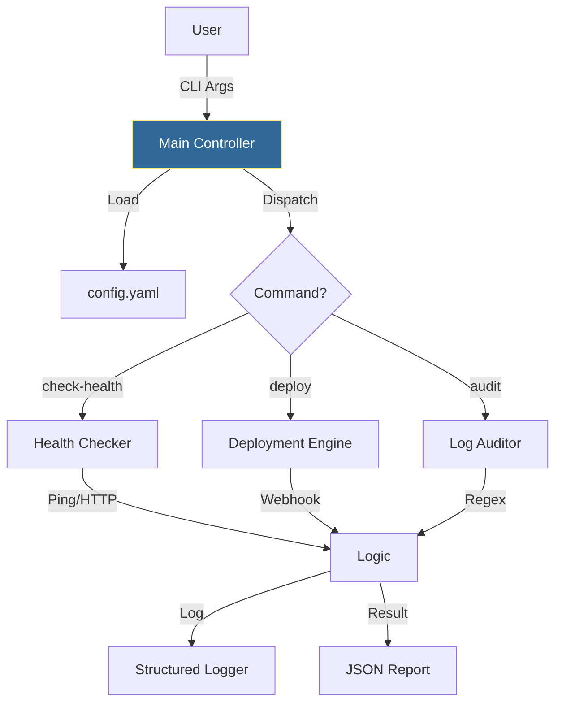
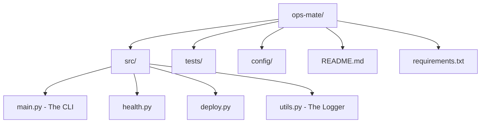

# 🚀 Capstone: The Operations Hub

> **"Theory becomes power only when it is applied. This capstone project combines every module you've studied—from Variables to Microservices—into a single, production-grade automation engine."**


---

## 🧠 The Mental Model: The Central Nervous System

**The Junior Struggle**: "I have 50 disparate scripts. `ping_servers.py`, `clean_logs.py`, `check_api.py`. I act as the manual glue between them."

**The Engineer Solution**: Build a **Unified Tool** (CLI) that orchestrates these tasks.
A professional tool has:
1. **A Single Entry Point** (`ops_tool.py`)
2. **Configuration** (YAML/JSON, not hardcoded)
3. **Observability** (Logging to file and console)
4. **Safety** (Dry-runs and confirmation)

### 🏗️ The Architecture



**The Key Insight**: This is exactly how tools like `kubectl` or `aws-cli` work under the hood.

---

## 📚 Why This Module Matters

**Before this module**, you had skills.
**After this module**, you have a **Product**.

You will build `ops-mate`, a CLI tool that can:
1. **Health Check**: Ping/HTTP check a list of servers.
2. **Audit Logs**: Find errors in log files using Regex.
3. **Trigger Deploy**: Send a webhook to your FastAPI service.

**The Difference**: You move from "knowing Python" to "building platforms."

---

## 🆚 Junior Way vs. Engineer Way

| Feature | The Junior Way (Problematic) | The Engineer Way (Production-ready) |
|:---|:---|:---|
| **Structure** | Single 2000-line script file | Modular package with `src/`, `tests/`, `config/` |
| **Logic** | Script logic mixed with config | Logic is generic; config is external (YAML) |
| **Integrity** | Script crashes if one API fails | Resilient loops with robust error boundaries |
| **Observability** | Printing "Done" at the end | Structured logging with rotation to `logs/` |
| **Deployment** | Running `python script.py` | Installed as a global CLI tool (`setup.py`) |
| **Confidence** | Manual testing of common paths | Unit tests covering success & failure cases |

---

### 🎨 Visual: The Production Project Structure



**Why this matters**: In a real DevOps team, you don't share scripts via Slack. You share **Git Repositories**. This structure allows your colleagues to understand, test, and contribute to your tool without you needing to explain it.

---

---

## 🎯 Learning Objectives

By the end of this module, you will:

- ✅ **Structure a Python Project**: `src/`, `tests/`, `config/`
- ✅ **Integrate CLI & Logging**: Professional interface
- ✅ **Load Configs**: Use `pathlib` and `yaml`
- ✅ **Execute Parallel Checks**: Use `subprocess`
- ✅ **Package it**: Create a `requirements.txt` and `setup`

---

## 🏗️ Part 1: The Project Structure

### 🧠 The Blueprint

Stop putting everything in one file.

```text
ops-mate/
├── config/
│   └── inventory.yaml     # Server list (The "Database")
├── logs/                  # Auto-generated logs
├── src/
│   ├── __init__.py
│   ├── main.py            # Entry point (CLI Parsing)
│   ├── health.py          # Ping/HTTP logic
│   ├── deploy.py          # API interaction
│   └── utils.py           # Logger setup
├── tests/
│   ├── __init__.py
│   └── test_health.py     # Unit tests
├── requirements.txt       # Dependencies
└── README.md              # Documentation
```

---

## 🚀 Part 2: The Logic (Reviewing Skills)

### 1. The CLI (Argparse - Module 16)
```python
# src/main.py
import argparse
from src.health import check_all_servers

def main():
    parser = argparse.ArgumentParser(description="OpsMate: The DevOps Swiss Army Knife")
    subparsers = parser.add_subparsers(dest="command")
    
    # Message: "health"
    health_parser = subparsers.add_parser("health", help="Check server health")
    health_parser.add_argument("--target", help="Specific server to check")
    
    args = parser.parse_args()
    
    if args.command == "health":
        check_all_servers(args.target)

if __name__ == "__main__":
    main()
```

### 2. The Configuration (YAML/Pathlib - Modules 11/17)
```yaml
# config/inventory.yaml
servers:
  - name: web-01
    url: https://web-01.prod.com
    type: http
  - name: db-01
    ip: 10.0.1.5
    type: ping
```

### 3. The Automation (Requests/Subprocess - Modules 10/20)
```python
# src/health.py
import subprocess
import requests
import logging

logger = logging.getLogger("ops-mate")

def check_http(url):
    try:
        r = requests.get(url, timeout=2)
        return r.status_code == 200
    except:
        return False

def check_ping(ip):
    # Cross-platform ping
    cmd = ["ping", "-c", "1", ip]
    result = subprocess.run(cmd, stdout=subprocess.DEVNULL)
    return result.returncode == 0
```

---

## 🔐 Part 3: The Glue (Putting it Together)

### 🧠 The Mental Model: The Controller

The Controller reads the config, loops through items, dispatches jobs, and aggregates results.

### 🔧 The Implementation

```python
# src/health.py (continued)
import yaml
from pathlib import Path

def load_config():
    config_path = Path("config/inventory.yaml")
    return yaml.safe_load(config_path.read_text())

def check_all_servers(target_filter=None):
    inventory = load_config()
    results = []

    for server in inventory['servers']:
        if target_filter and server['name'] != target_filter:
            continue
            
        status = "DOWN"
        if server['type'] == 'http':
            if check_http(server['url']):
                status = "UP"
        elif server['type'] == 'ping':
            if check_ping(server['ip']):
                status = "UP"
        
        logger.info(f"Server {server['name']} is {status}")
        results.append({"name": server['name'], "status": status})
    
    return results
```

---

## 🏆 Real-World DevOps Story: The Unified Dashboard

**The Scenario**: An SRE team had 12 different scripts to check various parts of their infrastructure.
- `check_db.sh`
- `verify_web.py`
- `audit_logs.pl`

**The Problem**: During an incident, they had to open 12 terminal windows. It was chaotic.

**The Solution**: They built `sre-cli` (like this capstone).
It unified all checks into `sre-cli status --all`.

**The Outcome**: Incident Response time dropped by 50%. New hires only had to learn one tool. The tool eventually grew to include `sre-cli deploy` and `sre-cli rollback`. This "Internal Developer Platform" (IDP) became the most valuable asset of the team.

---

## ❓ Interview Preparation (System Design)

### 🎯 Core Concepts

1. **Q: Why separate configuration from code?**
   - *A: So you can change parameters (like adding a server) without redeploying/touching the logic. This is the **12-Factor App** config principle.*

2. **Q: How would you parallelize this script?**
   - *A: The `for` loop in `check_all_servers` is blocking. I would use `concurrent.futures.ThreadPoolExecutor` to run the checks in parallel, reducing total time from Sum(T) to Max(T).*

3. **Q: How do you distribute this tool to the team?**
   - *A: Package it as a Python Wheel (`setup.py`) and upload it to a private PyPI, or simply build a Docker image that contains the tool.*

4. **Q: How do you handle secrets in this architecture?**
   - *A: The YAML config should reference environment variables (e.g., `api_key: ${API_KEY}`) rather than containing the raw key. The script then interpolates them.*

### 🚀 Advanced Questions

5. **Q: What is the benefit of `__init__.py`?**
   - *A: It marks a directory as a Python Package, allowing you to import modules like `from src.health import check_ping` logic cleanly.*

6. **Q: How would you add a "Dry Run" mode?**
   - *A: Pass a `dry_run=True` flag to the logic functions. If true, log the action ("Would restart DB") but simply return Success without running the subprocess.*

---

## 📝 Knowledge Check

### 🧠 Beginner Level

1. **Which file defines the dependencies?**
   - [ ] a) `package.json`
   - [x] b) `requirements.txt`
   - [ ] c) `config.yaml`

2. **What function is the standard entry point?**
   - [ ] a) `start()`
   - [x] b) `main()`
   - [ ] c) `run()`

3. **Why use `if __name__ == "__main__":`?**
   - [x] a) To prevents code from running when the file is imported as a module
   - [ ] b) To make it run faster
   - [ ] c) To enable debugging

### 🚀 Intermediate Level

4. **Which library helps load YAML files safely?**
   - [ ] a) `json`
   - [x] b) `PyYAML`
   - [ ] c) `configparser`

5. **If you want to run an external shell command, which module do you use?**
   - [ ] a) `os`
   - [x] b) `subprocess`
   - [ ] c) `sys`

6. **What is the purpose of `logging.getLogger("ops-mate")`?**
   - [x] a) To create a named logger channel for this specific application
   - [ ] b) To print to the screen
   - [ ] c) To read log files

### 🏆 Advanced Level

7. **How do you make the CLI available as a global command (e.g., just typing `ops-mate`)?**
   - [ ] a) Add it to the PATH manually
   - [x] b) Use `entry_points` in `setup.py` / `pyproject.toml`
   - [ ] c) Copy the file to `/bin`

8. **In a professional project, where should unit tests live?**
   - [ ] a) Next to the code
   - [x] b) In a `tests/` directory mirroring the `src/` structure
   - [ ] c) In the `README.md`

---

## 🎯 Key Takeaways for Juniors

### 🧠 Mental Models Over Syntax

1. **The Product**: You aren't writing scripts; you are building products.
2. **The Controller**: Central logic that delegates to specialized modules.
3. **The User Experience**: CLI flags and clean logs matter.

### 🛡️ Safety Patterns

1. **Config Validation**: Check the YAML structure before running.
2. **Exception Boundaries**: Don't let one failed server crash the loop.
3. **Audit Trails**: Log everything to files.

### 🚀 Production Rules

1. **Package it**: Don't just email `.py` files.
2. **Test it**: `pytest` is your friend.
3. **Document it**: A tool without a README is useless.

---

## 🏁 Final Words

You did it. 

You started with variables and loops. You ended with a Microservice API and a Production CLI Tool.
You are ready to automate the world.

**Return to [Curriculum Overview](../../../../../../readme.md)**
