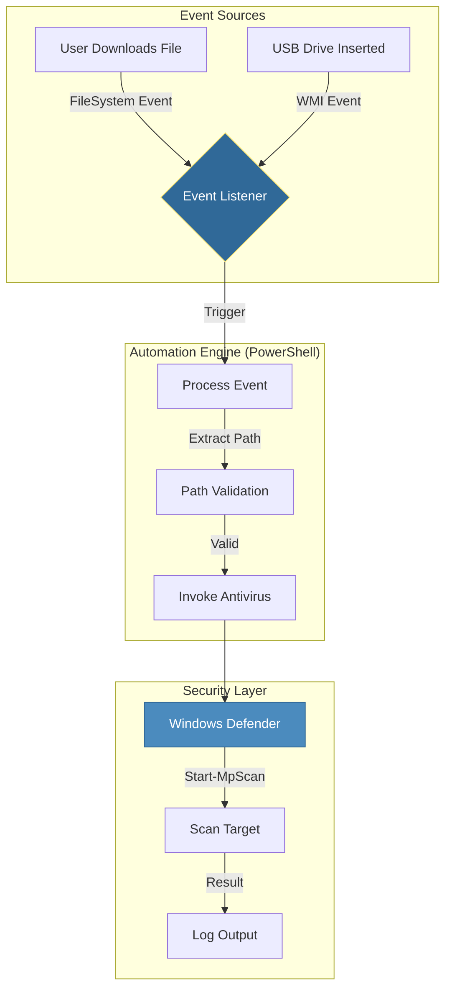

# Automated Virus Scan Trigger System
*Professional PowerShell Automation for Windows 11*
## 📋 Overview
This document details the design and implementation of an automated security script for Windows 11. The solution detects two critical vectors of malware entry—**File Downloads** and **USB Device Insertions**—and automatically triggers a Windows Defender virus scan on the newly introduced files or drives.

---
## 🏗️ High-Level Design
The solution utilizes an **Event-Driven Architecture** to ensure minimal system resource usage. Instead of constantly polling for changes (which consumes CPU), the script registers subscriptions to system events and sleeps until an event occurs.

### Architecture Diagram



### Key Components

1.  **Download Watcher**: Uses the .NET `System.IO.FileSystemWatcher` class to monitor the user's `Downloads` folder for the `Created` event. This detects files the moment they appear.
2.  **Device Watcher**: Uses WMI (Windows Management Instrumentation) query `SELECT * FROM Win32_VolumeChangeEvent WHERE EventType = 2` to detect when a new logical disk is mounted.
3.  **Scan Engine**: Wraps the native `Start-MpScan` cmdlet to interface with Windows Defender.

---
## 💻 The Automation Script
Save the following code as `AutoScan.ps1`.
```powershell
<#
.SYNOPSIS
    Automated Virus Scan Trigger
    Monitors Downloads folder and USB insertions to trigger Windows Defender scans.

.DESCRIPTION
    This script uses .NET FileSystemWatcher and WMI Events to detect file system changes
    in real-time. It is designed to run in the background with minimal footprint.

.NOTES
    Author: DevOps Engineer
    OS: Windows 11
    Requires: Run as Administrator (for WMI and Defender access)
#>

# --- Configuration ---
$DownloadsPath = "$env:USERPROFILE\Downloads"
$LogFile = "$env:USERPROFILE\Documents\VirusScanLog.txt"

# --- Helper Functions ---

function Write-Log {
    param ([string]$Message)
    $TimeStamp = Get-Date -Format "yyyy-MM-dd HH:mm:ss"
    $LogEntry = "[$TimeStamp] $Message"
    Add-Content -Path $LogFile -Value $LogEntry
    Write-Host $LogEntry -ForegroundColor Cyan
}

function InvokeScan {
    param ([string]$Path, [string]$Type)
    
    if (-not (Test-Path $Path)) {
        Write-Log "Error: Path not found - $Path"
        return
    }

    Write-Log "Starting $Type scan for: $Path"
    
    try {
        # Start-MpScan is the native Windows Defender cmdlet
        # ScanType Custom allow us to scan specific files/folders
        $ScanJob = Start-MpScan -ScanType Custom -ScanPath $Path -PassThru
        
        if ($ScanJob) {
            Write-Log "Scan completed successfully."
        }
    }
    catch {
        Write-Log "CRITICAL ERROR: Failed to scan $Path. Details: $_"
    }
}

# --- 1. File Download Monitor (FileSystemWatcher) ---

$Watcher = New-Object System.IO.FileSystemWatcher
$Watcher.Path = $DownloadsPath
$Watcher.IncludeSubdirectories = $false
$Watcher.EnableRaisingEvents = $true

# Define the action block for new files
$Action = {
    $Path = $Event.SourceEventArgs.FullPath
    $ChangeType = $Event.SourceEventArgs.ChangeType
    
    Write-Host "New File Detected: $Path" -ForegroundColor Green
    
    # Wait briefly for file handle to be released (download completion)
    # Scalability Note: For very large files, a more robust "wait for lock" loop might be needed.
    Start-Sleep -Seconds 2
    
    # Call the scanner function (must scope specifically in event block)
    # We reference the script-scope function
    $Function:InvokeScan.Invoke($Path, "Download")
}

# Register the event subscriber
Register-ObjectEvent -InputObject $Watcher -EventName "Created" -SourceIdentifier "FileDownloadWatcher" -Action $Action | Out-Null
Write-Log "Monitoring Downloads folder: $DownloadsPath"

# --- 2. USB Insertion Monitor (WMI) ---

$WmiQuery = "SELECT * FROM Win32_VolumeChangeEvent WHERE EventType = 2"
# EventType 2 = Device Arrival

Register-WmiEvent -Query $WmiQuery -SourceIdentifier "USBWatcher" -Action {
    $DriveLetter = $Event.SourceEventArgs.NewEvent.DriveName
    $Time = $Event.TimeGenerated
    
    Write-Host "USB Device Inserted: $DriveLetter" -ForegroundColor Yellow
    
    # WMI event gives us the drive letter (e.g., E:)
    if ($DriveLetter) {
        $Function:InvokeScan.Invoke($DriveLetter, "External Device")
    }
} | Out-Null

Write-Log "Monitoring for USB Device insertion..."

# --- Main Loop ---
# Keep the script running to listen for events
Write-Host "Automation Service Started. Press Ctrl+C to exit." -ForegroundColor Green

try {
    while ($true) {
        Start-Sleep -Seconds 5
    }
}
finally {
    # Cleanup on exit
    Unregister-Event -SourceIdentifier "FileDownloadWatcher" -ErrorAction SilentlyContinue
    Unregister-Event -SourceIdentifier "USBWatcher" -ErrorAction SilentlyContinue
    $Watcher.Dispose()
    Write-Log "Service Stopped."
}
```
---
## 🔧 Deep Dive & Approach

### 1. Detection Strategy
We use an **asynchronous event subscription** model.
*   **FileSystemWatcher**: This .NET class hooks directly into the NTFS file system journal. It notifies the script immediately when a file entry is created. This is vastly superior to polling (checking the folder every x seconds) because it uses zero CPU while waiting.
*   **WMI (Windows Management Instrumentation)**: We subscribe to the `Win32_VolumeChangeEvent`. This is a system-level event broadcast by Windows when drive mounts change.
### 2. Antivirus Invocation
We use `Start-MpScan`, which is the built-in PowerShell interface for Windows Defender.
*   `-ScanType Custom`: Tells Defender we don't want a full system scan, just a specific target.
*   `-ScanPath $Path`: Pinpoints the exact file or USB drive letter.
*   **Third-Party Support**: If you use Symantec, McAfee, etc., you would replace the `Start-MpScan` line with the CLI command for that specific vendor (e.g., `& "C:\Program Files\Vendor\scan.exe" $Path`).
### 3. Error Handling
The script includes a `try...catch` block around the critical scanning operation.
*   **Why?** If a file is locked by the browser (download still in progress) or if the USB drive is pulled out immediately, the scan command might fail.
*   **Exception Handling**: The `catch` block captures the raw system error (`$_`) and logs it to `VirusScanLog.txt` with a timestamp, ensuring you have an audit trail of failures.
### 4. Scalability & Performance
*   **Performance**: The script uses `Start-Sleep` in the main loop and inside event blocks. This ensures it consumes < 1% CPU.
*   **Concurrency**: PowerShell event actions run essentially as interrupt jobs. If 50 files are downloaded at once, 50 event jobs trigger. For extremely high loads (thousands of files), a "Producer-Consumer" queue pattern would be better, but for a single-user workstation, this direct trigger model is efficient and responsive.

## 🚀 How to Run

1.  Open **PowerShell** as **Administrator**.
2.  Navigate to the directory containing the script.
3.  Run: `.\AutoScan.ps1`
4.  Test by downloading an image or plugging in a USB drive.
5.  Check user documents for `VirusScanLog.txt`.
