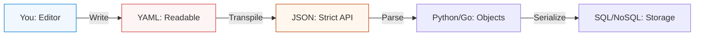

# 📄 Data Formats: The Language of the Machine

> **"Data is the oil of automation, and JSON/YAML is the pipeline. In the cloud, if you can't parse data, you can't automate systems. A missing space in YAML isn't just a typo; it's a production outage."**

---

## 🧠 The Mental Model: The Common Currency

**The Newbie Struggle**: "I spent 4 hours trying to fix my Kubernetes deployment, and it turned out I had one missing space in my YAML. I copied a JSON block into my code and it crashed because of a trailing comma. Why is the computer so picky? I feel like I'm trying to learn 5 different languages just to name a server!"

**The Engineer Solution**: You realize that Data Formats aren't "Languages"; they are **Contracts**. A computer doesn't 'guess' what you mean; it perfectly calculates the structure. You stop guessing and start **Validating**. You learn that JSON is for machines (fast and strict) and YAML is for humans (readable but sensitive). You treat your config files with the same respect as your code.

### 🏗️ The Data Analogy

Think of Data Formats like **Shipping Containers**:

| Format | Analogy | Strength |
|:-------|:--------|:---------|
| **YAML** | A neatly packed bookshelf | High readability for Humans |
| **JSON** | A tightly sealed medical crate | Speed and accuracy for Machines |
| **XML** | A massive library of ancient scrolls | Complex legacy relationships |
| **CSV** | A simple spreadsheet of names | Raw data in bulk |
| **Markdown** | The instruction manual | Explaining things to people |

---

## 📚 Why This Module Matters for Newbies

**Before this module**, you might think:
- "A file is just text."
- "The formatting is just for looks."
- "I can just eye-ball my YAML configs."

**After this module**, you'll understand:
- **Serialization**: How Python "Speaks" to a file.
- **Idempotency**: Why consistent data leads to stable infrastructure.
- **The "Big Three"**: Mastering JSON, YAML, and XML for any DevOps tool.
- **Validation**: Using Linters to catch errors before the server does.

**The Difference**: You move from "Blindly editing files" to **"Architecting Configs."**

---

---

## 🎯 Junior's Mission: The Config Crash
**Scenario**: You are tasked with migrating a legacy server list from a CSV file into a new Kubernetes configuration (YAML).
**Your Goal**: Ensure the YAML is **Lint-Perfect**, handles **Special Characters** correctly, and can be successfully parsed by a Python validation script.

---

## 🏗️ Operational Reality: Production Hazards
In the world of "Configuration as Code," a data format error is a **System Failure**.
1.  **The Invisible Tab**: Mixing Tabs and Spaces in YAML will cause the parser to fail, but it looks identical to the naked eye.
2.  **Trailing Commas**: Adding a comma after the last item in a JSON list will break most strict parsers (including AWS IAM policies).
3.  **Encoding Issues**: Saving a file in `UTF-16` instead of `UTF-8` can cause monitoring tools to read gibberish.
4.  **String vs. Number**: In YAML, `port: "80"` is a string, while `port: 80` is an integer. Some tools will crash if they expect one and get the other.

---

## 🛠️ The Data Toolbelt (Essential Commands)
| Command | Why it matters |
| :--- | :--- |
| `yq` | A command-line YAML processor. Like `jq` but for YAML. |
| `jq .` | Pretty-print and validate JSON files in the terminal. |
| `yamllint <file>` | Checks if your YAML follows best practices (not just syntax). |
| `python3 -m json.tool` | Built-in JSON validator if `jq` isn't installed. |
| `cat -A <file>` | Shows "hidden" characters (like tabs) that break YAML. |

---

## 🎯 Learning Objectives
By the end of this module, you will:

- ✅ **Decode YAML**: Mastering indentation, lists, and key-value pairs.
- ✅ **Parse JSON**: Understanding brackets, braces, and API payloads.
- ✅ **Navigate XML**: Understanding tags, attributes, and legacy systems.
- ✅ **Validate State**: Using tools to check for syntax errors.
- ✅ **Convert Data**: Moving from YAML to JSON and back safely.

---

---

## 🏗️ The Data Flow Architecture

Data moves from a Human (YAML) to a Machine (JSON) and eventually into Code (Objects).

---

## 📂 Deep-Dive Modules

1.  **[🏗️ YAML Mastery](./yaml/readme.md)**: The standard for Kubernetes and Ansible.
2.  **[⚙️ JSON Fundamentals](./json/readme.md)**: The language of REST APIs and AWS.
3.  **[🏢 XML & Enterprise Tech](./xml/readme.md)**: Managing legacy and Jenkins internals.
4.  **[📝 Modern Standards (TOML & Markdown)](./toml/readme.md)**: Pyproject and Documentation.

---

## 🏆 Real-World DevOps Story: The Million Dollar Space

**The Incident**: A major cloud provider had a 4-hour global outage in 2017.
**The Failure**: An engineer updated a YAML configuration file to increase the "Max Request" limit. He accidentally used **tabs** instead of **spaces** on one line. The automation tool didn't catch the error, but the server failed to load the config, leading to a cascading crash.
**The Fix**: Implementation of **Strict Linting** in the CI/CD pipeline. No config can reach production anymore without being "Validated" by a robot first.
**The Outcome**: The Newbie who made the mistake realized that "Formatting is Infrastructure."

---

## ❓ Interview Preparation (Data Formats)

### 🎯 Core Concepts

1. **Q: Why use YAML instead of JSON for Kubernetes?**
    *   *Answer: Readability. YAML supports comments, multi-line strings, and complex nested structures that are much harder to manage in raw JSON. Humans build K8s manifested; YAML is human-centric.*
2. **Q: What is the main strictness rule in JSON?**
    *   *Answer: No trailing commas, strict use of double quotes for keys/strings, and no comments allowed. This makes it extremely predictable for machines to parse.*
3. **Q: What is 'Serialization'?**
    *   *Answer: The process of converting a data structure or object (like a Python dict) into a format that can be stored (like a JSON file) or transmitted over a network.*

---

## 📝 Knowledge Check

1. **In YAML, what character is used for a list item?**
    * [ ] a) `{ }`
    * [x] b) `-`
    * [ ] c) `:`
2. **True or False: JSON supports comments.**
    * [ ] a) True
    * [x] b) False
3. **Which format is used by most modern Python build tools (like `pyproject`)?**
    * [ ] a) XML
    * [ ] b) JSON
    * [x] c) TOML

---

**Next Step**: Start with **[YAML Mastery](./yaml/readme.md)**

---
## 🧭 Additional Modules
- [Markdown](markdown/readme.md)
