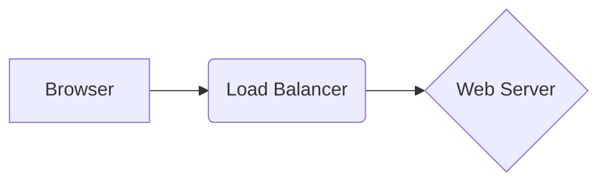

# 📝 Markdown Standards: The SRE Documentation Language
*Version 1.0 | Writing High-Performance Internal Knowledge Bases*

---

## 📖 Overview
Markdown is a lightweight markup language that allows you to write structured content in plain text. For DevOps, it is the standard for **READMEs**, **Runbooks**, and **Wiki pages**. Clean Markdown ensures that your documentation is readable in Git web interfaces, VS Code, and terminal viewers.

---

## 🏛️ Essential Markdown Syntax

### Headings
**Standard**: Use `#` followed by a space. Use only one `<h1>` (#) per file.
**Example**:
```markdown
# Module Name
## Section
### Sub-section
```

### Links & Images
**Standard**: `[Text](../readme.md)` for links and `` for images.
**Example**:
```markdown
[Deployment Logs](https://logs.prod.com)

```

### Code Blocks
**Standard**: Use triple backticks (```) with the language name for syntax highlighting.
**Example**:
```python
def deploy():
    print("Executing...")
```

### Tables
**Standard**: Used for structured data like configuration keys or device lists.
**Example**:
```markdown
| Command | Result |
| :--- | :--- |
| `ping` | connectivity check |
```

---

## 🚀 Advanced Documentation Features

### Admonitions (Alerts)
**Definition**: Special blocks for Warnings, Tips, or Important notes.
**Example**:
```markdown
> [!WARNING]
> Running this command will delete all prod pods.
```

### Task Lists
**Definition**: Checkboxes for tracking progress in deployment runbooks.
**Example**:
```markdown
- [x] Provision VPC
- [ ] Deploy Load Balancer
```

### Mermaid Diagrams
**Definition**: A tool to create charts and diagrams from text.
**Example**:


---

## 🔍 DevOps Use Cases

### Incident Runbooks
**Description**: Step-by-step Markdown files that guide an on-call engineer through a service outage.
**Standard**: Must include "Prerequisites," "Action Steps," and "Validation Checks."

### README.md (The Front Door)
**Description**: The first file anyone sees in a repository.
**Standard**: Must contain "What is this?", "Getting Started," and "Reference Library."

---

## 💡 SRE Pro-Tips
- **Linting**: Use `markdownlint` to ensure consistency in spacing, indentation, and heading levels.
- **Relative Pathing**: Use local paths (`./assets/img.png`) for images so they render correctly in the repo and local clones.
- **Explicitness**: Always specify the language in code blocks (e.g., ```yaml) to ensure readers see correct highlighting.

---
**Next Step**: [Data Formats Best Practices →](./data-formats-best-practices-ref.md)
