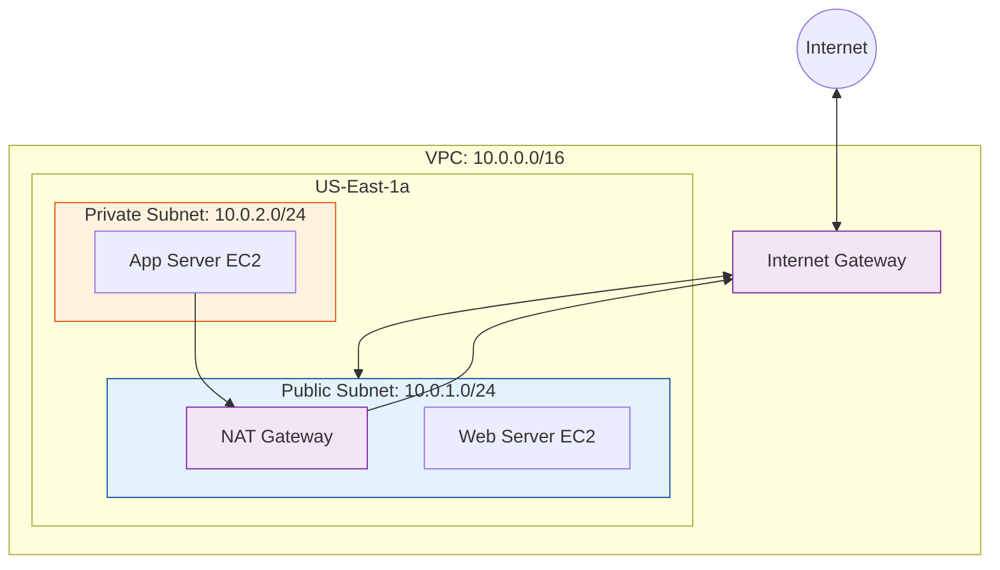

# AWS Networking Deep Dive (VPC, Security, Troubleshooting)

This comprehensive guide consolidates essential AWS networking concepts, providing a hands-on path to mastering Virtual Private Clouds (VPC), Security Groups, and network troubleshooting.

---

## 📚 Table of Contents
1. [Part 1: VPC Getting Started & Architecture](#part-1-vpc-getting-started--architecture)
2. [Part 2: Security Groups Deep Dive](#part-2-security-groups-deep-dive)
3. [Part 3: Troubleshooting Network Issues](#part-3-troubleshooting-network-issues)
4. [Part 4: Real-World Scenarios](#part-4-real-world-scenarios)
5. [Part 5: Interview Preparation](#part-5-interview-preparation)
<b>6. [Part 6: Knowledge Quiz</b>

Show Answer

Answer: 20+ Questions)](#part-6-knowledge-quiz

---

## Part 1: VPC Getting Started & Architecture

### Introduction
This section walks you through creating your first fully functional VPC with public/private subnets, internet connectivity, and proper security.

### Architecture

### Quick Reference: Implementation Steps
1.  **VPC**: Create with CIDR `10.0.0.0/16`. Enable DNS Hostnames.
2.  **Subnets**: 
    - Public: `10.0.1.0/24` (Map Public IP on launch)
    - Private: `10.0.2.0/24`
3.  **Gateways**:
    - **Internet Gateway (IGW)**: Attach to VPC.
    - **NAT Gateway**: Create in *Public* subnet, allocate Elastic IP.
4.  **Route Tables**:
    - **Public RT**: `0.0.0.0/0` -> IGW. Associate with Public Subnet.
    - **Private RT**: `0.0.0.0/0` -> NAT GW. Associate with Private Subnet.

*(For detailed CLI commands and step-by-step console instructions, refer to standard AWS documentation or the scripts provided in the repository examples.)*

---

## Part 2: Security Groups Deep Dive

Security Groups act as a virtual stateful firewall for your instance to control inbound and outbound traffic.

### Core Concepts
- **Stateful**: If you send a request out, the response traffic is automatically allowed regardless of inbound rules.
- **Allow Rules Only**: You cannot create denial rules (use NACLs for that).
- **Implicit Deny**: All traffic is blocked by default until you add a rule to allow it.

### Common Patterns

#### 1. Web Tier (Public)
| Type | Protocol | Port | Source | Description |
|------|----------|------|--------|-------------|
| HTTP | TCP | 80 | 0.0.0.0/0 | Allow web traffic |
| HTTPS| TCP | 443 | 0.0.0.0/0 | Allow secure web traffic |
| SSH | TCP | 22 | Your-IP/32 | Management access |

#### 2. App Tier (Private)
| Type | Protocol | Port | Source | Description |
|------|----------|------|--------|-------------|
| Custom| TCP | 8080 | **sg-web-tier-id** | Allow traffic *only* from Web Tier |

#### 3. Database Tier (Secure)
| Type | Protocol | Port | Source | Description |
|------|----------|------|--------|-------------|
| MySQL| TCP | 3306 | **sg-app-tier-id** | Allow traffic *only* from App Tier |

> **Best Practice**: Always reference other Security Groups by ID ("Source Chaining") rather than using IP ranges (CIDRs) for internal communication. This makes your rules dynamic and robust.

---

## Part 3: Troubleshooting Network Issues

When connectivity fails, follow this checklist to identify the root cause.

### The Connectivity Checklist
1.  **The Instance**: Is it running? Did it pass status checks (2/2)?
2.  **Security Groups (Most Common)**: 
    - Is the inbound port open? 
    - Is the source IP correct? (Did your home IP change?)
    - Are you referencing the correct Source Security Group ID?
3.  **Network ACLs (NACLs)**:
    - These are **Stateless**. Do you have both Inbound *and* Outbound rules?
    - Are there explicit DENY rules blocking your subnet?
4.  **Route Tables**: 
    - Public Subnet must point `0.0.0.0/0` to **IGW**.
    - Private Subnet must point `0.0.0.0/0` to **NAT Gateway**.
5.  **Gateways**: Is the NAT Gateway in `Available` state? Is the IGW attached?

### Debugging Tools
- **VPC Reachability Analyzer**: Automated analysis of path validity.
- **VPC Flow Logs**: Capture packet metadata (Accept/Reject) for detailed inspection.
- **Ping/Telnet**: Use `telnet <ip> <port>` to test specific port connectivity.

---

## Part 4: Real-World Scenarios

### Scenario 1: The "Black Hole" Private Instance
**Situation**: You deployed a backend API server in a private subnet. The application starts but immediately crashes because it cannot reach the public npm registry to install dependencies.
**Diagnosis**:
- Private subnets have no direct route to the internet (no IGW).
- The instance tries to send traffic to `0.0.0.0/0`, but the route table drops it.
**Solution**:
1. Provision a **NAT Gateway** in a Public Subnet.
2. Update the Private Subnet's Route Table to point `0.0.0.0/0` -> `nat-gateway-id`.

### Scenario 2: The "Works on My Machine" Security Group
**Situation**: A developer can connect to the database from their local laptop during development (because they opened port 3306 to `0.0.0.0/0`). In production, the Web Server cannot connect to the Database.
**Diagnosis**:
- The "allow all" rule was removed for security (correctly).
- No rule was added to allow the Web Server specifically.
**Solution**:
1. Identify the Security Group ID of the Web Server tier (e.g., `sg-web`).
2. Update the Database Security Group to allow Inbound TCP 3306 with source `sg-web`.

### Scenario 3: Asymmetric Routing with NACLs
**Situation**: You configured a Network ACL to allow inbound traffic on port 80, but users still can't connect. Security Groups are open.
**Diagnosis**:
- NACLs are stateless. You allowed the *request* to come in (Inbound Rule), but you forgot to allow the *response* to go out (Outbound Rule).
- Responses usually occur on "ephemeral ports" (1024-65535).
**Solution**:
- ADD Outbound Rule to NACL: Allow TCP Ports 1024-65535 to `0.0.0.0/0` (or specific client IPs).

---

## Part 5: Interview Preparation

**Q1: What is the difference between a Security Group and a Network ACL?**
> **Answer**: 
> - **Security Group**: Instance-level, Stateful (return traffic allowed automatically), Allow rules only.
> - **NACL**: Subnet-level, Stateless (must explicit allow return traffic), Allow and Deny rules allowed.

**Q2: Can I peer two VPCs with the same CIDR block?**
> **Answer**: No. VPC Peering requires non-overlapping CIDR blocks to function correctly. If address ranges overlap, routing would be ambiguous.

**Q3: Why would I use a NAT Gateway instead of a connection through the Internet Gateway?**
> **Answer**: Security. A NAT Gateway allows instances in a private subnet to request data from the internet (outbound-initiated), but prevents the internet from initiating connections to those instances. An Internet Gateway is for resources that need to be directly reachable from the internet (like load balancers or bastion hosts).

**Q4: How many Internet Gateways can I attach to a single VPC?**
> **Answer**: Only one. A VPC has a 1:1 relationship with an Internet Gateway.

**Q5: What happens if an instance in a public subnet doesn't have a public IP address?**
> **Answer**: It cannot communicate with the internet, even if the Routing Table points to an Internet Gateway. The IGW relies on the 1:1 NAT of private-to-public IP to route return traffic. Without a public IP (or Elastic IP), this translation cannot happen.

---

## Part 6: Knowledge Quiz

<b>1. Which component is required for a subnet to be considered "Public"?</b>

Show Answer

Answer: B.</b> A subnet is public if its route table sends internet traffic (0.0.0.0/0) to an Internet Gateway (IGW).

<b>2. True or False: One Security Group can be attached to multiple instances.</b>

Show Answer

Answer: A.</b> Use SGs as "roles" (e.g., "WebServers") and attach them to as many instances as fit that role.

<b>3. What is the maximum size of a VPC CIDR block?</b>

Show Answer

Answer: C.</b> The largest block AWS allows is /16 (65,536 IPs).

<b>4. Are Network ACLs stateful or stateless?</b>

Show Answer

Answer: B.</b> Stateless. You must explicitly define both inbound and outbound rules.

<b>5. Which feature allows you to capture information about the IP traffic going to and from network interfaces in your VPC?</b>

Show Answer

Answer: B.</b> VPC Flow Logs.

<b>6. When peering VPCs, is the connection transitive? (If A peers B, and B peers C, can A talk to C?)</b>

Show Answer

Answer: B.</b> VPC Peering is non-transitive. A would need to peer directly with C.

<b>7. To save costs on NAT Gateways, what can you use for S3 traffic?</b>

Show Answer

Answer: C.</b> A VPC Gateway Endpoint for S3 allows internal access to S3 without passing through a NAT Gateway or the public internet, avoiding separate data processing charges.

<b>8. Which IP address is reserved by AWS in every subnet for the router?</b>

Show Answer

Answer: A.</b> The first IP (.0) is network, .1 is router, .2 is DNS, .3 is future use, and the last (.255) is broadcast.

<b>9. Can you change the CIDR block of a VPC after creating it?</b>

Show Answer

Answer: B.</b> The primary CIDR is fixed, but you can add *secondary* CIDR blocks to expand it.

<b>10. What is the default limit of VPCs per region per account?</b>

Show Answer

Answer: B.</b> The default is 5, but this is a soft limit that can be raised.

<b>11. Traffic between instances in the same VPC is routed using:</b>

Show Answer

Answer: B.</b> Private IPs.

<b>12. Which has higher priority for evaluation: Security Groups or NACLs?</b>

Show Answer

Answer: B.</b> NACLs act as the first layer of defense at the subnet boundary before traffic reaches the instance (Security Group).

<b>13. You need to allow an instance to download updates but prevent internet initiation. Use:</b>

Show Answer

Answer: B.</b> NAT Gateway for IPv4 or Egress-Only IGW for IPv6.

<b>14. Security Groups evaluate rules using which logic?</b>

Show Answer

Answer: A.</b> "OR" logic. If any rule permits the traffic, it is allowed.

<b>15. An ephemeral port range is typically:</b>

Show Answer

Answer: B.</b> Used for return traffic in stateless connections.

<b>16. How do you permit traffic from one specific EC2 instance to another dynamic instance?</b>

Show Answer

Answer: B.</b> Using the SG ID is dynamic and doesn't break if the instance IP changes.

<b>17. Which resource is required to enable an EC2 instance in a public subnet to have a public DNS name?</b>

Show Answer

Answer: B.</b> Identifying `enableDnsHostnames` attribute on the VPC.

<b>18. What is the scope of a VPC?</b>

Show Answer

Answer: B.</b> A VPC spans an entire Region.

<b>19. What is the scope of a Subnet?</b>

Show Answer

Answer: C.</b> A subnet resides entirely within one Availability Zone.

<b>20. A "Default VPC" comes with:</b>

Show Answer

Answer: B.</b> It is designed to be immediately usable for public instances.

<b>21. Can you delete the "Main" Route Table of a VPC?</b>

Show Answer

Answer: B.</b> You can replace its associations or modify it, but you cannot delete the main route table.

