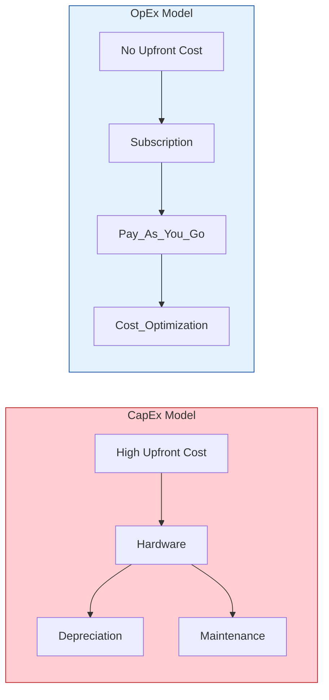

# Cloud Computing Fundamentals

Complete guide to cloud computing concepts, principles, and core technologies.

## What is Cloud Computing?
Cloud computing is the delivery of computing services—including servers, storage, databases, networking, software, analytics, and intelligence—over the Internet ("the cloud") to offer faster innovation, flexible resources, and economies of scale.

### Key Characteristics

#### 1. On-Demand Self-Service
```bash
# Users can provision computing capabilities automatically
# No human interaction with service providers required
# Examples:
- Launch virtual machines instantly
- Scale storage capacity up/down
- Deploy applications without IT intervention
```

#### 2. Broad Network Access
```bash
# Services available over the network
# Accessible through standard mechanisms
# Support for heterogeneous platforms
# Examples:
- Web browsers
- Mobile applications
- API access
- Command-line interfaces
```

#### 3. Resource Pooling
```bash
# Provider's computing resources are pooled
# Serve multiple consumers using multi-tenant model
# Resources dynamically assigned and reassigned
# Examples:
- Shared physical servers
- Virtual machine allocation
- Storage pool management
- Network bandwidth sharing
```

#### 4. Rapid Elasticity
```bash
# Capabilities can be elastically provisioned
# Scale rapidly outward and inward
# Appear unlimited to the consumer
# Examples:
- Auto-scaling groups
- Load balancer adjustment
- Storage expansion
- Compute capacity changes
```

#### 5. Measured Service
```bash
# Cloud systems automatically control and optimize resource use
# Monitoring, controlling, and reporting
# Transparency for both provider and consumer
# Examples:
- Pay-per-use billing
- Resource utilization metrics
- Cost allocation tracking
- Performance monitoring
```

## Cloud Computing Architecture

### Traditional IT vs Cloud Computing

```mermaid
graph TB
    subgraph "Traditional IT (On-Premises)"
        User1[User] --> FW[Firewall]
        FW --> LB[Hardware Load Balancer]
        LB --> S1[Physical Server 1]
        LB --> S2[Physical Server 2]
        S1 --> DB[Physical Database Cluster]
        S2 --> DB
    end

subgraph "Cloud Computing"
        User2[User] --> DNS[Cloud DNS]
        DNS --> CLB[Elastic Load Balancer]
        CLB --> ASG[Auto Scaling Group]
        ASG --> VM1[Virtual Machine 1]
        ASG --> VM2[Virtual Machine 2]
        ASG --> VM3[Virtual Machine 3]
        VM1 --> RDS[Managed Database Service]
        VM2 --> RDS
        VM3 --> RDS
    end

style FW fill:#ffcdd2,stroke:#b71c1c,color:#000000
    style LB fill:#ffcdd2,stroke:#b71c1c,color:#000000
    style S1 fill:#ffcdd2,stroke:#b71c1c,color:#000000
    style S2 fill:#ffcdd2,stroke:#b71c1c,color:#000000
    style DB fill:#ffcdd2,stroke:#b71c1c,color:#000000

style DNS fill:#e3f2fd,stroke:#0d47a1,color:#000000
    style CLB fill:#e3f2fd,stroke:#0d47a1,color:#000000
    style ASG fill:#e3f2fd,stroke:#0d47a1,color:#000000
    style VM1 fill:#e3f2fd,stroke:#0d47a1,color:#000000
    style VM2 fill:#e3f2fd,stroke:#0d47a1,color:#000000
    style VM3 fill:#e3f2fd,stroke:#0d47a1,color:#000000
    style RDS fill:#e3f2fd,stroke:#0d47a1,color:#000000
```


### Cloud Service Stack


## Cloud Computing Benefits

### 1. Cost Efficiency
```bash
# Capital Expenditure (CapEx) to Operational Expenditure (OpEx)
Traditional IT:
- High upfront hardware costs
- Ongoing maintenance expenses
- Over-provisioning for peak capacity
- Depreciation of assets

Cloud Computing:
- Pay-as-you-use model
- No upfront hardware investment
- Reduced operational costs
- Automatic scaling optimization
```



### 2. Scalability and Elasticity
```bash
# Horizontal Scaling (Scale Out/In)
aws autoscaling create-auto-scaling-group \
    --auto-scaling-group-name web-servers \
    --min-size 2 \
    --max-size 10 \
    --desired-capacity 3

# Vertical Scaling (Scale Up/Down)
aws ec2 modify-instance-attribute \
    --instance-id i-1234567890abcdef0 \
    --instance-type t3.large
```

### 3. Reliability and Availability
```bash
# Multi-Region Deployment
Regions: us-east-1, us-west-2, eu-west-1
Availability Zones per Region: 3+
Uptime SLA: 99.9% - 99.99%

# Disaster Recovery
- Automated backups
- Cross-region replication
- Failover mechanisms
- Recovery time objectives (RTO)
- Recovery point objectives (RPO)
```

### 4. Security
```bash
# Shared Responsibility Model
Cloud Provider Responsibilities:
- Physical security of data centers
- Infrastructure security
- Network controls
- Host operating system patching

Customer Responsibilities:
- Data encryption
- Identity and access management
- Operating system updates
- Application security
```

### 5. Global Reach
```bash
# Worldwide Infrastructure
AWS Regions: 31+ regions, 99+ availability zones
Azure Regions: 60+ regions, 140+ countries
GCP Regions: 35+ regions, 106+ zones

# Content Delivery Networks (CDN)
- Edge locations worldwide
- Reduced latency
- Improved user experience
- Global content distribution
```

## Virtualization in Cloud Computing

### Types of Virtualization

#### 1. Server Virtualization
```bash
# Hypervisor Types
Type 1 (Bare Metal):
- VMware vSphere/ESXi
- Microsoft Hyper-V
- Citrix XenServer
- KVM

Type 2 (Hosted):
- VMware Workstation
- Oracle VirtualBox
- Parallels Desktop
```

#### 2. Storage Virtualization
```bash
# Storage Abstraction
Physical Storage → Virtual Storage Pool → Logical Volumes

Benefits:
- Storage pooling
- Thin provisioning
- Snapshots and cloning
- Data migration
- Improved utilization
```

#### 3. Network Virtualization
```bash
# Software-Defined Networking (SDN)
Physical Network → Virtual Networks → Network Services

Components:
- Virtual switches
- Virtual routers
- Virtual firewalls
- Network overlays (VXLAN, GRE)
```

#### 4. Desktop Virtualization
```bash
# Virtual Desktop Infrastructure (VDI)
- Centralized desktop management
- Remote access capabilities
- Consistent user experience
- Enhanced security
- Cost optimization
```

## Cloud Computing Technologies

### Containerization
```bash
# Docker Containers
docker run -d --name web-server -p 80:80 nginx

# Container Orchestration
kubectl create deployment web --image=nginx --replicas=3
kubectl expose deployment web --port=80 --type=LoadBalancer

# Benefits:
- Lightweight virtualization
- Consistent environments
- Rapid deployment
- Microservices architecture
```

### Serverless Computing
```bash
# Function as a Service (FaaS)
AWS Lambda:
aws lambda create-function \
    --function-name ProcessData \
    --runtime python3.9 \
    --role arn:aws:iam::123456789012:role/lambda-role \
    --handler lambda_function.lambda_handler \
    --zip-file fileb://function.zip

# Characteristics:
- No server management
- Event-driven execution
- Automatic scaling
- Pay-per-execution
```

### Microservices Architecture
```bash
# Service Decomposition
Monolithic Application → Microservices

Benefits:
- Independent deployment
- Technology diversity
- Fault isolation
- Scalability
- Team autonomy

Challenges:
- Distributed system complexity
- Network latency
- Data consistency
- Service discovery
- Monitoring complexity
```

## Cloud Native Technologies

### 12-Factor App Methodology
```bash
1. Codebase: One codebase tracked in revision control
2. Dependencies: Explicitly declare and isolate dependencies
3. Config: Store config in the environment
4. Backing services: Treat backing services as attached resources
5. Build, release, run: Strictly separate build and run stages
6. Processes: Execute the app as one or more stateless processes
7. Port binding: Export services via port binding
8. Concurrency: Scale out via the process model
9. Disposability: Maximize robustness with fast startup and graceful shutdown
10. Dev/prod parity: Keep development, staging, and production as similar as possible
11. Logs: Treat logs as event streams
12. Admin processes: Run admin/management tasks as one-off processes
```

### DevOps Integration
```bash
# Continuous Integration/Continuous Deployment (CI/CD)
Source Code → Build → Test → Deploy → Monitor

Tools:
- Jenkins, GitLab CI, GitHub Actions
- Docker, Kubernetes
- Terraform, CloudFormation
- Prometheus, Grafana
```

## Cloud Computing Challenges

### 1. Security and Privacy
```bash
# Common Security Concerns
- Data breaches
- Insider threats
- Account hijacking
- Insecure APIs
- Data loss

# Mitigation Strategies
- Encryption at rest and in transit
- Multi-factor authentication
- Regular security audits
- Compliance frameworks
- Zero-trust architecture
```

### 2. Vendor Lock-in
```bash
# Risks
- Proprietary technologies
- Data portability issues
- Cost implications
- Limited flexibility

# Mitigation Strategies
- Multi-cloud strategy
- Open standards adoption
- Containerization
- API abstraction layers
```

### 3. Performance and Latency
```bash
# Factors Affecting Performance
- Network latency
- Bandwidth limitations
- Resource contention
- Geographic distance

# Optimization Strategies
- Content delivery networks
- Edge computing
- Caching strategies
- Performance monitoring
```

### 4. Compliance and Governance
```bash
# Regulatory Requirements
- GDPR (General Data Protection Regulation)
- HIPAA (Health Insurance Portability and Accountability Act)
- SOX (Sarbanes-Oxley Act)
- PCI DSS (Payment Card Industry Data Security Standard)

# Governance Framework
- Data classification
- Access controls
- Audit trails
- Policy enforcement
```

## Cloud Economics

### Cost Models
```bash
# Pay-as-you-go (On-Demand)
- No upfront costs
- Pay for actual usage
- Highest per-unit cost
- Maximum flexibility

# Reserved Instances/Committed Use
- Upfront payment
- Significant discounts (30-70%)
- 1-3 year commitments
- Predictable workloads

# Spot/Preemptible Instances
- Unused capacity
- Up to 90% discount
- Can be interrupted
- Fault-tolerant workloads
```

### Total Cost of Ownership (TCO)
```bash
# Traditional IT Costs
- Hardware acquisition
- Software licensing
- Data center facilities
- Power and cooling
- IT staff
- Maintenance and support

# Cloud Computing Costs
- Compute resources
- Storage costs
- Network transfer
- Support plans
- Training and certification
```

## Future of Cloud Computing

### Emerging Trends
```bash
# Edge Computing
- Processing closer to data source
- Reduced latency
- IoT applications
- 5G networks

# Quantum Computing
- Quantum advantage
- Complex problem solving
- Cryptography implications
- Research and development

# Artificial Intelligence/Machine Learning
- AI-powered cloud services
- AutoML platforms
- Intelligent automation
- Predictive analytics

# Sustainability
- Green computing initiatives
- Renewable energy adoption
- Carbon footprint reduction
- Efficient resource utilization
```

### Industry Evolution
```bash
# Cloud-First Strategy
- Digital transformation
- Remote work enablement
- Agile development
- Innovation acceleration

# Hybrid and Multi-Cloud
- Best-of-breed services
- Risk mitigation
- Regulatory compliance
- Cost optimization
```

## Getting Started with Cloud Computing

### Learning Path
```bash
1. Understand cloud fundamentals
2. Choose a cloud provider
3. Create free tier account
4. Practice with basic services
5. Learn infrastructure as code
6. Implement CI/CD pipelines
7. Study security best practices
8. Explore advanced services
9. Pursue certifications
10. Build real-world projects
```

### Hands-On Labs
```bash
# Basic Cloud Operations
1. Launch virtual machine
2. Create storage bucket
3. Set up database
4. Configure networking
5. Implement monitoring
6. Deploy web application
7. Set up load balancer
8. Configure auto-scaling
```

This comprehensive guide provides the foundation for understanding cloud computing concepts and preparing for practical implementation across various cloud platforms.

## Real World Scenarios

### Scenario 1: Retail Black Friday Sale
**Context:** A large retail company expects a 500% traffic surge during Black Friday.
**Solution:**
- **Elasticity:** Use Auto Scaling Groups (ASG) to automatically add servers when CPU usage > 60%.
- **Load Balancing:** Distribute traffic across instances using an Elastic Load Balancer (ELB).
- **Caching:** Use a CDN (Content Delivery Network) like CloudFront to cache static assets (images, CSS) to offload servers.
**Benefit:** Zero downtime, seamless customer experience, and costs drop back down after the sale (OpEx).

### Scenario 2: Startup with Limited Capital
**Context:** A new SaaS startup needs to launch an MVP but has very limited funding.
**Solution:**
- **Serverless:** Build the backend using AWS Lambda (FaaS) to pay only for execution time.
- **Managed Database:** Use DynamoDB (NoSQL) with on-demand capacity.
- **Hosting:** Host the frontend on S3 + CloudFront.
**Benefit:** Minimal upfront cost (CapEx near zero), no server management, scales automatically from 0 to 1M users.

---

## Interview Questions

### Basic Level
1. **What are the main characteristics of Cloud Computing?**
   - On-Demand Self-Service, Broad Network Access, Resource Pooling, Rapid Elasticity, Measured Service.
2. **Explain the difference between CapEx and OpEx.**
   - CapEx (Capital Expenditure): Upfront cost for physical assets. OpEx (Operational Expenditure): Ongoing day-to-day expenses (pay-as-you-go).
3. **What is a Hypervisor?**
   - Software that creates and runs virtual machines (VMs). Type 1 runs on bare metal; Type 2 runs on an OS.

### Intermediate Level
4. **How does Horizontal Scaling differ from Vertical Scaling?**
   - Horizontal (Scale Out): Adding more instances. Vertical (Scale Up): Increasing power (CPU/RAM) of existing instances.
5. **What is High Availability (HA)?**
   - Systems designed to operate continuously without failure for a long time. Achieved using redundancy and failover.
6. **Describe the Shared Responsibility Model.**
   - Security obligations are shared between provider (security *of* the cloud) and customer (security *in* the cloud).

### Knowledge Check

1. **Which cloud characteristic allows users to provision computing capabilities automatically without human interaction?**
<details>
<summary>Show Answer</summary>
Answer: On-Demand Self-Service
</details>

2. **Scaling resources outward by adding more instances is known as:**
<details>
<summary>Show Answer</summary>
Answer: Horizontal Scaling
</details>

3. **Which model represents "Pay-as-you-go" pricing?**
<details>
<summary>Show Answer</summary>
Answer: OpEx (Operational Expenditure)
</details>

4. **In the Shared Responsibility Model, who is responsible for physical security of data centers?**
<details>
<summary>Show Answer</summary>
Answer: The Cloud Provider
</details>

5. **Which virtualization type runs directly on the bare metal hardware?**
<details>
<summary>Show Answer</summary>
Answer: Type 1 Hypervisor
</details>

6. **Which benefit allows a cloud application to survive a data center failure?**
<details>
<summary>Show Answer</summary>
Answer: High Availability (Disaster Recovery capability)
</details>

7. **What technology allows multiple operating systems to run on a single physical server?**
<details>
<summary>Show Answer</summary>
Answer: Virtualization
</details>

8. **Which cloud deployment model is restricted to a specific organization?**
<details>
<summary>Show Answer</summary>
Answer: Private Cloud
</details>

9. **Which is NOT a standard NIST cloud service model?**
<details>
<summary>Show Answer</summary>
Answer: HaaS (Hardware as a Service) - commonly IaaS, PaaS, SaaS
</details>

10. **What does RPO stand for in Disaster Recovery?**
<details>
<summary>Show Answer</summary>
Answer: Recovery Point Objective
</details>

11. **Docker is an example of what technology?**
<details>
<summary>Show Answer</summary>
Answer: Containerization
</details>

12. **Which capability allows resources to appear unlimited to the consumer?**
<details>
<summary>Show Answer</summary>
Answer: Rapid Elasticity
</details>

13. **Which is an example of SaaS?**
<details>
<summary>Show Answer</summary>
Answer: Gmail / Salesforce / Office 365
</details>

14. **Moving from on-premises to cloud shifts responsibility of hardware maintenance to:**
<details>
<summary>Show Answer</summary>
Answer: The Cloud Provider
</details>

15. **Which allows users to sign in once and access multiple applications?**
<details>
<summary>Show Answer</summary>
Answer: SSO (Single Sign-On)
</details>

16. **What is the primary benefit of Edge Computing?**
<details>
<summary>Show Answer</summary>
Answer: Reduced Latency
</details>

17. **Which is a characteristic of "Cloud Native" apps?**
<details>
<summary>Show Answer</summary>
Answer: Microservices architecture
</details>

18. **What does "Multi-Tenancy" mean?**
<details>
<summary>Show Answer</summary>
Answer: Multiple users sharing the same resource/infrastructure security
</details>

19. **AWS Lambda is an example of:**
<details>
<summary>Show Answer</summary>
Answer: FaaS (Serverless)
</details>

20. **Which compliance standard relates to healthcare data?**
<details>
<summary>Show Answer</summary>
Answer: HIPAA
</details>

21. **What is the main advantage of a Hybrid Cloud?**
<details>
<summary>Show Answer</summary>
Answer: Flexibility to keep sensitive data private while scaling public workloads
</details>

22. **Which service model provides the most control over the infrastructure?**
<details>
<summary>Show Answer</summary>
Answer: IaaS (Infrastructure as a Service)
</details>

23. **"Vendor Lock-in" is most difficult to resolve in which model?**
<details>
<summary>Show Answer</summary>
Answer: SaaS (Software as a Service) - migrating data and business logic is hardest
</details>

24. **What best describes "Elasticity"?**
<details>
<summary>Show Answer</summary>
Answer: Automatic, rapid scaling of resources based on demand
</details>

25. **Which is a benefit of "Serverless" computing for developers?**
<details>
<summary>Show Answer</summary>
Answer: Focus on business logic code without managing servers
</details>
