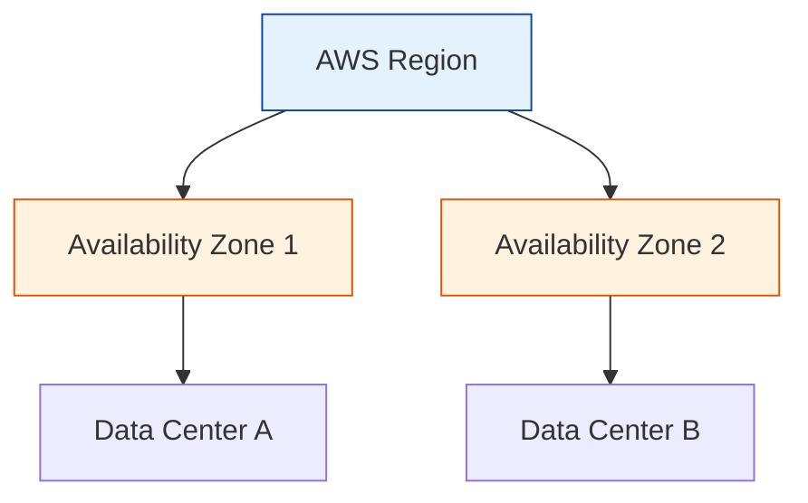

# AWS Introduction & CLI

A standardized starting point for AWS. This module consolidates core concepts and CLI setup.

## Overview
- **Fundamentals:** Understanding Regions, Availability Zones, and the Global Infrastructure.
- **CLI:** Automating AWS interactions from your terminal.

## Core Concepts

## Real World Scenarios
### Scenario: Automated Nightly Reports
**Context:** You manually login to the console every night to download billing CSV's.
**Solution:**
- **AWS CLI:** Write a simple bash script using `aws ce get-cost-and-usage`.
- **Cron Job:** Schedule it to run at 2 AM.
**Benefit:** Saves time and eliminates human error.

<b>1. What is an AWS Region?</b>

Show Answer

Answer: B) A physical location around the world where AWS clusters data centers</b>

<b>2. How many Availability Zones are normally in a Region?</b>

Show Answer

Answer: B) Minimum 2 (with exceptions), usually 3+</b>

<b>3. Which command configures your AWS CLI credentials?</b>

Show Answer

Answer: B) aws configure</b>

<b>4. Credentials for the CLI consist of:</b>

Show Answer

Answer: B) Access Key ID and Secret Access Key</b>

<b>5. Which output format is default for AWS CLI?</b>

Show Answer

Answer: B) JSON</b>

<b>6. Can you use the CLI to delete production databases?</b>

Show Answer

Answer: B) Yes, if permissions allow (Dangerous!)</b>

<b>7. What is "Edge Location"?</b>

Show Answer

Answer: B) A site that CloudFront uses to cache copies of content closer to users</b>

<b>8. AWS CLI is built on which language SDK?</b>

Show Answer

Answer: B) Python (Boto3)</b>

<b>9. Which file stores your credentials locally?</b>

Show Answer

Answer: A) ~/.aws/credentials</b>

<b>10. To list S3 buckets via CLI:</b>

Show Answer

Answer: A) aws s3 ls</b>

<b>11. What is ARN?</b>

Show Answer

Answer: A) AWS Resource Name (Unique Identifier)</b>

<b>12. Global Infrastructure includes:</b>

Show Answer

Answer: A) Regions, AZs, Edge Locations</b>

<b>13. Which command updates the CLI to the latest version?</b>

Show Answer

Answer: B) Depends on OS (e.g., pip install --upgrade awscli)</b>

<b>14. "Dry Run" flag allows you to:</b>

Show Answer

Answer: A) Execute a command without actually making changes (simulate permission check)</b>

<b>15. Why use Profiles in CLI?</b>

Show Answer

Answer: A) To manage multiple AWS accounts (e.g., --profile prod)</b>

<b>16. How do you get help for a specific command?</b>

Show Answer

Answer: D) All of the above</b>

<b>17. Can you run CLI in a Docker container?</b>

Show Answer

Answer: A) Yes</b>

<b>18. Pagination in CLI outputs:</b>

Show Answer

Answer: A) Automatically handles large lists by showing a "NextToken"</b>

<b>19. Query parameter (`--query`) allows you to:</b>

Show Answer

Answer: A) Filter the client-side output using JSONPath</b>

<b>20. Which partition is standard for most users?</b>

Show Answer

Answer: A) aws</b>

<b>21. Does CLI support Auto-Completion?</b>

Show Answer

Answer: A) Yes, if configured in shell (e.g., .bashrc)</b>

