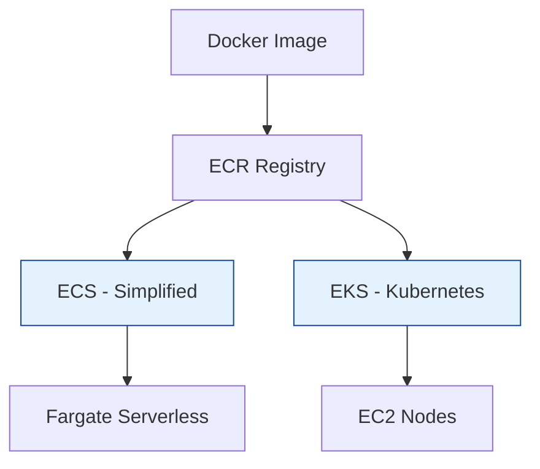

# AWS Containers (ECS & EKS)

Running Docker containers on AWS.

## Architecture: ECS vs EKS

## Real World Scenarios
### Scenario: Microservices Migration
**Context:** Monolithic app is being broken into 20 services. Team knows Docker but not Kubernetes.
**Solution:**
- **ECS (Elastic Container Service):** Use ECS with Fargate.
**Benefit:** Lower learning curve than K8s. No server management (Fargate).

<b>1. ECR stands for:</b>

Show Answer

Answer: A) Elastic Container Registry</b>

<b>2. ECS vs EKS: Which uses standard Kubernetes?</b>

Show Answer

Answer: A) EKS</b>

<b>3. Fargate is:</b>

Show Answer

Answer: A) Serverless compute engine for containers</b>

<b>4. To run a container, you need a Task Definition in ECS. This is similar to a:</b>

Show Answer

Answer: A) Docker Compose file</b>

<b>5. Can EKS run on Fargate?</b>

Show Answer

Answer: A) Yes</b>

<b>6. Which costs more to manage (Control Plane fees)?</b>

Show Answer

Answer: A) EKS (Cost per hour for cluster)</b>

<b>7. "Pod" is a concept in:</b>

Show Answer

Answer: A) Kubernetes (EKS)</b>

<b>8. "Task" is a concept in:</b>

Show Answer

Answer: A) ECS</b>

<b>9. App Mesh is used for:</b>

Show Answer

Answer: A) Service Mesh (networking between microservices)</b>

<b>10. To authenticate Docker CLI to ECR, you run:</b>

Show Answer

Answer: A) aws ecr get-login-password | docker login...</b>

<b>11. Can ECS run Windows Containers?</b>

Show Answer

Answer: A) Yes</b>

<b>12. What is the "Sidecar" pattern?</b>

Show Answer

Answer: A) Running a helper container alongside the main application container in the same task/pod</b>

<b>13. EKS Nodes are managed via:</b>

Show Answer

Answer: A) Managed Node Groups or Self-Managed EC2</b>

<b>14. Copilot CLI is a tool for:</b>

Show Answer

Answer: A) Simplifying ECS deployment</b>

<b>15. Why use a Private Registry (ECR) instead of Docker Hub?</b>

Show Answer

Answer: A) Security, speed (in VPC), and unlimited pulls</b>

<b>16. IAM Roles for Tasks (ECS) allows:</b>

Show Answer

Answer: A) Granular permissions per container</b>

<b>17. In EKS, "kubectl" is:</b>

Show Answer

Answer: A) The command line tool for Kubernetes</b>

<b>18. Can you run stateful workloads (with EBS) on EKS?</b>

Show Answer

Answer: A) Yes, using CSI drivers</b>

<b>19. Which load balancer is best for containerized HTTP apps?</b>

Show Answer

Answer: A) Application Load Balancer (ALB)</b>

<b>20. ECS "Service" ensures:</b>

Show Answer

Answer: A) A specified number of tasks are always running (auto-restart)</b>

<b>21. Does EKS support Helm charts?</b>

Show Answer

Answer: A) Yes</b>

---
## 🧭 Additional Modules
- [ECR Registry](ecr-registry/readme.md)
