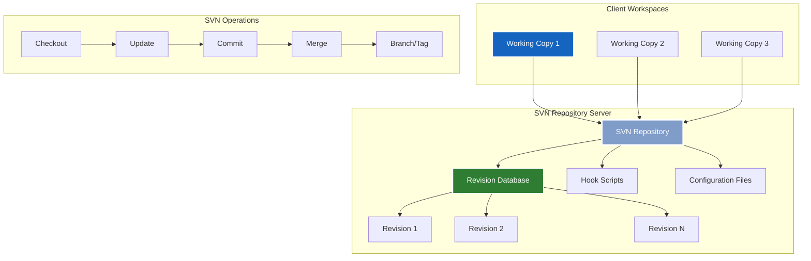
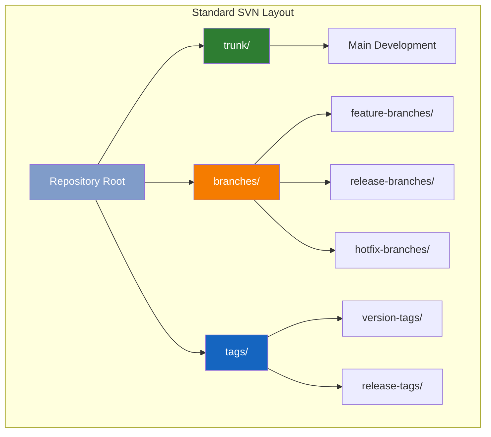

# 📁 Subversion (SVN) - Enterprise Centralized Version Control


Apache Subversion (SVN) is a centralized version control system that has been the backbone of enterprise software development for decades. While distributed systems like Git dominate modern development, SVN remains crucial for legacy systems, large binary files, and organizations requiring centralized control.

---

## 🎯 Learning Objectives

By completing this module, you will master:
- SVN architecture and centralized version control concepts
- Enterprise SVN server administration and configuration
- Advanced branching and merging strategies in SVN
- Migration strategies from SVN to modern VCS
- Large binary file management and optimization
- Integration with enterprise tools and CI/CD systems

---

## 🏗️ SVN Architecture Overview



---

## 📂 Module Structure

### 🚀 01-SVN-Fundamentals
**Core Concepts and Setup**
- SVN architecture and concepts
- Repository creation and configuration
- Basic SVN operations (checkout, update, commit)
- Working copy management
- SVN client tools and configuration

### 🌿 02-Branching-Merging
**Advanced Workflow Management**
- SVN branching strategies
- Trunk-based development
- Feature branching in SVN
- Merging and conflict resolution
- Tag management and releases

### 🏢 03-Enterprise-Administration
**Large-Scale SVN Management**
- SVN server setup and configuration
- Apache HTTP server integration
- Access control and authentication
- Backup and disaster recovery
- Performance optimization

### 🔐 04-Security-Compliance
**Enterprise Security Features**
- Authentication mechanisms (LDAP, AD)
- Authorization and path-based access
- Hook scripts for policy enforcement
- Audit logging and compliance
- SSL/TLS configuration

### 📦 05-Binary-File-Management
**Large File Handling**
- Binary file optimization
- Repository layout strategies
- Storage optimization techniques
- Cleanup and maintenance
- Performance considerations

### 🔄 06-Migration-Modernization
**Platform Transitions**
- SVN to Git migration strategies
- History preservation techniques
- Team training and adoption
- Hybrid workflows during transition
- Legacy system integration

---

## 🚀 SVN Fundamentals

### 📋 Essential SVN Commands

```bash
# Repository Operations
svnadmin create /path/to/repository
svnadmin dump /path/to/repository > backup.dump
svnadmin load /path/to/repository < backup.dump

# Basic Client Operations
svn checkout https://server/repo/trunk working-copy
svn update
svn add file.txt
svn commit -m "Add new file"
svn status
svn log
svn diff

# Branching and Tagging
svn copy https://server/repo/trunk https://server/repo/branches/feature-branch -m "Create feature branch"
svn copy https://server/repo/trunk https://server/repo/tags/v1.0 -m "Tag version 1.0"

# Merging
svn merge https://server/repo/branches/feature-branch
svn commit -m "Merge feature branch"

# Advanced Operations
svn switch https://server/repo/branches/feature-branch
svn relocate old-url new-url
svn export https://server/repo/trunk export-directory
```

### 🔧 SVN Configuration

```ini
# ~/.subversion/config (Client Configuration)
[auth]
store-passwords = yes
store-plaintext-passwords = no

[helpers]
editor-cmd = vim
diff-cmd = diff
merge-tool-cmd = meld

[tunnels]
ssh = ssh -o ControlMaster=no

[miscellany]
global-ignores = *.o *.lo *.la *.al .libs *.so *.so.[0-9]* *.a *.pyc *.pyo __pycache__
log-encoding = UTF-8
use-commit-times = yes
no-unlock = yes

[auto-props]
*.c = svn:eol-style=native
*.cpp = svn:eol-style=native
*.h = svn:eol-style=native
*.java = svn:eol-style=native
*.py = svn:eol-style=native
*.txt = svn:eol-style=native
*.xml = svn:eol-style=native
*.sh = svn:eol-style=native;svn:executable
*.bat = svn:eol-style=CRLF
*.exe = svn:mime-type=application/octet-stream
*.png = svn:mime-type=image/png
*.jpg = svn:mime-type=image/jpeg
```

---

## 🏢 Enterprise SVN Server Setup

### 🌐 Apache HTTP Server Configuration

```apache
# /etc/apache2/sites-available/svn.conf
<VirtualHost *:80>
    ServerName svn.company.com
    DocumentRoot /var/www/html
    
    # Redirect HTTP to HTTPS
    Redirect permanent / https://svn.company.com/
</VirtualHost>

<VirtualHost *:443>
    ServerName svn.company.com
    DocumentRoot /var/www/html
    
    # SSL Configuration
    SSLEngine on
    SSLCertificateFile /etc/ssl/certs/svn.company.com.crt
    SSLCertificateKeyFile /etc/ssl/private/svn.company.com.key
    SSLCertificateChainFile /etc/ssl/certs/ca-bundle.crt
    
    # SVN Configuration
    <Location /svn>
        DAV svn
        SVNParentPath /var/svn/repositories
        SVNListParentPath on
        
        # Authentication
        AuthType Basic
        AuthName "SVN Repository"
        AuthUserFile /etc/apache2/svn-auth-users
        AuthzSVNAccessFile /etc/apache2/svn-authz-policy
        
        # Require authentication for all operations
        Require valid-user
        
        # Performance optimizations
        SVNInMemoryCacheSize 16384
        SVNCompressionLevel 5
    </Location>
    
    # Logging
    ErrorLog ${APACHE_LOG_DIR}/svn_error.log
    CustomLog ${APACHE_LOG_DIR}/svn_access.log combined
    LogLevel info ssl:warn
</VirtualHost>
```

### 🔐 Access Control Configuration

```ini
# /etc/apache2/svn-authz-policy
[aliases]
developers = alice, bob, charlie
managers = david, eve
admins = frank, grace

[groups]
dev-team = @developers, @managers
all-users = @dev-team, @admins

# Global permissions
[/]
@admins = rw
* = r

# Project-specific permissions
[project1:/]
@dev-team = rw
@managers = rw

[project1:/trunk]
@developers = rw
@managers = rw

[project1:/branches]
@developers = rw
@managers = rw

[project1:/tags]
@managers = rw
@developers = r

# Sensitive directories
[project1:/trunk/config/production]
@admins = rw
@managers = r
@developers =

# Branch-specific permissions
[project1:/branches/release-*]
@managers = rw
@developers = r
```

---

## 🌿 Advanced Branching Strategies

### 📊 SVN Repository Layout



### 🔄 Enterprise Branching Workflow

```bash
#!/bin/bash
# SVN Enterprise Branching Workflow Script

SVN_BASE="https://svn.company.com/repo"
PROJECT="myproject"

# Function to create feature branch
create_feature_branch() {
    local feature_name=$1
    local branch_path="$SVN_BASE/$PROJECT/branches/feature-$feature_name"
    
    echo "Creating feature branch: $feature_name"
    svn copy "$SVN_BASE/$PROJECT/trunk" "$branch_path" \
        -m "Create feature branch: $feature_name"
    
    # Checkout the new branch
    svn checkout "$branch_path" "feature-$feature_name"
    echo "Feature branch created and checked out to: feature-$feature_name/"
}

# Function to create release branch
create_release_branch() {
    local version=$1
    local branch_path="$SVN_BASE/$PROJECT/branches/release-$version"
    
    echo "Creating release branch: $version"
    svn copy "$SVN_BASE/$PROJECT/trunk" "$branch_path" \
        -m "Create release branch: $version"
    
    echo "Release branch created: release-$version"
}

# Function to merge feature branch
merge_feature_branch() {
    local feature_name=$1
    local branch_path="$SVN_BASE/$PROJECT/branches/feature-$feature_name"
    
    # Switch to trunk
    cd trunk
    svn update
    
    # Merge feature branch
    echo "Merging feature branch: $feature_name"
    svn merge "$branch_path"
    
    # Commit the merge
    svn commit -m "Merge feature branch: $feature_name"
    
    echo "Feature branch merged successfully"
}

# Function to create tag
create_tag() {
    local version=$1
    local source_path=${2:-"$SVN_BASE/$PROJECT/trunk"}
    local tag_path="$SVN_BASE/$PROJECT/tags/v$version"
    
    echo "Creating tag: v$version"
    svn copy "$source_path" "$tag_path" \
        -m "Tag version $version"
    
    echo "Tag created: v$version"
}

# Usage examples
case "$1" in
    "feature")
        create_feature_branch "$2"
        ;;
    "release")
        create_release_branch "$2"
        ;;
    "merge")
        merge_feature_branch "$2"
        ;;
    "tag")
        create_tag "$2" "$3"
        ;;
    *)
        echo "Usage: $0 {feature|release|merge|tag} <name> [source]"
        exit 1
        ;;
esac
```

---

## 🔐 Enterprise Security Implementation

### 🛡️ Hook Scripts for Policy Enforcement

```python
#!/usr/bin/env python3
"""
SVN Pre-commit Hook Script
Enforces enterprise policies before commits
"""

import sys
import subprocess
import re
import os

def check_commit_message(message):
    """Validate commit message format"""
    # Require ticket reference
    ticket_pattern = r'(TICKET-\d+|JIRA-\d+|#\d+)'
    if not re.search(ticket_pattern, message, re.IGNORECASE):
        return False, "Commit message must reference a ticket (TICKET-123, JIRA-456, or #789)"
    
    # Minimum message length
    if len(message.strip()) < 10:
        return False, "Commit message must be at least 10 characters long"
    
    return True, ""

def check_file_restrictions(changed_files):
    """Check for restricted file operations"""
    restricted_patterns = [
        r'\.exe$',
        r'\.dll$', 
        r'\.so$',
        r'/config/production/',
        r'\.key$',
        r'\.pem$'
    ]
    
    for file_path in changed_files:
        for pattern in restricted_patterns:
            if re.search(pattern, file_path, re.IGNORECASE):
                return False, f"Restricted file detected: {file_path}"
    
    return True, ""

def check_file_size(repo_path, transaction):
    """Check for large files"""
    max_size = 50 * 1024 * 1024  # 50MB limit
    
    # Get changed files in transaction
    cmd = ['svnlook', 'changed', '-t', transaction, repo_path]
    result = subprocess.run(cmd, capture_output=True, text=True)
    
    for line in result.stdout.strip().split('\n'):
        if line.startswith('A') or line.startswith('U'):
            file_path = line[4:].strip()
            
            # Get file size
            cmd = ['svnlook', 'filesize', '-t', transaction, repo_path, file_path]
            try:
                result = subprocess.run(cmd, capture_output=True, text=True)
                size = int(result.stdout.strip())
                
                if size > max_size:
                    return False, f"File too large: {file_path} ({size} bytes > {max_size} bytes)"
            except:
                continue
    
    return True, ""

def main():
    if len(sys.argv) != 3:
        sys.stderr.write("Usage: pre-commit.py REPOS TXN\n")
        sys.exit(1)
    
    repo_path = sys.argv[1]
    transaction = sys.argv[2]
    
    # Get commit message
    cmd = ['svnlook', 'log', '-t', transaction, repo_path]
    result = subprocess.run(cmd, capture_output=True, text=True)
    commit_message = result.stdout.strip()
    
    # Get changed files
    cmd = ['svnlook', 'changed', '-t', transaction, repo_path]
    result = subprocess.run(cmd, capture_output=True, text=True)
    changed_files = [line[4:].strip() for line in result.stdout.strip().split('\n')]
    
    # Run checks
    checks = [
        check_commit_message(commit_message),
        check_file_restrictions(changed_files),
        check_file_size(repo_path, transaction)
    ]
    
    for success, error_msg in checks:
        if not success:
            sys.stderr.write(f"COMMIT REJECTED: {error_msg}\n")
            sys.exit(1)
    
    # All checks passed
    sys.exit(0)

if __name__ == "__main__":
    main()
```

---

## 🔄 Migration Strategies

### 📦 SVN to Git Migration Tool

```python
#!/usr/bin/env python3
"""
SVN to Git Migration Tool
Enterprise-grade migration with history preservation
"""

import subprocess
import os
import sys
import tempfile
from pathlib import Path

class SVNToGitMigrator:
    def __init__(self, svn_url, git_repo_path, authors_file=None):
        self.svn_url = svn_url
        self.git_repo_path = Path(git_repo_path)
        self.authors_file = authors_file
        self.temp_dir = None
    
    def create_authors_file(self):
        """Generate authors file from SVN log"""
        if self.authors_file:
            return self.authors_file
        
        print("Extracting SVN authors...")
        cmd = ['svn', 'log', '-q', self.svn_url]
        result = subprocess.run(cmd, capture_output=True, text=True)
        
        authors = set()
        for line in result.stdout.split('\n'):
            if line.startswith('r') and '|' in line:
                parts = line.split('|')
                if len(parts) >= 2:
                    author = parts[1].strip()
                    if author and author != '(no author)':
                        authors.add(author)
        
        # Create authors file
        authors_file = self.temp_dir / 'authors.txt'
        with open(authors_file, 'w') as f:
            for author in sorted(authors):
                f.write(f"{author} = {author} <{author}@company.com>\n")
        
        return str(authors_file)
    
    def migrate_repository(self):
        """Perform the migration"""
        try:
            # Create temporary directory
            self.temp_dir = Path(tempfile.mkdtemp())
            print(f"Working in temporary directory: {self.temp_dir}")
            
            # Create authors file if not provided
            authors_file = self.create_authors_file()
            
            # Clone SVN repository using git-svn
            print("Cloning SVN repository...")
            os.chdir(self.temp_dir)
            
            cmd = [
                'git', 'svn', 'clone', self.svn_url,
                '--authors-file', authors_file,
                '--no-metadata',
                '--prefix=svn/',
                '--trunk=trunk',
                '--branches=branches',
                '--tags=tags',
                'git-repo'
            ]
            
            subprocess.run(cmd, check=True)
            
            # Process the converted repository
            os.chdir('git-repo')
            
            # Convert SVN tags to Git tags
            print("Converting SVN tags to Git tags...")
            self.convert_tags()
            
            # Convert SVN branches to Git branches
            print("Converting SVN branches to Git branches...")
            self.convert_branches()
            
            # Clean up SVN references
            subprocess.run(['git', 'config', '--remove-section', 'svn-remote.svn'], 
                         check=False)
            subprocess.run(['git', 'config', '--remove-section', 'svn'], 
                         check=False)
            
            # Create final repository
            print(f"Creating final Git repository at {self.git_repo_path}")
            self.git_repo_path.parent.mkdir(parents=True, exist_ok=True)
            
            subprocess.run(['git', 'clone', '.', str(self.git_repo_path)], check=True)
            
            print("Migration completed successfully!")
            
        except subprocess.CalledProcessError as e:
            print(f"Migration failed: {e}")
            sys.exit(1)
        
        finally:
            # Cleanup
            if self.temp_dir and self.temp_dir.exists():
                import shutil
                shutil.rmtree(self.temp_dir)
    
    def convert_tags(self):
        """Convert SVN tags to Git tags"""
        # Get all SVN tag references
        result = subprocess.run(['git', 'branch', '-r'], 
                              capture_output=True, text=True)
        
        for line in result.stdout.split('\n'):
            line = line.strip()
            if line.startswith('svn/tags/'):
                tag_name = line.replace('svn/tags/', '')
                if tag_name:
                    # Create Git tag
                    subprocess.run(['git', 'tag', tag_name, line], check=False)
                    # Delete the branch
                    subprocess.run(['git', 'branch', '-D', '-r', line], check=False)
    
    def convert_branches(self):
        """Convert SVN branches to Git branches"""
        result = subprocess.run(['git', 'branch', '-r'], 
                              capture_output=True, text=True)
        
        for line in result.stdout.split('\n'):
            line = line.strip()
            if line.startswith('svn/') and not line.startswith('svn/trunk'):
                branch_name = line.replace('svn/', '')
                if branch_name:
                    # Create local branch
                    subprocess.run(['git', 'branch', branch_name, line], check=False)

# Usage
if __name__ == "__main__":
    if len(sys.argv) < 3:
        print("Usage: svn_to_git.py <svn-url> <git-repo-path> [authors-file]")
        sys.exit(1)
    
    svn_url = sys.argv[1]
    git_repo_path = sys.argv[2]
    authors_file = sys.argv[3] if len(sys.argv) > 3 else None
    
    migrator = SVNToGitMigrator(svn_url, git_repo_path, authors_file)
    migrator.migrate_repository()
```

---

## 🧪 Hands-On Labs

### Lab 1: SVN Server Setup
**Objective**: Deploy enterprise SVN server with Apache integration
**Duration**: 90 minutes
**Skills**: Server configuration, authentication, access control

### Lab 2: Advanced Branching Workflow
**Objective**: Implement enterprise branching strategy with policies
**Duration**: 75 minutes
**Skills**: Branch management, merging, hook scripts

### Lab 3: Binary File Optimization
**Objective**: Optimize SVN for large binary files and media assets
**Duration**: 60 minutes
**Skills**: Repository layout, performance tuning, cleanup

### Lab 4: SVN to Git Migration
**Objective**: Migrate enterprise SVN repository to Git with full history
**Duration**: 120 minutes
**Skills**: Migration tools, history preservation, team coordination

---

## 📋 Interview Questions & Quiz (25+ Questions)

### 🎯 Technical Questions

1. **What is the main architectural difference between SVN and Git?**
   - A) SVN is distributed, Git is centralized
   - B) SVN is centralized, Git is distributed
   - C) Both are distributed systems
   - D) Both are centralized systems

2. **Which SVN command creates a branch?**
   - A) `svn branch`
   - B) `svn copy`
   - C) `svn checkout -b`
   - D) `svn create-branch`

3. **What is the purpose of SVN revision numbers?**
   - A) Identify individual files
   - B) Global repository state identifiers
   - C) Branch identifiers
   - D) User identifiers

### 🏢 Enterprise Scenarios

4. **Your organization has a 500GB SVN repository with 10 years of history. How would you optimize performance?**

5. **Design an access control strategy for a multi-project SVN server with 200+ developers.**

6. **How would you implement a code review process in an SVN-based workflow?**

---

## 🎯 Real-Life Scenarios

### Scenario 1: Legacy System Modernization
**Context**: 15-year-old SVN repository with critical business applications
**Challenge**: Modernize without disrupting ongoing development
**Solution**: Gradual migration with parallel Git repositories

### Scenario 2: Compliance and Audit Requirements
**Context**: Financial services company with strict audit requirements
**Challenge**: Implement comprehensive access logging and controls
**Solution**: Advanced hook scripts and audit trail implementation

### Scenario 3: Large Binary Asset Management
**Context**: Game development company with GB-sized art assets
**Challenge**: Efficient version control for large binary files
**Solution**: Optimized repository layout and cleanup procedures

---

## 📊 SVN vs Modern VCS Comparison

| Feature | SVN | Git | Mercurial |
|---------|-----|-----|-----------|
| **Architecture** | Centralized | Distributed | Distributed |
| **Offline Work** | Limited | Full | Full |
| **Branching** | Expensive | Cheap | Cheap |
| **Binary Files** | Excellent | Poor | Good |
| **Learning Curve** | Easy | Steep | Medium |
| **Enterprise Features** | Excellent | Good | Good |

---

## 📚 Additional Resources

### 📖 Official Documentation
- [Apache Subversion Documentation](https://subversion.apache.org/docs/)
- [SVN Book](http://svnbook.red-bean.com/)
- [SVN Best Practices](https://subversion.apache.org/docs/community-guide/)

### 🎥 Video Resources
- [SVN Tutorial for Beginners](https://www.youtube.com/watch?v=v6p4L4nQm3g)
- [Enterprise SVN Administration](https://www.youtube.com/watch?v=o_3c0VcuVjM)

### 🛠️ Tools
- [TortoiseSVN](https://tortoisesvn.net/) - Windows GUI client
- [AnkhSVN](https://ankhsvn.open.collab.net/) - Visual Studio integration
- [Subclipse](https://subclipse.apache.org/) - Eclipse plugin

---

## ✅ Completion Checklist

- [ ] Set up SVN server with Apache integration
- [ ] Configure authentication and authorization
- [ ] Implement branching and merging workflows
- [ ] Create and deploy hook scripts
- [ ] Optimize repository for large files
- [ ] Complete SVN to Git migration challenge
- [ ] Configure backup and disaster recovery
- [ ] Pass the comprehensive quiz (85%+ score)

---

**"SVN may be legacy, but it remains the gold standard for centralized control and binary file management."**

*Master SVN to bridge the gap between legacy systems and modern DevOps practices.*