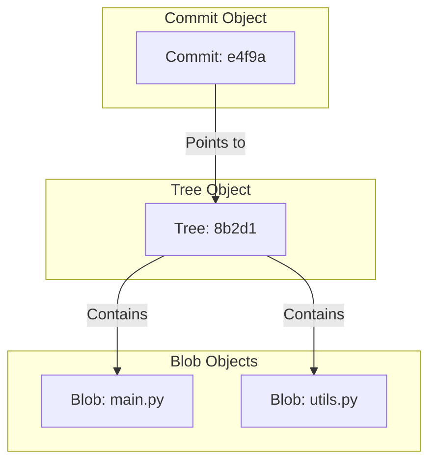

# Git Internal Architecture Reference

**Doc Version:** 1.0.0
**Role:** Senior DevOps Engineer
**Scope:** Deep Dive into Git Objects & Storage

---

## 1. The Git Object Model

Git is essentially a **content-addressable filesystem**. It doesn't store file changes (deltas) but rather snapshots of the entire filesystem. At its core, Git is a key-value data store where the keys are SHA-1 hashes and the values are objects.

There are four main types of objects in Git:

### A. Blob (Binary Large Object)
- **Concept:** Represents the *content* of a file.
- **Details:** Stores file data but **no metadata** (no filename, no timestamps). If two files in different directories have the exact same content, they share the same Blob object.
- **Reference:** The base unit of data.

`[ File Data ] -> SHA1(Content) -> Blob`

### B. Tree
- **Concept:** Represents a *directory*.
- **Details:** Maps filenames to Blobs or other Trees (subdirectories). It captures the filesystem structure at a specific point in time.
- **Contents:**
    - Blob SHA-1 pointers (files)
    - Tree SHA-1 pointers (subfolders)
    - File permissions (e.g., 100644)
    - Filenames

`[ Directory Listing ] -> SHA1(Entries) -> Tree`

### C. Commit
- **Concept:** A snapshot of the working tree.
- **Details:** Points to the top-level Tree object and adds context.
- **Contents:**
    - Top-level Tree SHA-1
    - Parent Commit SHA-1 (if any)
    - Author & Committer (Name, Email, Timestamp)
    - Commit Message
    - GPG Signature (if signed)

`[ Snapshot Context ] -> SHA1(Metadata + Tree) -> Commit`

### D. Tag
- **Concept:** A persistent reference to a specific commit.
- **Details:** Unlike branches (which move), tags are static.
- **Annotated Tags:** Stored as full objects containing:
    - Tagger name/email/date
    - Tag message
    - Pointer to the commit SHA-1

---

## 2. The Hashing Mechanism (SHA-1 & SHA-256)

Git ensures data integrity using cryptographic hashing.

- **SHA-1:** The traditional 40-character hexadecimal string (e.g., `a1b2c3d4...`).
    - Every object is named by the hash of its contents.
    - **Immutability:** If you change a single bit in a file, its hash changes. This propagates up: the Tree hash changes, and the Commit hash changes.
- **SHA-256:** Git is transitioning to SHA-256 to prevent collision attacks.

**Why this matters for DevOps:**
- **Security:** You cannot alter history without breaking the chain of hashes.
- **Deduplication:** Git automatically deduplicates content. 100 copies of the same file = 1 Blob.

---

## 3. Tracking Content vs. Files

Git does **not** track files; it tracks content.

1.  **Renaming:** If you rename a file, Git detects it as a Rename only because the content (Blob) is identical, but the filename in the Tree changed.
2.  **Movement:** Moving a file is just a Tree update pointing the same Blob to a new path.
3.  **Data Integrity:** This methodology ensures that `git fsck` can validate the entire repository history by recalculating hashes.

---

## 4. Visualizing the Graph

> **Enterprise Note:** Understanding this architecture is critical for debugging "detached HEAD" states, recovering lost commits via `git reflog`, and managing large repositories where large binaries (LFS) break this model.
