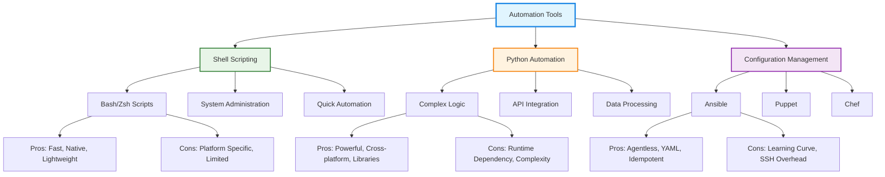

# Automation Tools Comparison

```mermaid
graph TD
    A[Automation Tools] --> B[Shell Scripting]
    A --> C[Python Automation]
    A --> D[Configuration Management]
    
    B --> E[Bash/Zsh Scripts]
    B --> F[System Administration]
    B --> G[Quick Automation]
    
    C --> H[Complex Logic]
    C --> I[API Integration]
    C --> J[Data Processing]
    
    D --> K[Ansible]
    D --> L[Puppet]
    D --> M[Chef]
    
    E --> N[Pros: Fast, Native, Lightweight]
    E --> O[Cons: Platform Specific, Limited]
    
    H --> P[Pros: Powerful, Cross-platform, Libraries]
    H --> Q[Cons: Runtime Dependency, Complexity]
    
    K --> R[Pros: Agentless, YAML, Idempotent]
    K --> S[Cons: Learning Curve, SSH Overhead]
    
    style A fill:#e1f5fe,stroke:#1e88e5,stroke-width:3px
    style B fill:#e8f5e8,stroke:#2e7d32,stroke-width:2px
    style C fill:#fff3e0,stroke:#f57c00,stroke-width:2px
    style D fill:#f3e5f5,stroke:#8e24aa,stroke-width:2px
```

This comparison helps understand when to use shell scripting versus other automation tools in DevOps workflows.